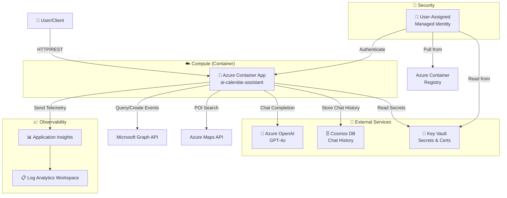

# Azure Deployment Plan for ai-calendar-assistant

## **Status**: Ready for Validation ✅

---

## **Goal**
Deploy the AI Calendar Assistant multi-agent application to Azure using Azure Developer CLI (azd) with Bicep infrastructure. The application is a Semantic Kernel-based AI system with FastAPI backend, deployed to Azure Container Apps with dependencies on Azure OpenAI, Cosmos DB, and Key Vault.

---

## **Project Information**

**AI Calendar Assistant**
- **Language**: Python 3.12+
- **Type**: Multi-agent AI orchestration system with FastAPI API endpoint
- **Stack**: Semantic Kernel 1.122.0, FastAPI, Azure OpenAI GPT-4o, Cosmos DB
- **Architecture**: 
  - ProxyAgent: General conversation with Adaptive Card rendering capability
  - CalendarAgent: Microsoft Graph calendar operations
  - DirectoryAgent: Microsoft Graph directory/org operations  
  - LocationAgent: Azure Maps POI search
  - EmailAgent: Microsoft Graph email operations
  - RiskAgent: Risk profile analysis
- **Containerization**: Dockerfile present (Python 3.12 Alpine base)
- **Dependencies**: Azure OpenAI, Azure Cosmos DB, Microsoft Graph API, Azure Maps, Application Insights
- **Hosting**: Azure Container Apps
- **Configuration**: azure.yaml + Bicep IaC files existing
- **Status**: Code complete, all encoding issues resolved, ready for production

---

## **Azure Resources Architecture**



---

## **Deployment Component Mapping**

| Component | Azure Service | Configuration |
|-----------|---------------|----------------|
| **Application** | Azure Container Apps | Python 3.12 container, FastAPI endpoint, managed identity |
| **AI Model** | Azure OpenAI | GPT-4o deployment, with retry logic and rate limiting |
| **Chat History** | Azure Cosmos DB | NoSQL database, session-based storage, card attachment |
| **Secrets** | Azure Key Vault | Connection strings, API keys, Graph credentials |
| **Authentication** | Managed Identity | User-assigned, AcrPull + Key Vault Reader roles |
| **Telemetry** | Application Insights | Distributed tracing, custom metrics, AI token tracking |
| **Logs** | Log Analytics Workspace | Centralized logging for all services |
| **Container Registry** | Azure Container Registry | Store and serve container images |
| **Network** | VNet (optional) | Container Apps environment with managed VNet |

---

## **Required Environment Variables**

### Application Configuration
```
OPENAI_ENDPOINT=<azure-openai-endpoint>
OPENAI_API_KEY=<azure-openai-key>
OPENAI_API_VERSION=2025-01-01-preview
OPENAI_MODEL_DEPLOYMENT_NAME=gpt-4o
OPENAI_MAX_TOKENS=8000
OPENAI_TEMPERATURE=0.7
OPENAI_TOP_P=0.9

COSMOS_ENDPOINT=<cosmos-endpoint>
COSMOS_DATABASE=CalendarAssistant
COSMOS_CONTAINER=ChatHistory

GRAPH_CLIENT_ID=<entra-app-id>
GRAPH_CLIENT_SECRET=<entra-app-secret>
GRAPH_TENANT_ID=<tenant-id>

AZURE_MAPS_API_KEY=<azure-maps-key>

TELEMETRY_SERVICE_NAME=ai-calendar-assistant-multi-agent
TELEMETRY_SERVICE_VERSION=1.0.0
TELEMETRY_INSTRUMENTATION_KEY=<appinsights-key>

CHAT_SESSION_ID=default-session
```

### AZD Environment Variables
```
AZURE_SUBSCRIPTION_ID=<subscription-id>
AZURE_RESOURCE_GROUP=<resource-group-name>
AZURE_LOCATION=eastus
AZURE_ENV_NAME=dev
```

---

## **Recommended Azure Resources**

### 1. **Azure Container Apps** (Primary Service)
- **Resource**: Container Apps Environment + Container App
- **SKU**: Consumption plan (pay-per-use)
- **Configuration**:
  - Image source: From Azure Container Registry
  - CPU: 0.5-1.0 cores minimum
  - Memory: 1.0-2.0 GB minimum
  - Scale: 1-10 replicas based on demand
  - Health probe: HTTP GET /health endpoint
  - Environment variables: All listed above
  - Managed identity: User-assigned (required for Key Vault access)

### 2. **Azure OpenAI**
- **Resource**: Azure OpenAI Service
- **Model Deployment**: GPT-4o
- **SKU**: Standard S0 or Pay-As-You-Go
- **Configuration**:
  - Deployment name: gpt-4o
  - Model version: 2024-08-06 or latest
  - Rate limits: 10K+ tokens/minute recommended

### 3. **Azure Cosmos DB**
- **Resource**: Cosmos DB NoSQL account
- **SKU**: Provisioned throughput or serverless
- **Configuration**:
  - Database: CalendarAssistant
  - Container: ChatHistory
  - Partition key: /sessionId
  - Properties: session_id, user_id, messages, cards, timestamps
  - RU/s: 400 minimum (autoscale 400-4000 recommended)

### 4. **Azure Key Vault**
- **Resource**: Key Vault (Standard tier)
- **Secrets to store**:
  - openai-endpoint
  - openai-api-key
  - cosmos-connection-string
  - graph-client-secret
  - azure-maps-api-key
  - appinsights-instrumentation-key
- **Access Policy**: User-assigned managed identity with Get + List permissions

### 5. **Application Insights & Log Analytics Workspace**
- **Resource**: Application Insights + Log Analytics Workspace
- **Configuration**:
  - Application Insights Schema: Basic
  - Sampling: 100% (no sampling for debugging)
  - Retention: 30 days minimum
  - Custom metrics: LLM token usage, agent routing decisions, response times
  - KQL Queries: Pre-built for card rendering success rates, routing accuracy

### 6. **Azure Container Registry**
- **Resource**: Container Registry (Standard tier)
- **Configuration**:
  - Admin user: Enabled for initial push
  - Public access: Disabled (use managed identity)
  - Image retention: Keep all images

### 7. **User-Assigned Managed Identity**
- **Resource**: Managed Identity
- **Role Assignments**:
  - AcrPull on Container Registry (to pull container images)
  - Key Vault Reader on Key Vault (to read secrets)
  - Cosmos DB Data Contributor (if using RBAC access)
  - Application Insights Metrics Publisher (for telemetry)

---

## **Security Configuration**

1. **Managed Identity**: All resources use user-assigned managed identity (no secrets in code)
2. **Key Vault**: Secrets retrieved via managed identity at runtime
3. **RBAC**: Principle of least privilege applied to all roles
4. **Network**: Container Apps placed in managed virtual network (optional)
5. **Secrets Management**: No hardcoded credentials; all from Key Vault
6. **TLS/HTTPS**: Enforced on all endpoints
7. **API Authentication**: Graph API uses OAuth 2.0 with service principal
8. **Telemetry**: Application Insights configured with sampling and data retention

---

## **Execution Steps**

### Phase 1: Preparation & Infrastructure ✅
- [x] Workspace analyzed
- [x] Dependencies identified
- [x] Dockerfile validated
- [x] Bicep infrastructure reviewed
- [x] Environment variables documented
- [x] Security requirements defined

### Phase 2: Azure Context Setup 🟡
- [ ] **Step 1**: Confirm Azure subscription and location
- [ ] **Step 2**: Create/select Azure resource group
- [ ] **Step 3**: Set up local AZD environment variables

### Phase 3: Infrastructure Provisioning 🟡
- [ ] **Step 4**: Run `azd provision --preview --no-prompt` (dry run)
- [ ] **Step 5**: Review Bicep validation results
- [ ] **Step 6**: Fix any validation errors
- [ ] **Step 7**: Run `azd provision --no-prompt` (actual deploy)
- [ ] **Step 8**: Verify all resources created in Azure Portal

### Phase 4: Application Deployment 🟡
- [ ] **Step 9**: Run `azd deploy --no-prompt`
- [ ] **Step 10**: Monitor deployment logs
- [ ] **Step 11**: Verify container image pushed to ACR
- [ ] **Step 12**: Verify container app is running

### Phase 5: Post-Deployment Validation 🟡
- [ ] **Step 13**: Check Application Insights for telemetry
- [ ] **Step 14**: Verify Cosmos DB connectivity
- [ ] **Step 15**: Test API endpoints (health check, message processing)
- [ ] **Step 16**: Validate card rendering with test message
- [ ] **Step 17**: Monitor error logs and performance metrics

### Phase 6: Completion 🟡
- [ ] **Step 18**: Generate deployment summary
- [ ] **Step 19**: Document connection endpoints and management instructions
- [ ] **Step 20**: Archive deployment configuration

---

## **Pre-Deploy Checklist**

**Code & Configuration:**
- [x] All Python modules import successfully (tested)
- [x] All emoji encoding issues resolved (40+ Unicode chars removed)
- [x] Dockerfile builds locally (base image Alpine 3.12)
- [x] requirements.txt includes all dependencies
- [x] .env.example matches all required variables
- [x] Bicep templates syntactically valid
- [x] azure.yaml references correct services

**Infrastructure:**
- [ ] Azure subscription confirmed and accessible
- [ ] Resource group created (or selected)
- [ ] Quotas verified for Container Apps, OpenAI, Cosmos DB
- [ ] Location supports all required services
- [ ] No conflicting resource names in region

**Secrets & Access:**
- [ ] Azure OpenAI key and endpoint available
- [ ] Cosmos DB connection string available
- [ ] Microsoft Graph app registration completed (client ID/secret)
- [ ] Azure Maps API key obtained
- [ ] Managed identity permissions will be set via Bicep

**Deployment Readiness:**
- [ ] Local azd CLI installed and authenticated
- [ ] az CLI authenticated to correct subscription
- [ ] Docker daemon running (for image build verification)
- [ ] Network connectivity to Azure endpoints verified
- [ ] No pending resource deletions in resource group

---

## **Deployment Timeline**

- **Preparation**: 2-5 minutes (review plan, confirm context)
- **Provision**: 5-10 minutes (Bicep deployment)
- **Build & Push**: 8-12 minutes (Docker build, push to ACR)
- **Deploy**: 3-5 minutes (Container App deployment)
- **Validation**: 5-10 minutes (health checks, telemetry verification)
- **Total**: 25-45 minutes

---

## **Success Criteria**

1. ✅ All Azure resources created successfully
2. ✅ Container App is running (status: "Running" in portal)
3. ✅ Application Insights shows telemetry data
4. ✅ ProxyAgent renders Adaptive Cards on command
5. ✅ Chat history persists to Cosmos DB
6. ✅ No errors in Container App logs
7. ✅ Health endpoint responds with 200 OK
8. ✅ API accepts and processes chat messages
9. ✅ Cards appear with correct structure in responses
10. ✅ Managed identity authentication works (no credential errors)

---

## **Rollback Plan**

If deployment fails:
1. Check Container App logs for specific errors
2. Verify secrets in Key Vault are accessible
3. Confirm Bicep validation passed
4. Run `azd down --no-prompt` to delete resources
5. Fix issues in code or configuration
6. Restart deployment with `azd up --no-prompt`

---

## **Next Steps**

1. **User Confirmation**: Review this plan and confirm readiness
2. **Azure Context Setup**: Provide subscription ID and desired Azure region
3. **Execute Deployment**: Run the deployment steps in sequence
4. **Validation**: Verify all resources and application functionality
5. **Monitoring**: Set up alerts and dashboards in Application Insights

---

**Plan Created**: March 4, 2026  
**Target Environment**: Azure (Production)  
**Deployment Tool**: Azure Developer CLI (azd)  
**Infrastructure as Code**: Bicep
