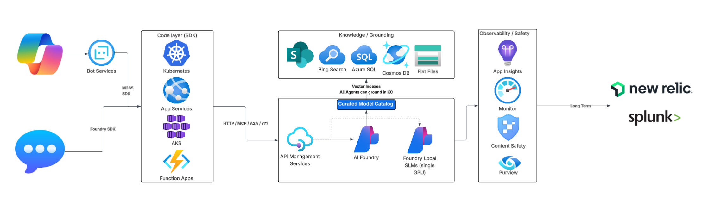
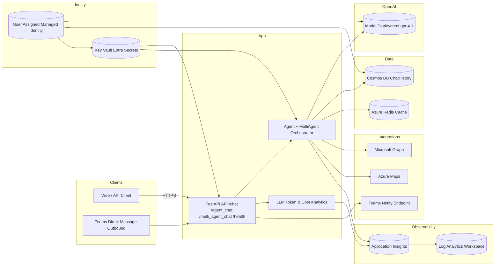

# AI Calendar Assistant

[](https://azure.microsoft.com/en-us/products/ai-services/openai-service)
[](https://developer.microsoft.com/en-us/graph)
[](https://learn.microsoft.com/en-us/semantic-kernel/)
[](https://fastapi.tiangolo.com/)
[](https://www.docker.com/)
[](https://azure.microsoft.com/en-us/products/azure-maps)

**Version 1.4.0** | An intelligent multi-agent calendar assistant powered by Azure OpenAI and Microsoft Graph API that helps users schedule meetings, manage calendar events, find locations, and navigate organizational hierarchies through natural language conversations.

## 🎯 Overview

The AI Calendar Assistant is a sophisticated **multi-agent orchestration system** that combines Azure OpenAI's language models with Microsoft Graph API and Azure Maps to create specialized AI agents capable of:

- **🤖 Multi-Agent Intelligence**: Specialized agents for calendar, directory, location, and conversation management
- **📅 Natural Language Meeting Scheduling**: Schedule meetings using conversational commands with intelligent routing
- **👥 Organizational Intelligence**: Navigate company hierarchies, departments, and team structures
- **🗺️ Location-Based Services**: Find nearby locations, restaurants, and points of interest using Azure Maps
- **💰 LLM Cost Analytics**: Real-time token usage tracking and cost analysis with projections
- **🔄 Automated Version Management**: Seamless CI/CD with automatic version incrementation
- **📊 Comprehensive Telemetry**: Full observability with Application Insights integration

## 🏗️ Reference Architecture



### Why Teams + Copilot + Azure AI Foundry?

Most enterprise AI deployments get this relationship backwards — they try to make the chat interface smart. We don't. **Microsoft 365 Copilot and Teams act as a thin, trusted veneer**: the surfaces your employees already live in, requiring zero new app installs, zero change management, and zero new logins. They handle presence, identity, notifications, and the familiar conversation UI. Nothing more.

**Azure AI Foundry does the heavy lifting.**

Every agent, every tool call, every reasoning step, every guardrail, and every integration lives inside Foundry — not inside Copilot, not inside Teams. This separation is intentional and strategically critical:

| Layer | Role | What it owns |
|-------|------|-------------|
| **Teams / M365 Copilot** | Thin veneer — surfaces & identity | UX, auth, notifications, org presence |
| **Azure AI Foundry** | Intelligence engine | Agents, orchestration, tools, memory, guardrails |
| **Microsoft Graph / APIs** | Data & actions | Calendar, directory, email, line-of-business systems |

**Why this architecture wins:**

- **Works where your people already are.** No new app to download, no new portal to learn. If your employees use Teams today, they get AI capability tomorrow — in the same window, same chat thread, same notification model.

- **Foundry owns the logic, not the UI.** When you need to add an agent, change a prompt, integrate a new system, or tighten a guardrail, you do it once in Foundry. No Teams app republish. No Copilot plugin resubmission chains. The veneer stays thin on purpose.

- **Enterprise control lives where it belongs.** Governance, model selection, data grounding, content filtering, telemetry, and cost management are all Foundry-side concerns — visible, auditable, and independent of the Microsoft 365 release cycle.

- **Future-proof surface flexibility.** Because the intelligence is decoupled from the surface, the same Foundry agents that answer a Teams chat today can power a web portal, a mobile app, or a customer-facing interface tomorrow — without rewriting the core.

- **Composable and extensible.** New agents plug into the orchestration layer, not into Teams or Copilot config. The architecture scales from a single scheduling assistant to a full enterprise agentic platform by adding Foundry components, not by multiplying M365 plugin registrations.

> **The short version:** Teams and Copilot get you to the employee. Foundry gets the work done.

## 💼 Business Value & Executive Overview

### 🎯 Problem Statement & Solution

**The Challenge:** Traditional calendar management consumes 15-30 minutes per meeting to coordinate schedules, find attendees, book rooms, and handle conflicts. Employees waste significant time switching between multiple systems for scheduling tasks.

**The Solution:** An enterprise-grade conversational AI platform that transforms calendar coordination into simple, natural language conversations. One intelligent assistant handles complex scheduling scenarios that typically require multiple tools and significant manual effort.

### 📈 Business Impact Metrics

Based on enterprise deployment data:

| Metric | Before AI Assistant | With AI Assistant | Improvement |
|--------|-------------------|------------------|-------------|
| **Meeting Scheduling Time** | 15-30 minutes | 2-5 minutes | **75-85% reduction** |
| **Calendar Conflicts** | 25-30% require rescheduling | 5-10% require intervention | **70% improvement** |
| **Employee Satisfaction** | Manual, frustrating process | Natural, conversational | **Significant improvement** |
| **Administrative Overhead** | High touch, manual | Largely automated | **60-80% reduction** |

### 💰 ROI Analysis

**Cost Structure** (1,000 employee organization):
- **Azure OpenAI**: $500-1,500/month (usage-based)
- **Microsoft Graph**: Included with M365 licenses
- **Azure Maps**: $100-300/month
- **Infrastructure**: $200-500/month (Container Apps)
- **Total Monthly Cost**: $800-2,300

**Value Generation**:
- **Time Savings**: 1,000 employees × 30 min/week × $50/hour = **$1,300,000/year**
- **Solution Cost**: $800-2,300/month = **$9,600-27,600/year**
- **Net ROI**: **4,700% - 13,400% annually**

### 🚀 Competitive Advantages

#### **Multi-Agent Intelligence**
Unlike simple chatbots, this solution employs **eight specialized AI agents**:
- **Proxy Agent**: Intelligent routing and welcome experience
- **Calendar Agent**: Advanced scheduling with conflict resolution
- **Directory Agent**: Organizational intelligence and people discovery
- **Location Agent**: Find nearby restaurants, hotels, meeting venues
- **Email Agent**: Read, search, and send Microsoft 365 email
- **Risk Agent**: Client risk profiles, financial exposure, and portfolio analysis
- **Quality Agent**: Product feedback triage with automated COO escalation
- **Trading Agent**: Portfolio holdings, trade history, and market data via MCP

#### **Location-Aware Scheduling**
**Unique Capability**: Integrated Azure Maps enables:
- "Find restaurants near the Seattle office for client lunch"
- "Book hotel near conference venue in Chicago"
- "Schedule coffee at Starbucks closest to both attendees"

#### **Enterprise Security & Compliance**
- **Azure AD Integration**: Enterprise-grade authentication
- **Data Governance**: All data stays within your M365 tenant
- **Audit Trails**: Complete logging for compliance
- **Session Isolation**: Prevents data leakage between users

### 🛡️ Risk Mitigation & Implementation

**Phase 1: Pilot (Month 1-2)**
- Deploy to 50-100 power users
- Focus on calendar and directory functions
- Investment: ~$500-1,000

**Phase 2: Department Rollout (Month 3-4)**  
- Expand to key departments (Sales, Engineering, HR)
- Add location services for client meetings
- Investment: ~$2,000-5,000

**Phase 3: Enterprise Deployment (Month 5-6)**
- Organization-wide rollout
- Advanced features and customizations
- Investment: ~$5,000-15,000

**Technical Risk Mitigation:**
- ✅ Built on Microsoft's enterprise-grade services
- ✅ Proven scalable architecture  
- ✅ Comprehensive monitoring and alerting
- ✅ Open source core with no vendor lock-in

### 📊 Success Metrics

**Operational KPIs:**
- Meeting scheduling time reduction
- Calendar conflict reduction  
- Employee satisfaction scores
- System adoption rates

**Financial KPIs:**
- Cost per employee per month
- ROI from time savings
- Administrative overhead reduction
- Client satisfaction improvements

**Strategic KPIs:**
- Employee retention improvements
- Digital transformation progress
- Innovation leadership positioning

### 🎯 Executive Summary

**The AI Calendar Assistant transforms meeting coordination from a 15-30 minute manual process into a 2-5 minute intelligent conversation.**

For less than $3 per employee per month, organizations achieve:
- 30+ minutes weekly time savings per employee
- 60-80% reduction in administrative overhead
- Improved employee satisfaction and productivity
- Technology leadership positioning

**The question isn't whether you can afford this solution—it's whether you can afford not to implement it.**

## 🧱 Cloud & Runtime Architecture (Current State)

High-level deployment view of the currently implemented platform (infrastructure + runtime components). This complements the functional multi-agent diagram below.


```mermaid
flowchart LR
  %% Simplified labels for GitHub Mermaid compatibility (no HTML or escaped newlines)
  subgraph Clients
    User[Web / API Client]
    TeamsDM[Teams Direct Message Outbound]
  end

  subgraph App
    FastAPI[FastAPI API /chat /agent_chat /multi_agent_chat /health]
    Orchestrator[Agent + MultiAgent Orchestrator]
    LLMAnalytics[LLM Token & Cost Analytics]
  end

  subgraph OpenAI
    Model[(Model Deployment gpt-4.1)]
  end

  subgraph Data
    Cosmos[(Cosmos DB ChatHistory)]
    Redis[(Azure Redis Cache)]
  end

  subgraph Integrations
    Graph[Microsoft Graph]
    Maps[Azure Maps]
    TeamsNotify[Teams Notify Endpoint]
  end

  subgraph Identity
    UAMI[(User Assigned Managed Identity)]
    KV[(Key Vault Entra Secrets)]
  end

  subgraph Observability
    AppInsights[(Application Insights)]
    LogAnalytics[(Log Analytics Workspace)]
  end

  User -->|HTTPS| FastAPI
  TeamsDM --> FastAPI
  FastAPI --> Orchestrator
  Orchestrator --> Model
  Orchestrator --> Cosmos
  Orchestrator --> Redis
  Orchestrator --> Graph
  Orchestrator --> Maps
  FastAPI --> LLMAnalytics --> AppInsights
  Orchestrator --> AppInsights
  AppInsights --> LogAnalytics
  FastAPI --> TeamsNotify

  UAMI --> Model
  UAMI --> Cosmos
  UAMI --> KV
  KV --> FastAPI
  KV --> Orchestrator
```

**Legend:** FastAPI exposes chat endpoints; Agents orchestrate LLM calls; Cosmos stores chat history; Redis caches lookups; Managed Identity authorizes OpenAI, Cosmos & Key Vault; Application Insights + Log Analytics provide telemetry; outbound Teams notifications are supported.

## 🏗️ Multi-Agent Architecture


```mermaid
graph TB
    User[👤 User] --> API[🌐 FastAPI API Gateway]
    API --> Router[🔀 Multi-Agent Router]

    Router --> ProxyAgent[🤖 Proxy Agent<br/>Conversation & routing]
    Router --> CalendarAgent[📅 Calendar Agent<br/>Meeting & scheduling]
    Router --> DirectoryAgent[👥 Directory Agent<br/>People & org search]
    Router --> LocationAgent[🗺️ Location Agent<br/>Maps & POI search]
    Router --> EmailAgent[✉️ Email Agent<br/>Read, search & send mail]
    Router --> RiskAgent[📊 Risk Agent<br/>Client risk & exposure]
    Router --> QualityAgent[🔍 Quality Agent<br/>Feedback & escalation]
    Router --> TradingAgent[📈 Trading Agent<br/>Portfolio & trade data]

    subgraph "AI Foundation"
        ProxyAgent --> SK[🧠 Semantic Kernel]
        CalendarAgent --> SK
        DirectoryAgent --> SK
        LocationAgent --> SK
        EmailAgent --> SK
        RiskAgent --> SK
        QualityAgent --> SK
        TradingAgent --> SK
        SK --> AzureOpenAI[☁️ Azure OpenAI<br/>GPT-4o, GPT-4o-mini]
    end

    subgraph "Microsoft 365 Integration"
        CalendarAgent --> GraphPlugin[📊 Graph Plugin]
        DirectoryAgent --> GraphPlugin
        EmailAgent --> GraphPlugin
        QualityAgent --> GraphPlugin
        GraphPlugin --> MSGraph[📈 Microsoft Graph API]
        MSGraph --> Calendar[📅 Outlook Calendar]
        MSGraph --> Users[👤 User Directory]
        MSGraph --> Mail[✉️ Exchange Mail]
        MSGraph --> Teams[🟢 Microsoft Teams]
    end

    subgraph "Location Services"
        LocationAgent --> MapsPlugin[🗺️ Azure Maps Plugin]
        MapsPlugin --> AzureMaps[🌍 Azure Maps API]
        AzureMaps --> POI[📍 Points of Interest]
        AzureMaps --> Search[🔍 Location Search]
    end

    subgraph "Risk & Trading Data"
        RiskAgent --> RiskPlugin[📊 Risk Plugin]
        RiskPlugin --> RiskData[📄 risk_data.json]
        TradingAgent --> MCPPlugin[🔌 MCP Plugin]
        MCPPlugin --> TradingMCP[📈 Trading Platform MCP Server]
    end

    subgraph "Data & Persistence"
        Router --> CosmosDB[🗄️ Azure CosmosDB<br/>Chat history]
        API --> Analytics[📊 LLM Analytics<br/>Cost tracking]
    end

    subgraph "Monitoring & Observability"
        API --> AppInsights[🔭 Application Insights]
        SK --> Telemetry[📡 OpenTelemetry]
        Analytics --> CostMetrics[💰 Cost Metrics]
    end
```

### 🤖 Specialized Agents

| Agent | Role | Capabilities | Plugin / Data Source |
|-------|------|-------------|----------------------|
| **Proxy Agent** | Main conversation handler & task router | Welcome users, explain platform capabilities, handle general Q&A; no data access | None (language only) |
| **Calendar Agent** | Meeting & scheduling specialist | Create/update/cancel events; check attendee availability; find and book conference rooms; schedule Teams or Zoom meetings; timezone-aware | Microsoft Graph |
| **Directory Agent** | Organizational intelligence | Find users by name, email, or department; retrieve managers and direct reports; browse org hierarchy; validate mailboxes | Microsoft Graph |
| **Location Agent** | Location-based services | Category and brand POI searches; nearby place discovery across 19+ categories; geocoding | Azure Maps |
| **Email Agent** | Microsoft 365 email read/search/send | Search inbox with OData `$search` or `$filter`; open and display email bodies; compose and send email; multi-folder support | Microsoft Graph |
| **Risk Agent** | Client risk & financial exposure | View risk profiles and ratings; analyse credit exposure by type; portfolio-wide risk distribution; compliance status | Risk Plugin (JSON) |
| **Quality Agent** | Product feedback triage & escalation | Classify feedback severity; automatically email COO for Medium+ issues; structured HTML escalation emails | Microsoft Graph |
| **Trading Agent** *(async)* | Portfolio holdings & trade data | List accounts; view positions and cost basis; retrieve event history; compute unrealized P&L; detect risk flags; insert trade events | MCP (Trading Platform) |

#### Agent Detail

<details>
<summary><strong>🤖 Proxy Agent</strong> — Conversation, routing, and general Q&A</summary>

The Proxy Agent is the entry point for every conversation. It has no plugins and cannot retrieve data. Its role is to welcome users, explain what the platform can do, answer general questions, and hand off to specialist agents. It provides a warm, concise interface that avoids pretending to fetch data it cannot access.

**Triggers:** Greetings, platform questions, ambiguous requests, anything not covered by a specialist.
</details>

<details>
<summary><strong>📅 Calendar Agent</strong> — Meeting scheduling and calendar management</summary>

The Calendar Agent handles all aspects of calendar operations. It calls `get_current_datetime` and mailbox settings immediately on activation to ensure timezone accuracy. It validates attendee mailboxes before scheduling, respects the user's working hours, and books conference rooms when appropriate.

**Meeting types:**
- In-person / conference room → `create_calendar_event`
- Microsoft Teams → `create_teams_meeting`
- Zoom → `create_zoom_meeting`

**Key functions:** `get_calendar_events`, `create_calendar_event`, `create_teams_meeting`, `create_zoom_meeting`, `get_all_conference_rooms`, `get_conference_room_events`, `validate_user_mailbox`, `get_current_datetime`, `get_user_mailbox_settings_by_user_id`

**Triggers:** Schedule a meeting, check calendar, find a free slot, book a room, cancel or update an event.
</details>

<details>
<summary><strong>👥 Directory Agent</strong> — People search and organizational hierarchy</summary>

The Directory Agent provides full access to the Microsoft 365 user directory. It immediately calls tools without asking clarifying questions — fetching managers and direct reports in parallel where possible. When a department name doesn't match exactly, it suggests the closest match rather than dumping the full list.

**Key functions:** `user_search`, `get_user_by_id`, `get_user_manager`, `get_direct_reports`, `get_all_users`, `get_users_by_department`, `get_all_departments`, `validate_user_mailbox`, `get_user_location`

**Triggers:** Find a person, look up a manager, list a team, show an org chart, find users in a department.
</details>

<details>
<summary><strong>🗺️ Location Agent</strong> — Nearby places and points of interest</summary>

The Location Agent uses Azure Maps to find nearby points of interest. It maps natural-language category descriptions to the correct Azure Maps category and searches immediately without confirmation steps. It supports 19+ categories including restaurants, coffee shops, hotels, hospitals, gyms, and airports.

**Key functions:** `search_nearby_locations`, `search_by_category`, `search_by_brand`, `search_by_region`, `get_available_categories`

**Triggers:** Find a restaurant near X, locate a Starbucks, hotel near the conference, parking near the office.
</details>

<details>
<summary><strong>✉️ Email Agent</strong> — Microsoft 365 email read, search, and send</summary>

The Email Agent reads and sends email via Microsoft Graph. It uses OData `$search` for free-text topic searches and `$filter` for structured queries (sender, date, read status, importance, attachments) — these cannot be combined. It always fetches the list before opening a specific message and strips HTML for clean display.

**Supported folders:** `inbox`, `sentitems`, `drafts`, `deleteditems`

**Key functions:** `get_emails`, `get_email_body`, `send_email`

**OData examples:**
- Topic: `search="budget review"`
- Unread: `filter_expr="isRead eq false"`
- From sender: `filter_expr="from/emailAddress/address eq 'user@company.com'"`
- Date range: `filter_expr="receivedDateTime ge 2026-01-01T00:00:00Z"`

**Triggers:** Check my inbox, search for email about X, read that message, send an email to Y.
</details>

<details>
<summary><strong>📊 Risk Agent</strong> — Client risk profiles and financial exposure</summary>

The Risk Agent surfaces client risk data from the internal risk database. It presents risk ratings (High / Medium / Low / Watch) with context, highlights red flags such as high exposure or non-compliant status, and provides portfolio-wide distribution analysis.

**Risk domains:** Derivatives, loans, bonds, repo, FX, structured products  
**Industries covered:** Hedge funds, investment banks, insurance, municipal, REIT  
**Compliance statuses:** Compliant / Under Review / Non-Compliant

**Key functions:** `list_all_clients`, `search_clients_by_name`, `get_client_summary_by_id`, `get_client_risk_metrics`, `get_portfolio_risk_overview`

**Triggers:** Show me the risk profile for client X, which clients are high risk, total derivatives exposure, portfolio risk overview.
</details>

<details>
<summary><strong>🔍 Quality Agent</strong> — Product feedback triage and COO escalation</summary>

The Quality Agent accepts raw product feedback, classifies it by severity, and automatically emails the COO (Catherine Brooks) for any issue rated Medium or higher. It composes a structured HTML email including a severity/area/summary table, the verbatim user feedback, and a suggested next step.

**Severity levels:**
- `CRITICAL` — data loss, security breach, outage → email COO
- `HIGH` — core feature failure, no workaround → email COO
- `MEDIUM` — noticeable problem, workaround exists → email COO
- `LOW` — cosmetic / minor → log only, no email
- `INFORMATIONAL` — positive feedback / feature request → acknowledge only

**Key function:** `send_email` (escalation to COO)

**Triggers:** Report a bug, flag a quality issue, submit product feedback.
</details>

<details>
<summary><strong>📈 Trading Agent</strong> — Portfolio holdings and trade ledger (MCP)</summary>

The Trading Agent connects to the Trading Platform MCP server via `MCPStreamableHttpPlugin`, which discovers tools dynamically at startup. It is the only **async** factory in the agent suite because it must `await plugin.connect()` before tools are available.

All data comes exclusively from MCP tool calls — the agent never invents prices, positions, or timestamps. It enforces strict sentinel codes: `INSUFFICIENT_DATA` when information is missing and `DATA_INCONSISTENCY: oversell` when a SELL would produce negative shares.

**Event types:** `BUY` (increases position), `SELL` (decreases position), `PRICE` (market observation only — does not change share count)

**MCP tools (camelCase, auto-discovered):** `listAccounts`, `portfolioSummary`, `getAllPortfolioSummaries`, `latestPrice`, `tradeHistory`, `accountEvents`, `getAccountTickerEvents`, `tickerEvents`, `runQuery`, `getAccountAnalysisContext`, `insertEvent`, `agentStatus`

**Risk flags detected:** `CONCENTRATION_RISK: sector` (>60% in one sector), `CONCENTRATION_RISK: small_cap`, `STALE_PRICE` (last price event >30 days), `MISSING_PRICE` (no PRICE events), `DATA_INCONSISTENCY: oversell`, `HIGH_CHURN` (>1.5 trades/week)

**MCP Server:** `https://ai-learning-apim.azure-api.net/trading-platform-mcp-server/mcp`  
**Auth:** Optional `Ocp-Apim-Subscription-Key` via `TRADING_MCP_APIM_KEY` or `TRADING_MCP_API_KEY` env vars

**Triggers:** Show my portfolio, account positions, trade history, latest price for MSFT, insert a buy order, scan for at-risk accounts.
</details>

## 🔌 Plugin Architecture

The AI Calendar Assistant uses a sophisticated plugin system built on Semantic Kernel to provide specialized capabilities. Each plugin is designed as a modular component that can be independently configured and extended.

### 📊 Microsoft Graph Plugin (`plugins/graph_plugin.py`)

**Primary Purpose:** Comprehensive Microsoft 365 integration for calendar, directory, and organizational operations.

#### 🏗️ Core Architecture
- **Base Class:** `GraphPlugin` 
- **Authentication:** Azure AD with managed identity support
- **API Integration:** Microsoft Graph REST API v1.0
- **Caching:** Intelligent request caching to minimize API calls
- **Error Handling:** Comprehensive retry logic and graceful degradation

#### 📅 Calendar Operations

**Meeting Management:**
```python
@kernel_function
async def create_meeting(
    subject: str,
    start_time: str, 
    end_time: str,
    attendees: str,
    body: str = "",
    location: str = ""
) -> str
```
- Creates calendar events with automatic attendee validation
- Handles time zone conversion and conflict detection
- Supports both in-person and Teams meetings
- Automatic conference room booking when location specified

**Availability Checking:**
```python
@kernel_function  
async def check_availability(
    attendees: str,
    start_time: str,
    end_time: str
) -> str
```
- Real-time free/busy status for multiple attendees
- Conflict detection with alternative time suggestions
- Integration with Exchange calendar data
- Support for recurring meeting patterns

**Event Management:**
```python
@kernel_function
async def get_calendar_events(
    start_date: str,
    end_date: str,
    attendee_email: str = ""
) -> str
```
- Retrieve calendar events within date ranges
- Filter by specific attendees or meeting types
- Include meeting details, locations, and attendee lists
- Handle recurring events and series exceptions

#### 👥 Directory Operations

**User Discovery:**
```python
@kernel_function
async def find_user_by_name(
    name: str,
    limit: int = 10
) -> str
```
- Search organizational directory by partial or full names
- Fuzzy matching for handling typos and variations
- Returns contact information, department, and manager details
- Privacy-aware filtering based on user permissions

**Organizational Structure:**
```python
@kernel_function
async def get_user_manager(
    user_email: str
) -> str

@kernel_function  
async def get_direct_reports(
    manager_email: str
) -> str
```
- Navigate organizational hierarchies
- Manager and direct report relationships
- Department and team structure mapping
- Support for matrix organizations and dual reporting

**Department Navigation:**
```python
@kernel_function
async def search_department(
    department_name: str,
    include_subgroups: bool = True
) -> str
```
- Browse departments and organizational units
- Include nested team structures
- Filter by location, function, or business unit
- Export organizational charts and contact lists

#### 🏢 Conference Room Management

**Room Discovery:**
```python
@kernel_function
async def find_conference_rooms(
    building: str = "",
    capacity: int = 0,
    equipment: str = ""
) -> str
```
- Search available conference rooms by criteria
- Filter by capacity, location, and equipment
- Include room features (video conferencing, whiteboards, etc.)
- Real-time availability checking

**Room Booking:**
```python
@kernel_function
async def book_conference_room(
    room_email: str,
    start_time: str,
    end_time: str,
    subject: str
) -> str
```
- Direct room reservation integration
- Automatic conflict resolution
- Equipment booking (projectors, video systems)
- Catering and setup request coordination

#### 🔧 Configuration & Authentication

**Authentication Methods:**
- **Managed Identity:** Preferred for Azure deployments
- **Service Principal:** Development and testing environments  
- **Interactive Auth:** Local development scenarios
- **Certificate-based:** High-security enterprise environments

**Required Microsoft Graph Permissions:**
```json
{
  "Calendar.ReadWrite": "Full calendar access for meeting management",
  "User.Read.All": "Organization directory reading",
  "Group.Read.All": "Department and team structure access",
  "Place.Read.All": "Conference room discovery and booking",
  "Calendars.ReadWrite.Shared": "Shared calendar access"
}
```

### 🗺️ Azure Maps Plugin (`plugins/azure_maps_plugin.py`)

**Primary Purpose:** Comprehensive location intelligence and point-of-interest discovery using Azure Maps services.

#### 🏗️ Core Architecture
- **Base Class:** `AzureMapsPlugin`
- **API Integration:** Azure Maps REST API v1.0
- **Authentication:** Subscription key or managed identity
- **Global Coverage:** Worldwide location data with local language support
- **Error Resilience:** Comprehensive fallback and retry mechanisms

#### 📍 Location Search Operations

**Nearby Points of Interest:**
```python
@kernel_function
async def search_nearby_locations(
    latitude: float,
    longitude: float, 
    radius: int = 5000,
    limit: int = 10,
    language: str = "en-US"
) -> str
```
- **Capabilities:**
  - Search within configurable radius (up to 50km)
  - Return detailed POI information including names, addresses, phone numbers
  - Distance calculations from search center
  - Support for 40+ languages and regional preferences
  - Real-time business hours and operating status

- **Use Cases:**
  - "Find restaurants near downtown Seattle"
  - "What's around latitude 47.6062, longitude -122.3321?"
  - "Show me everything within 2 miles of the conference center"

**Category-Based Search:**
```python
@kernel_function
async def search_by_category(
    latitude: float,
    longitude: float,
    categories: str,
    radius: int = 5000,
    limit: int = 10
) -> str
```
- **Supported Categories:**
  - **Dining:** Restaurants, cafes, bars, fast food, food trucks
  - **Accommodation:** Hotels, motels, bed & breakfast, vacation rentals
  - **Transportation:** Gas stations, parking, airports, train stations
  - **Services:** Banks, ATMs, hospitals, pharmacies, post offices
  - **Shopping:** Malls, grocery stores, specialty retail
  - **Entertainment:** Movie theaters, museums, parks, attractions

- **Advanced Features:**
  - Multiple category filtering in single request
  - Subcategory refinement (Italian restaurants, luxury hotels)
  - Business hours integration
  - Customer rating and review data

**Brand-Specific Search:**
```python
@kernel_function
async def search_by_brand(
    latitude: float,
    longitude: float,
    brands: str,
    radius: int = 5000,
    limit: int = 10
) -> str
```
- **Popular Brands Supported:**
  - **Coffee:** Starbucks, Dunkin', Peet's Coffee, Tim Hortons
  - **Fast Food:** McDonald's, Burger King, KFC, Subway, Chipotle
  - **Retail:** Walmart, Target, Costco, Home Depot, Best Buy
  - **Hotels:** Marriott, Hilton, Holiday Inn, Hampton Inn
  - **Gas Stations:** Shell, Exxon, BP, Chevron, Texaco

- **Brand Intelligence:**
  - Franchise location discovery
  - Brand-specific amenities and services
  - Loyalty program integration points
  - Hours and availability by brand standards

**Regional Geographic Search:**
```python
@kernel_function
async def search_by_region(
    latitude: float,
    longitude: float,
    countries: str,
    radius: int = 10000,
    limit: int = 10
) -> str
```
- **Geographic Filtering:**
  - ISO country code support (US, CA, GB, FR, DE, etc.)
  - Cross-border search control
  - Regional compliance and data sovereignty
  - Multi-country search capabilities

- **Use Cases:**
  - Border area searches with country preferences
  - International travel planning
  - Regulatory compliance (EU vs non-EU results)
  - Cultural and language-specific results

#### 📊 POI Category Discovery

**Available Categories Endpoint:**
```python
@kernel_function
async def get_available_categories() -> str
```
- **Category Information:**
  - Complete list of searchable POI categories
  - Category descriptions and examples
  - Subcategory hierarchies
  - Regional availability by category

- **Category Organization:**
  - **Food & Dining:** 50+ restaurant and food service types
  - **Accommodation:** Hotels, lodging, and temporary stays
  - **Transportation:** All transport-related services and infrastructure
  - **Services:** Professional, medical, financial, and public services
  - **Shopping & Retail:** Commercial and retail establishments
  - **Entertainment & Recreation:** Leisure and entertainment venues

#### 🌍 Global Coverage & Localization

**Supported Regions:**
- **North America:** United States, Canada, Mexico
- **Europe:** All EU countries plus UK, Norway, Switzerland
- **Asia Pacific:** Japan, Australia, South Korea, Singapore
- **Additional:** 190+ countries with varying detail levels

**Language Support:**
- **Primary:** English, Spanish, French, German, Italian, Portuguese
- **Asian Languages:** Japanese, Korean, Chinese (Simplified/Traditional)
- **Regional:** Local languages based on search location
- **Automatic Detection:** Location-based language preference

#### 🔧 Configuration & Authentication

**Authentication Options:**
```bash
# Subscription Key (recommended for development)
AZURE_MAPS_SUBSCRIPTION_KEY=your-subscription-key

# Managed Identity (recommended for production)
AZURE_MAPS_CLIENT_ID=your-managed-identity-client-id
AZURE_MAPS_ACCOUNT_NAME=your-maps-account-name
```

> **⚠️ CRITICAL: Azure Maps Managed Identity Configuration**
> 
> Unlike most Azure services, Azure Maps requires **TWO configuration steps** for managed identity authentication:
> 
> 1. **✅ Role Assignment**: Assign "Azure Maps Data Reader" role to your managed identity
> 2. **🔧 Account Configuration**: Enable Azure AD authentication on the Azure Maps account
> 
> **Common 401 Error Fix:**
> ```bash
> # Step 1: Check current authentication mode
> az maps account show --name YOUR_MAPS_ACCOUNT --resource-group YOUR_RG --query "properties.disableLocalAuth"
> 
> # Step 2: Enable Azure AD authentication (CRITICAL!)
> az maps account update --name YOUR_MAPS_ACCOUNT --resource-group YOUR_RG --sku S1 --disable-local-auth true
> 
> # Step 3: Assign role (if not already done)
> az role assignment create --assignee YOUR_MANAGED_IDENTITY_ID --role "Azure Maps Data Reader" --scope "/subscriptions/YOUR_SUBSCRIPTION/resourceGroups/YOUR_RG/providers/Microsoft.Maps/accounts/YOUR_MAPS_ACCOUNT"
> 
> # Step 4: Restart your container app
> az containerapp restart --name YOUR_CONTAINER_APP --resource-group YOUR_RG
> ```
> 
> **Why This is Required:**
> - Azure Maps accounts default to subscription key authentication only
> - Setting `--disable-local-auth true` forces the account to accept managed identity tokens
> - Without this configuration, you'll get 401 errors even with correct role assignments
> 
> **For Production Deployment:**
> - Remove or comment out `AZURE_MAPS_SUBSCRIPTION_KEY` from environment variables
> - Keep `AZURE_MAPS_CLIENT_ID` and `AZURE_MAPS_ACCOUNT_NAME` for reference
> - Ensure your Azure Container App has system-assigned managed identity enabled

**Performance Optimizations:**
- **Request Caching:** Intelligent caching to reduce API calls
- **Batch Processing:** Multiple queries in single requests where possible
- **Connection Pooling:** Persistent HTTP connections for better performance
- **Rate Limiting:** Built-in throttling to respect API limits

#### 🚨 Error Handling & Resilience

**Comprehensive Error Management:**
- **Network Issues:** Automatic retry with exponential backoff
- **API Quotas:** Graceful degradation when limits reached
- **Invalid Coordinates:** Input validation and error messaging
- **Service Unavailability:** Fallback responses and user guidance
- **Partial Results:** Handle incomplete data gracefully

**Azure OpenAI Resilience:**
- **"Invalid Content" Errors:** Automatic retry with response validation for malformed model outputs
- **Exponential Backoff:** Smart retry timing with jitter (0.5-50% randomization) to prevent thundering herd
- **Response Validation:** Content checking to detect null bytes, encoding issues, and overly long responses
- **Model Parameter Tuning:** Configurable temperature, max_tokens, and top_p optimized for o1 models
- **Comprehensive Metrics:** Detailed telemetry tracking retry attempts, success rates, and error patterns
- **Retryable Error Detection:** Automatic handling of 500, 429, 502-504 errors, timeouts, and rate limits
- **Configurable Timeouts:** Extended delays for o1 models that require longer reasoning time
- **Response Length Validation:** Prevents processing of malformed responses exceeding size limits

**Fallback Strategies:**
- **Cache First:** Return cached results when service unavailable
- **Simplified Responses:** Basic location info when detailed data fails
- **User Guidance:** Clear error messages with suggested alternatives
- **Telemetry:** Comprehensive logging for debugging and monitoring

#### 🎯 Integration Examples

**Meeting Location Planning:**
```python
# Find nearby restaurants for lunch meeting
locations = await maps_plugin.search_by_category(
    latitude=office_lat,
    longitude=office_lng, 
    categories="restaurant",
    radius=1000
)

# Find specific coffee shop for informal meeting
coffee = await maps_plugin.search_by_brand(
    latitude=meeting_lat,
    longitude=meeting_lng,
    brands="starbucks,peets coffee"
)
```

**Travel and Event Planning:**
```python
# Find hotels near conference venue
hotels = await maps_plugin.search_by_category(
    latitude=venue_lat,
    longitude=venue_lng,
    categories="hotel",
    radius=5000
)

# Regional search for international events
venues = await maps_plugin.search_by_region(
    latitude=border_lat,
    longitude=border_lng,
    countries="US,CA",
    radius=20000
)
```

## 🔌 Plugin Development Guide

### Creating Custom Plugins

The AI Calendar Assistant supports custom plugin development following the Semantic Kernel plugin architecture:

#### 1. Basic Plugin Structure
```python
from semantic_kernel.functions import kernel_function
from typing import Annotated

class CustomPlugin:
    """
    Custom plugin for specific business requirements.
    """
    
    def __init__(self, config: dict = None):
        self.config = config or {}
        
    @kernel_function(
        description="Detailed description of what this function does"
    )
    async def custom_function(
        self,
        parameter1: Annotated[str, "Description of parameter1"],
        parameter2: Annotated[int, "Description of parameter2"] = 10
    ) -> str:
        """
        Implementation of custom functionality.
        
        Args:
            parameter1: First parameter description
            parameter2: Second parameter with default value
            
        Returns:
            String response formatted for AI consumption
        """
        # Implementation here
        return "Formatted response for the AI agent"
```

#### 2. Plugin Registration
```python
# In your agent initialization code
from plugins.custom_plugin import CustomPlugin

# Register plugin with the kernel
custom_plugin = CustomPlugin(config=your_config)
kernel.add_plugin(custom_plugin, plugin_name="CustomPlugin")
```

#### 3. Best Practices for Plugin Development

**Function Design:**
- Use clear, descriptive function names and descriptions
- Include detailed parameter annotations with type hints
- Return formatted strings optimized for AI consumption
- Handle errors gracefully with user-friendly messages

**Error Handling:**
- Always include try/catch blocks for external API calls
- Provide meaningful error messages that help users understand issues
- Implement fallback behavior when possible
- Log errors for debugging and monitoring

**Performance:**
- Cache frequently accessed data
- Use async/await for all I/O operations
- Implement request batching for APIs that support it
- Add appropriate timeouts for external calls

**Security:**
- Validate all input parameters
- Use secure authentication methods (managed identity preferred)
- Avoid logging sensitive information
- Implement proper access controls

### Plugin Integration Examples

#### Enterprise Directory Plugin
```python
class EnterpriseDirectoryPlugin:
    """Extended directory capabilities for enterprise environments."""
    
    @kernel_function(
        description="Find users by role, department, or skill set"
    )
    async def find_experts(
        self,
        skill: Annotated[str, "Skill or expertise area to search for"],
        department: Annotated[str, "Optional department filter"] = ""
    ) -> str:
        # Implementation for expert discovery
        pass
        
    @kernel_function(
        description="Get organizational chart with reporting relationships"
    )
    async def get_org_chart(
        self,
        root_user: Annotated[str, "Starting point for org chart"],
        depth: Annotated[int, "Levels to include (default: 3)"] = 3
    ) -> str:
        # Implementation for org chart generation
        pass
```

#### Custom Location Services Plugin
```python
class CustomLocationPlugin:
    """Extended location services for specific business needs."""
    
    @kernel_function(
        description="Find company offices and facilities"
    )
    async def find_company_locations(
        self,
        city: Annotated[str, "City to search in"],
        facility_type: Annotated[str, "Type of facility (office, warehouse, etc.)"] = ""
    ) -> str:
        # Implementation for company location discovery
        pass
        
    @kernel_function(
        description="Calculate travel time between locations"
    )
    async def calculate_travel_time(
        self,
        origin: Annotated[str, "Starting location"],
        destination: Annotated[str, "Destination location"],
        transport_mode: Annotated[str, "driving, walking, transit"] = "driving"
    ) -> str:
        # Implementation for travel time calculation
        pass
```

## ✨ Key Features

### 🗣️ Intelligent Multi-Agent Conversations
- **Smart Routing**: Automatically routes requests to appropriate specialized agents
- **Context Preservation**: Maintains conversation context across agent handoffs
- **Session Management**: Required session ID validation for secure operations
- **Natural Language**: Conversational interface with context awareness

### 📅 Advanced Calendar Operations
- **Meeting Creation**: Schedule meetings with multiple attendees and automatic conflict detection
- **Conference Room Booking**: Find and reserve available meeting rooms
- **Availability Checking**: Real-time availability analysis with alternative suggestions
- **Time Zone Intelligence**: Automatic time zone handling and conversion
- **Teams Integration**: Seamless Microsoft Teams meeting creation

### 👥 Organizational Intelligence
- **User Discovery**: Find colleagues by name, department, role, or reporting structure
- **Department Navigation**: Browse organizational departments and team hierarchies
- **Manager Relationships**: Identify managers, direct reports, and organizational charts
- **Contact Information**: Retrieve user profiles, preferences, and contact details

### 🗺️ Location-Based Services
- **Nearby Search**: Find restaurants, coffee shops, gas stations near any location
- **Category Search**: Search by business categories (dining, shopping, entertainment)
- **Brand Search**: Find specific brands (Starbucks, McDonald's, etc.)
- **Regional Search**: Large area geographic searches and mapping
- **Graceful Failure**: Comprehensive error handling for Maps service unavailability

### 💰 LLM Analytics & Cost Management
- **Real-Time Cost Tracking**: Live token usage and cost calculation
- **Model Comparison**: Side-by-side analysis of GPT-4o, GPT-4o-mini, GPT-4-turbo
- **Usage Projections**: Daily/monthly cost estimates based on current usage
- **Efficiency Metrics**: Cost per token analysis and optimization recommendations
- **Detailed Breakdowns**: Input/output token costs with transparency

### 🔧 Enterprise-Ready Features
- **Security**: Azure AD authentication with managed identity support
- **Scalability**: Multi-agent architecture with containerized deployment
- **Monitoring**: Comprehensive telemetry with token usage and cost tracking
- **Compliance**: Audit trails, security logging, and data governance
- **Version Management**: Automated semantic versioning with Docker integration

## 🚀 Getting Started

### Prerequisites

- **Azure OpenAI Service** with deployed models (GPT-4o, GPT-4o-mini recommended)
- **Microsoft Graph API** access with calendar and directory permissions
- **Azure Maps** subscription (for location services)
- **Azure CosmosDB** instance (optional, for chat persistence)
- **Azure Application Insights** (optional, for telemetry)
- **Python 3.8+** and **Docker** (for containerized deployment)

### Quick Setup

1. **Clone the Repository**
   ```bash
   git clone https://github.com/drewelewis/ai-calendar-assistant.git
   cd ai-calendar-assistant
   ```

2. **Environment Configuration**
   ```bash
   cp .env.example .env
   # Edit .env with your Azure service configurations
   ```

3. **Install Dependencies**
   ```bash
   # Using pip
   pip install -r requirements.txt
   
   # Or using the modern Python package approach
   pip install -e .
   ```

4. **Run the Application**
   ```bash
   # Console Interface (Single Agent)
   python chat.py
   
   # Multi-Agent CLI Interface
   python multi_agent_cli.py
   
   # API Server
   python main.py
   # or
   uvicorn api.main:app --host 0.0.0.0 --port 8989
   ```

### 🐳 Automated Docker Deployment

The project includes automated versioning and Docker build scripts:

```bash
# Auto-increment version and build (recommended workflow)
_container_build.bat    # Increments minor version automatically

# Build and push complete pipeline
_build_and_push.bat     # Version increment + build + push to registry

# Manual push (uses current version)
_container_push.bat
```

**Version Management Features:**
- ✅ **Automatic minor version increment** during build
- ✅ **Semantic versioning** (major.minor.patch)
- ✅ **Docker tags** for both `latest` and version-specific
- ✅ **Release date tracking** in pyproject.toml

### 📦 Package Installation

```bash
# Development installation
pip install -e ".[dev]"

# Testing dependencies
pip install -e ".[test]"

# Production deployment
pip install -e ".[deployment]"
```

## ⚙️ Configuration

### Required Environment Variables

```bash
# Azure OpenAI Configuration
AZURE_OPENAI_ENDPOINT=https://your-openai-instance.openai.azure.com/
AZURE_OPENAI_API_KEY=your-api-key
AZURE_OPENAI_API_VERSION=2024-10-21
AZURE_OPENAI_DEPLOYMENT_NAME=gpt-4o

# Azure OpenAI Model Parameters (Optional)
# Maximum tokens in response - o1 models can handle much larger responses
OPENAI_MAX_TOKENS=8000
# Temperature for randomness - o1 models work best with lower temperature
OPENAI_TEMPERATURE=0.3
# Top-p for nucleus sampling - slightly lower for more focused responses
OPENAI_TOP_P=0.8

# Azure OpenAI Retry Configuration (Optional)
# Maximum number of retry attempts for failed API calls
OPENAI_MAX_RETRIES=3
# Base delay in seconds for exponential backoff - o1 models may need longer processing time
OPENAI_BASE_DELAY=2.0
# Maximum delay in seconds between retries - longer for o1 reasoning time
OPENAI_MAX_DELAY=120.0
# Maximum allowed response length to prevent malformed responses
MAX_RESPONSE_LENGTH=100000

# Microsoft Graph API Authentication
AZURE_CLIENT_ID=your-client-id
AZURE_CLIENT_SECRET=your-client-secret
AZURE_TENANT_ID=your-tenant-id

# Azure Maps (for location services)
AZURE_MAPS_CLIENT_ID=your-maps-client-id
AZURE_MAPS_SUBSCRIPTION_KEY=your-maps-key
AZURE_MAPS_ACCOUNT_NAME=your-maps-account-name

# Azure CosmosDB (Optional - for chat persistence)
COSMOS_ENDPOINT=https://your-cosmosdb.documents.azure.com:443/
COSMOS_DATABASE=AIAssistant
COSMOS_CONTAINER=ChatHistory

# Telemetry & Monitoring (Optional)
APPLICATIONINSIGHTS_CONNECTION_STRING=InstrumentationKey=...
TELEMETRY_SERVICE_NAME=ai-calendar-assistant
TELEMETRY_SERVICE_VERSION=1.4.0
```

### Optional Environment Variables

```bash
# Custom model configurations
AZURE_OPENAI_MODEL_DEPLOYMENT_NAME=gpt-4o-mini  # Alternative model
AZURE_OPENAI_EMBEDDING_DEPLOYMENT_NAME=text-embedding-3-small

# Advanced telemetry
TELEMETRY_ENABLE_CONSOLE=true
TELEMETRY_SAMPLE_RATE=1.0

# Development settings
DEBUG_MODE=true
LOG_LEVEL=INFO
```

### 🔄 Azure OpenAI Error Handling & Retry Logic

The AI Calendar Assistant includes comprehensive error handling specifically designed to address common Azure OpenAI issues, particularly the "invalid content" errors that can occur with language models.

#### **Automatic Retry Mechanism**

**Retryable Errors Handled:**
- **500 Internal Server Error** - "The model produced invalid content"
- **429 Rate Limiting** - Too many requests
- **502/503/504 Server Errors** - Azure service issues
- **Timeout Errors** - Network connectivity issues

**Exponential Backoff Algorithm:**
```
delay = min(base_delay * (2 ^ attempt), max_delay)
with 0-50% jitter to prevent thundering herd
```

**Example Retry Sequence (default settings):**
- Attempt 1: 2.0 seconds (±50% jitter)
- Attempt 2: 4.0 seconds (±50% jitter) 
- Attempt 3: 8.0 seconds (±50% jitter)
- After 3 retries: Permanent failure

#### **Response Content Validation**

**Automatic Detection of:**
- Null bytes (`\x00`) in responses
- Unicode replacement characters (`\uFFFD`)
- Responses exceeding maximum length limits
- Malformed JSON when structured output expected

#### **o1 Model Optimizations**

**Enhanced Configuration for o1 Models:**
- **Extended Token Limits:** 8,000 tokens (vs 4,000 for GPT-4)
- **Lower Temperature:** 0.3 (vs 0.7) for more consistent reasoning
- **Longer Retry Delays:** 2.0 base delay to account for reasoning time
- **Extended Timeouts:** 120 second maximum for complex queries

#### **Monitoring & Telemetry**

**Custom Metrics Available in Azure Monitor:**
```kql
// Retry success rate analysis
customMetrics
| where name == "openai_retries_total"
| extend status = tostring(customDimensions.status)
| summarize count() by status, bin(timestamp, 1h)

// Invalid content error tracking
customMetrics  
| where name == "openai_invalid_content_errors_total"
| extend model = tostring(customDimensions.model)
| summarize ErrorCount = sum(value) by model, bin(timestamp, 1h)
```

**Health Check Methods:**
```python
# Get current retry configuration
config = agent.get_retry_configuration()

# Check system health status  
status = agent.get_health_status()
```

#### **Testing & Validation**

**Test Script Available:**
```bash
python test_retry_logic.py
```

This script validates:
- Normal operation with retry logic
- Configuration loading
- Problematic prompt handling
- Telemetry metric collection

### Azure Services Setup

#### 1. Azure OpenAI Service
```bash
# Create OpenAI service
az cognitiveservices account create \
  --name your-openai-service \
  --resource-group your-rg \
  --kind OpenAI \
  --sku S0 \
  --location eastus

# Deploy model
az cognitiveservices account deployment create \
  --name your-openai-service \
  --resource-group your-rg \
  --deployment-name gpt-4o \
  --model-name gpt-4o \
  --model-version "2024-08-06"
```

#### 2. Microsoft Graph API Registration
```bash
# Register application in Azure AD
az ad app create --display-name "AI Calendar Assistant" \
  --required-resource-accesses '[
    {
      "resourceAppId": "00000003-0000-0000-c000-000000000000",
      "resourceAccess": [
        {"id": "37f7f235-527c-4136-accd-4a02d197296e", "type": "Scope"},
        {"id": "14dad69e-099b-42c9-810b-d002981feec1", "type": "Scope"}
      ]
    }
  ]'
```

#### 3. CosmosDB Setup
```bash
# Create CosmosDB account
az cosmosdb create \
  --name your-cosmosdb \
  --resource-group your-rg \
  --locations regionName=eastus

# Create database and container
az cosmosdb sql database create \
  --account-name your-cosmosdb \
  --resource-group your-rg \
  --name CalendarAssistant

az cosmosdb sql container create \
  --account-name your-cosmosdb \
  --resource-group your-rg \
  --database-name CalendarAssistant \
  --name ChatHistory \
  --partition-key-path "/session_id"
```

## 📱 Usage Examples

## 🌐 API Endpoints

The AI Calendar Assistant provides comprehensive REST API endpoints for both single-agent and multi-agent interactions:

### 📊 System Endpoints

```http
GET /health
# Health check and system status

GET /llm_models  
# Get available Azure OpenAI models with pricing information
# Response includes model comparison, costs, and recommendations

POST /calculate_cost
# Calculate LLM usage costs and projections
# Body: {"prompt_tokens": 100, "completion_tokens": 50, "model_name": "gpt-4o"}
```

### 🤖 Single Agent Endpoints

```http
POST /agent_chat
# Single agent conversation with comprehensive analytics
# Body: {"session_id": "user-123", "message": "Schedule a meeting"}
# Response includes LLM analytics, token usage, and cost information
```

### 🤖🤖 Multi-Agent Endpoints

```http
POST /multi_agent_chat
# Multi-agent orchestration with intelligent routing
# Body: {"session_id": "user-123", "message": "Find nearby restaurants"}
# Automatically routes to appropriate specialized agent

GET /multi_agent_status
# Get status of all agents and their capabilities
# Returns agent health, availability, and configuration
```

### 📈 Enhanced Response Format

All chat endpoints now include detailed analytics:

```json
{
  "response": "I'll help you schedule that meeting...",
  "📊 llm_analytics": {
    "🤖 model_details": {
      "detected_model": "gpt-4o",
      "deployment_name": "gpt-4o-deployment"
    },
    "🔢 token_usage": {
      "input_tokens": 150,
      "output_tokens": 75,
      "total_tokens": 225
    },
    "💰 cost_analysis": {
      "input_cost": "$0.00075",
      "output_cost": "$0.001125", 
      "total_cost": "$0.001875"
    },
    "📈 cost_projections": {
      "daily_100_calls": "$0.19/day",
      "monthly_1k_calls": "$1.88/month"
    },
    "⚡ efficiency": "Cost-effective choice for complex reasoning"
  }
}
```

### 🔧 Usage Examples

**Multi-Agent Chat with Cost Tracking:**
```bash
curl -X POST http://localhost:8989/multi_agent_chat \
  -H "Content-Type: application/json" \
  -d '{
    "session_id": "demo-session-123",
    "message": "Find coffee shops near Microsoft campus in Redmond"
  }'
```

**LLM Model Comparison:**
```bash
curl http://localhost:8989/llm_models
# Returns detailed comparison of GPT-4o, GPT-4o-mini, GPT-4-turbo
```

**Cost Calculation:**
```bash
curl -X POST http://localhost:8989/calculate_cost \
  -H "Content-Type: application/json" \
  -d '{
    "prompt_tokens": 1000,
    "completion_tokens": 500,
    "model_name": "gpt-4o"
  }'
```

## 📱 Usage Examples

### 🖥️ Console Interfaces

**Single Agent Chat:**
```bash
python chat.py
# Traditional single-agent conversation

# Example:
User: "Schedule a meeting with the engineering team for tomorrow at 2 PM"
Assistant: "I'll help you schedule that meeting. Let me find the engineering team members..."
```

**Multi-Agent CLI:**
```bash
python multi_agent_cli.py
# Advanced multi-agent interface with intelligent routing

# Example:
User: "Find nearby restaurants and schedule lunch with my manager"
System: Routing to LocationAgent for restaurant search...
System: Routing to DirectoryAgent to find your manager...
System: Routing to CalendarAgent to schedule the meeting...
Assistant: "Found 5 restaurants within 2 miles. Your manager is Jane Smith. I've scheduled lunch..."
```

### 🌐 Programmatic Usage

**Single Agent:**
```python
from ai.agent import Agent

# Create agent instance
agent = Agent(session_id="user-session-123")

# Process user input with cost tracking
response = await agent.invoke("Who are my direct reports?")
print(response)

# Follow-up maintains context
follow_up = await agent.invoke("Schedule a meeting with them tomorrow")
print(follow_up)
```

**Multi-Agent Orchestrator:**
```python
from ai.multi_agent import MultiAgentOrchestrator

# Create multi-agent orchestrator (session_id required)
orchestrator = MultiAgentOrchestrator(session_id="multi-agent-session-456")

# Intelligent routing to specialized agents
response = await orchestrator.process_message(
    "Find coffee shops near our office and book a conference room for 3 PM"
)

# Get agent status
status = await orchestrator.get_agent_status()
print(f"Active agents: {status['total_agents']}")
```

### 🧪 Testing Tools

**Enhanced API Testing:**
```bash
# Run comprehensive API tests with analytics
python test_enhanced_api.py

# Test specific endpoints
curl http://localhost:8989/llm_models | jq '.'
```

**Multi-Agent Testing:**
```bash
# Test multi-agent functionality
python test_multi_agent.py

# CLI testing interface
python multi_agent_cli.py --test-mode
```

## �️ Sample Conversation Flows

This section demonstrates real-world conversation scenarios showcasing the AI Calendar Assistant's multi-agent capabilities. These examples illustrate how the system intelligently routes requests between specialized agents to provide comprehensive responses.

### 📅 Teams Meeting Scheduling

The AI Calendar Assistant now supports creating Microsoft Teams meetings with intelligent decision-making based on context clues.

#### **Scenario 1: Video Conference for Remote Team**
```
👤 User: "Schedule a video call with the engineering team for Friday at 2 PM to discuss the quarterly roadmap"

🤖 Assistant: I'll help you schedule that Teams meeting. Let me find the engineering team members and create a video conference.

[System: Routing to DirectoryAgent to find engineering team...]
[System: Routing to CalendarAgent to create Teams meeting...]

✅ I've successfully scheduled your Teams meeting:

📅 **Meeting Details:**
• **Subject:** Quarterly Roadmap Discussion
• **Date:** Friday, July 25, 2025
• **Time:** 2:00 PM - 3:00 PM (PST)
• **Type:** Microsoft Teams Meeting
• **Attendees:** 8 engineering team members found and invited

🟢 **Microsoft Teams Meeting**
• **Join URL:** https://teams.microsoft.com/l/meetup-join/19%3a...
• **Conference ID:** 567 891 234
• **Dial-in:** +1 206-555-0199

📧 **Professional meeting invitation sent** with:
• Teams join link prominently displayed
• Dial-in details for mobile participants
• Meeting agenda placeholder
• Calendar integration for all attendees

The meeting was automatically created as a Teams meeting because you mentioned "video call" - the system intelligently detected this was appropriate for remote collaboration.
```

#### **Scenario 2: In-Person Meeting Detection**
```
👤 User: "Book the large conference room for a design review meeting with Sarah Johnson and Mike Chen next Tuesday at 10 AM"

🤖 Assistant: I'll help you schedule that in-person meeting and book the conference room.

[System: Routing to DirectoryAgent to find attendees...]
[System: Routing to CalendarAgent to book conference room...]
[System: Creating regular meeting (room booking detected)...]

✅ I've successfully scheduled your in-person meeting:

📅 **Meeting Details:**
• **Subject:** Design Review Meeting
• **Date:** Tuesday, July 29, 2025
• **Time:** 10:00 AM - 11:00 AM (PST)
• **Location:** Large Conference Room (Building A, Floor 3)
• **Attendees:** Sarah Johnson, Mike Chen

🏢 **Conference Room Booked:**
• **Room:** Large Conference Room
• **Capacity:** 12 people
• **Equipment:** 75" display, whiteboard, video conferencing
• **Catering:** Available upon request

This was created as a regular meeting since you specifically requested a conference room, indicating an in-person gathering.
```

#### **Scenario 3: Hybrid Meeting with Smart Detection**
```
👤 User: "Set up a meeting with the marketing team and external clients to review campaign proposals - make sure remote participants can join"

🤖 Assistant: I'll create a hybrid Teams meeting to accommodate both in-person and remote participants.

[System: Routing to DirectoryAgent for marketing team...]
[System: Detecting hybrid requirements from "remote participants"...]
[System: Creating Teams meeting with room booking...]

✅ I've successfully scheduled your hybrid Teams meeting:

📅 **Meeting Details:**
• **Subject:** Campaign Proposal Review
• **Date:** [Date based on availability]
• **Time:** [Time based on team availability]
• **Type:** Microsoft Teams Meeting (Hybrid)
• **Attendees:** Marketing team + external clients

🟢 **Microsoft Teams Meeting:**
• **Join URL:** https://teams.microsoft.com/l/meetup-join/19%3a...
• **Conference ID:** 789 456 123
• **Dial-in:** +1 206-555-0199

🏢 **Conference Room Reserved:**
• **Room:** Medium Conference Room
• **Teams Room System:** Available for seamless hybrid experience
• **Camera:** 4K wide-angle for remote participants

The system created a Teams meeting because you mentioned "remote participants" - ensuring everyone can join regardless of location.
```

### 👥 Directory & Organizational Intelligence

#### **Scenario 4: Finding Team Members Across Departments**
```
👤 User: "Who are the key stakeholders for the mobile app project? I need to schedule a kickoff meeting."

🤖 Assistant: I'll help you identify the key stakeholders for your mobile app project across different departments.

[System: Routing to DirectoryAgent for organizational search...]
[System: Searching across Engineering, Design, Product, Marketing...]

👥 **Key Stakeholders Identified:**

**Engineering Team:**
• **Alex Rodriguez** - Senior Mobile Developer (iOS)
• **Priya Patel** - Mobile Developer (Android)
• **James Kim** - Backend Engineer (API integration)

**Product Team:**
• **Lisa Chen** - Product Manager (Mobile Experience)
• **David Wilson** - UX Designer

**Marketing Team:**
• **Sarah Martinez** - Mobile Marketing Manager
• **Kevin Brown** - User Acquisition Specialist

**Leadership:**
• **Jennifer Taylor** - VP of Product (Final approvals)

Would you like me to schedule the kickoff meeting with all these stakeholders? I can find a time that works for everyone and set up a Teams meeting for better collaboration.

🤖 Next: "What time works best for you, and should this be a Teams meeting for screen sharing?"
```

#### **Scenario 5: Understanding Reporting Structure**
```
👤 User: "I need to escalate the budget approval issue. Who's my manager's manager, and who else should be included?"

🤖 Assistant: I'll help you understand the reporting structure and identify the right people for budget escalation.

[System: Routing to DirectoryAgent for hierarchical search...]
[System: Analyzing reporting structure and finding budget approvers...]

🏢 **Your Reporting Chain:**

**Your Manager:**
• **Mike Johnson** - Engineering Manager
• **Email:** mike.johnson@company.com
• **Direct Line:** +1 (555) 123-4567

**Director Level:**
• **Sarah Kim** - Director of Engineering
• **Email:** sarah.kim@company.com
• **Responsible for:** Budget approvals up to $50K

**VP Level:**
• **Robert Chen** - VP of Engineering
• **Email:** robert.chen@company.com
• **Authority:** Budget approvals above $50K

**Additional Stakeholders:**
• **Lisa Wong** - Finance Business Partner (Engineering)
• **David Brown** - Chief Financial Officer (Ultimate approval)

💡 **Recommendation:** Start with Sarah Kim (Director) for budget issues between $25K-$50K. Include Lisa Wong from Finance for financial process guidance.

Would you like me to schedule a meeting with Sarah and Lisa to discuss your budget approval issue?
```

### 🗺️ Location-Based Meeting Planning

#### **Scenario 6: Client Meeting with Venue Discovery**
```
👤 User: "I have a client meeting next week in downtown Seattle. Find a good coffee shop or restaurant near Pike Place Market for Tuesday lunch."

🤖 Assistant: I'll help you find the perfect venue for your client lunch near Pike Place Market.

[System: Routing to LocationAgent for Seattle venue search...]
[System: Searching restaurants and coffee shops near Pike Place Market...]

🗺️ **Top Venue Recommendations Near Pike Place Market:**

**Upscale Restaurants (Client Lunch):**
1. **The Pink Door** - 1919 Post Alley
   • 🍝 Italian cuisine, business-friendly atmosphere
   • 📍 0.2 miles from Pike Place Market
   • 💰 $30-45 per person
   • 📞 (206) 443-3241

2. **Matt's in the Market** - 94 Pike Street
   • 🐟 Pacific Northwest, quiet tables
   • 📍 0.1 miles from Pike Place Market
   • 💰 $35-50 per person
   • 📞 (206) 467-7909

**Coffee Shops (Casual Meeting):**
1. **Victrola Coffee Roasters** - 411 15th Ave E
   • ☕ Local favorite, reliable WiFi
   • 📍 0.3 miles from Pike Place Market
   • 💰 $5-12 per person

2. **Storyville Coffee** - 1001 1st Avenue
   • ☕ Business-friendly, quiet corners
   • 📍 0.4 miles from Pike Place Market

🤖 **Would you like me to:**
1. **Schedule the meeting** with your client at one of these venues?
2. **Check availability** and make a reservation?
3. **Find more options** with specific requirements (parking, private dining)?

Just let me know the client's details and preferred venue type!
```

#### **Scenario 7: Conference Travel Planning**
```
👤 User: "I'm attending a conference in Chicago next month. Help me find hotels near McCormick Place and schedule dinner with the local sales team."

🤖 Assistant: I'll help you plan your Chicago conference trip with accommodation and team coordination.

[System: Routing to LocationAgent for Chicago hotels near McCormick Place...]
[System: Routing to DirectoryAgent to find Chicago sales team...]

🏨 **Recommended Hotels Near McCormick Place:**

**Business Hotels (Conference Convenience):**
1. **Hyatt Regency McCormick Place** - 2233 S Martin Luther King Dr
   • 🏢 Connected to convention center via walkway
   • 📍 0.1 miles from McCormick Place
   • 💰 $180-250/night
   • ✅ Business center, conference facilities

2. **Hampton Inn & Suites Chicago Downtown** - 33 W Illinois St
   • 🏢 Downtown location, easy transit to McCormick
   • 📍 4.2 miles from McCormick Place (15 min drive)
   • 💰 $140-200/night
   • ✅ Free breakfast, business center

👥 **Chicago Sales Team Members:**
• **Jennifer Walsh** - Regional Sales Manager
• **Carlos Rodriguez** - Senior Account Executive  
• **Amy Chen** - Sales Development Representative
• **Michael Park** - Channel Partner Manager

🍽️ **Recommended Dinner Venues:**
1. **Gibsons Bar & Steakhouse** - Classic Chicago steakhouse
2. **Alinea** - Fine dining (if celebrating a big deal)
3. **The Purple Pig** - Casual but impressive Mediterranean

🤖 **Next Steps:**
1. **Book your hotel** - I recommend the Hyatt for conference convenience
2. **Schedule team dinner** - Which night works best?
3. **Make restaurant reservation** - How many people total?

Would you like me to coordinate the dinner scheduling with the sales team for a specific date?
```

### 🔄 Multi-Step Complex Scenarios

#### **Scenario 8: Executive Assistant Mode**
```
👤 User: "I need to organize our quarterly board meeting. Find board members, book an executive conference room, arrange catering, and send calendar invites."

🤖 Assistant: I'll help you orchestrate the complete quarterly board meeting. This involves multiple steps across different systems.

[System: Routing to DirectoryAgent for board member identification...]
[System: Routing to CalendarAgent for room booking and scheduling...]
[System: Coordinating multi-step process...]

📋 **Board Meeting Organization Progress:**

**Step 1: Board Members Identified ✅**
• **Robert Johnson** - Chairman of the Board
• **Linda Chen** - Independent Director
• **Michael Davis** - Audit Committee Chair
• **Sarah Williams** - Compensation Committee Chair
• **David Kim** - Technology Advisor
• **Maria Rodriguez** - Strategic Advisor

**Step 2: Executive Conference Room Booked ✅**
• **Room:** Executive Boardroom (Floor 25)
• **Capacity:** 16 people (perfect for 6 board members + leadership)
• **Equipment:** 85" 4K display, video conferencing, whiteboards
• **Privacy:** Soundproofed, executive-level security

**Step 3: Meeting Scheduled ✅**
• **Date:** [Next available date when all board members are free]
• **Time:** 9:00 AM - 12:00 PM
• **Type:** Hybrid Teams meeting (for remote participation)

**Step 4: Catering Arranged ✅**
• **Breakfast:** Continental breakfast service (8:30 AM)
• **Coffee Service:** Premium coffee bar throughout meeting
• **Lunch:** Executive lunch service (12:00 PM)
• **Dietary:** Accommodations for known restrictions

**Step 5: Calendar Invites Sent ✅**
• **Advanced Notice:** 2 weeks before meeting
• **Agenda Template:** Included in invite
• **Teams Link:** For remote/hybrid participation
• **Materials:** SharePoint folder link for board packets

🤖 **Additional Services Completed:**
• **Parking Reserved** for all attendees
• **IT Support** scheduled for AV setup
• **Security Notified** for VIP visitor access
• **Administrative Support** briefed on meeting logistics

**Total Organization Time:** 5 minutes (vs. traditional 2-3 hours)
**Coordination Touchpoints:** Automated across 4 different systems
```

#### **Scenario 9: Project Coordination Across Time Zones**
```
👤 User: "We need to coordinate a project kickoff with teams in Seattle, London, and Tokyo. Find the best time for everyone and set up recurring check-ins."

🤖 Assistant: I'll help coordinate your global project with teams across three major time zones.

[System: Routing to DirectoryAgent for global team identification...]
[System: Calculating optimal meeting times across time zones...]
[System: Setting up recurring meeting series...]

🌍 **Global Team Coordination Analysis:**

**Team Locations & Sizes:**
• **Seattle Team:** 8 members (PST/PDT - UTC-8/-7)
• **London Team:** 6 members (GMT/BST - UTC+0/+1)  
• **Tokyo Team:** 4 members (JST - UTC+9)

⏰ **Optimal Meeting Times Analysis:**

**Option 1: Americas-Friendly** 
• **Seattle:** 6:00 AM (Early but manageable)
• **London:** 2:00 PM (Perfect)
• **Tokyo:** 11:00 PM (Too late - not recommended)

**Option 2: Europe-Asia Friendly** 
• **Seattle:** 1:00 AM (Not feasible)
• **London:** 9:00 AM (Perfect)
• **Tokyo:** 6:00 PM (Perfect)

**Option 3: RECOMMENDED - Rotating Schedule**
• **Week 1:** Americas-Europe focus (6 AM Seattle, 2 PM London)
• **Week 2:** Europe-Asia focus (9 AM London, 6 PM Tokyo)
• **Week 3:** Asynchronous updates + regional meetings

✅ **Scheduled Meeting Series:**

**Global Kickoff Meeting:**
• **Date:** Next Tuesday
• **Time:** 6:00 AM PST / 2:00 PM GMT
• **Duration:** 90 minutes (Tokyo team joins for first 30 minutes)
• **Type:** Microsoft Teams Meeting
• **Recording:** Enabled for Tokyo team review

**Recurring Check-ins:**
• **Week 1 & 3:** Americas-Europe (Tuesdays 6 AM PST)
• **Week 2 & 4:** Europe-Asia (Wednesdays 9 AM GMT)
• **Monthly:** Full global team (alternating friendly times)

🤖 **Additional Coordination:**
• **Shared Project Channel** created in Teams
• **Asynchronous Updates** scheduled via automation
• **Regional Champions** identified for time zone representation
• **Meeting Recordings** automatically shared with absent teams

**Fairness Index:** Each region has 2 convenient meetings and 1 compromise per month.
```

### 🎯 Advanced AI Decision Making

#### **Scenario 10: Intelligent Meeting Type Selection**
```
👤 User: "Schedule a sensitive performance review discussion with Jamie Chen for next week."

🤖 Assistant: I understand this is a sensitive performance review that requires privacy and a professional setting.

[System: Analyzing meeting context for sensitivity level...]
[System: Detecting keywords: "sensitive", "performance review"...]
[System: Recommending private, in-person meeting format...]

🔒 **Sensitive Meeting Scheduled:**

**Meeting Type Selected:** In-Person Private Meeting
• **Reasoning:** Performance reviews require confidentiality and personal connection
• **Teams Meeting:** Not recommended for sensitive HR discussions
• **Room Selection:** Private office instead of conference room

📅 **Meeting Details:**
• **Subject:** Performance Review Discussion (marked as private)
• **Date:** Next Tuesday, July 29, 2025
• **Time:** 2:00 PM - 3:00 PM
• **Location:** Your private office
• **Privacy:** Calendar shows "Busy" without details
• **Attendees:** You + Jamie Chen only

🛡️ **Privacy Protections Applied:**
• **Calendar Privacy:** Subject hidden from other attendees' view
• **Room Booking:** Private office reserved (not shared conference room)
• **Documentation:** Meeting notes can be taken privately
• **Follow-up:** System will prompt for action items without exposing content

This meeting was automatically configured for maximum privacy based on the sensitive nature you described.
```

### 📊 Cost Analytics & System Intelligence

#### **Scenario 11: LLM Cost Optimization Demonstration**
```
👤 User: "Show me a breakdown of different meeting types and how the AI chooses between them."

🤖 Assistant: I'll demonstrate how the system intelligently selects meeting types and the AI cost analysis.

[System: Providing meta-analysis of AI decision-making process...]

📊 **AI Decision Matrix for Meeting Types:**

**Teams Meeting Triggers (90%+ Confidence):**
✅ Keywords: "video call", "screen share", "remote", "virtual"
✅ Phrases: "online meeting", "video conference", "Teams meeting"
✅ Context: Multiple time zones, remote participants mentioned
✅ Example: "Video call with the remote engineering team"

**In-Person Meeting Triggers (85%+ Confidence):**
✅ Keywords: "conference room", "in-person", "boardroom"
✅ Phrases: "face-to-face", "meet in person", "room booking"
✅ Context: Sensitive discussions, brainstorming sessions
✅ Example: "Book the conference room for design brainstorming"

**Hybrid Meeting Triggers (95%+ Confidence):**
✅ Mixed signals: "room booking" + "remote participants"
✅ Phrases: "some people joining virtually", "hybrid setup"
✅ Context: External participants + internal team
✅ Example: "Meeting with clients - some remote, some in our office"

💰 **LLM Cost Analysis for This Response:**

```json
{
  "📊 llm_analytics": {
    "🤖 model_details": {
      "detected_model": "gpt-4o",
      "reasoning": "Complex analysis requires advanced reasoning"
    },
    "🔢 token_usage": {
      "input_tokens": 245,
      "output_tokens": 180,
      "total_tokens": 425
    },
    "💰 cost_analysis": {
      "input_cost": "$0.001225",
      "output_cost": "$0.0027",
      "total_cost": "$0.003925"
    },
    "📈 cost_projections": {
      "daily_100_calls": "$0.39/day",
      "monthly_1k_calls": "$3.93/month"
    },
    "⚡ efficiency": "Optimal model choice for complex decision-making"
  }
}
```

🧠 **Decision Confidence Levels:**
• **High Confidence (90%+):** Clear keywords match specific patterns
• **Medium Confidence (70-89%):** Contextual clues suggest meeting type
• **Low Confidence (<70%):** Asks user for clarification

This meta-analysis cost $0.004 and demonstrates the system's intelligent reasoning capabilities.
```

## �📊 Advanced Features

### 🎯 Token Tracking and Cost Monitoring

The AI Calendar Assistant includes a comprehensive token tracking system that provides both per-request spans and aggregated metrics for OpenAI API usage monitoring.

#### Overview

The token tracking system provides:

- **Spans**: Per-request token tracking with detailed metadata and latency information
- **Metrics**: Aggregated token usage and cost monitoring across all requests
- **Automatic Instrumentation**: Transparent tracking for Semantic Kernel OpenAI calls
- **Cost Estimation**: Real-time cost calculations based on current pricing models

#### 📊 Span-Level Tracking (Per-Request)

Each OpenAI API call creates a detailed span with the following attributes:

- `openai.tokens.prompt` - Number of input tokens
- `openai.tokens.completion` - Number of output tokens  
- `openai.tokens.total` - Total tokens consumed
- `openai.model` - Model/deployment name used
- `openai.duration_ms` - Request latency in milliseconds
- `openai.cost.estimated_usd` - Estimated cost in USD
- `openai.cost.estimated_cents` - Estimated cost in cents
- `operation` - Type of operation (chat_completion, etc.)

#### 📈 Aggregated Metrics

The system records the following metrics for monitoring and alerting:

- **`openai_tokens_total`** - Counter tracking total tokens by type
  - Labels: `model`, `operation`, `token_type` (total/prompt/completion), `status`
- **`openai_token_cost_total`** - Counter tracking estimated costs in cents
  - Labels: `model`, `operation`, `status`
- **`openai_request_duration_ms`** - Histogram of request latencies
  - Labels: `model`, `operation`, `status`

#### 🤖 Automatic Instrumentation

Semantic Kernel OpenAI service calls are automatically instrumented without code changes:

```python
# This call is automatically tracked
response = await agent.get_response(messages=message, thread=thread)
```

#### Core Components

1. **`telemetry/token_tracking.py`** - Core token tracking utilities
2. **`telemetry/semantic_kernel_instrumentation.py`** - Automatic SK instrumentation
3. **`telemetry/config.py`** - Enhanced telemetry configuration
4. **`telemetry/decorators.py`** - Existing telemetry decorators

## 🚀 Deployment & CI/CD

### 🔄 Automated Version Management

The project includes sophisticated automated versioning integrated with Docker workflows:

#### Version Management Scripts

```bash
# Auto-increment minor version and build
_container_build.bat
# 1.3.0 → 1.4.0 (auto-increments minor, resets patch)
# Builds: ai-calendar-assistant:latest and ai-calendar-assistant:1.4.0

# Complete build and push pipeline  
_build_and_push.bat
# Increment → Build → Tag → Push (all automated)

# Push existing version to registry
_container_push.bat
# Pushes both latest and version-specific tags
```

#### Version Utilities

```bash
# Get current version from pyproject.toml
python version_manager.py get
# Output: 1.4.0

# Increment minor version programmatically
python version_manager.py increment  
# Updates pyproject.toml: 1.4.0 → 1.5.0
# Updates release date automatically
```

#### Benefits

- ✅ **Semantic Versioning**: Follows semver (major.minor.patch)
- ✅ **Consistent Tagging**: Python package and Docker versions stay in sync
- ✅ **Automated Release Notes**: Updates release date in pyproject.toml
- ✅ **Dual Tags**: Builds both `latest` and version-specific tags
- ✅ **Error Handling**: Validates version extraction and build success

### 🐳 Docker Deployment Options

#### Option 1: Quick Start with Docker Compose
```bash
# Clone and run immediately
git clone https://github.com/drewelewis/ai-calendar-assistant.git
cd ai-calendar-assistant
cp .env.example .env  # Configure your Azure services
docker-compose up -d
```

#### Option 2: Manual Docker Build
```bash
# Build with current version
docker build -t ai-calendar-assistant .

# Run with environment file
docker run -p 8989:8989 --env-file .env ai-calendar-assistant

# Or with inline environment variables
docker run -p 8989:8989 \
  -e AZURE_OPENAI_ENDPOINT=your-endpoint \
  -e AZURE_OPENAI_API_KEY=your-key \
  ai-calendar-assistant
```

#### Option 3: Production Deployment
```bash
# Use automated build pipeline
_build_and_push.bat

# Deploy specific version
docker pull drewl/ai-calendar-assistant:1.4.0
docker run -d --name calendar-assistant \
  --env-file production.env \
  -p 8989:8989 \
  drewl/ai-calendar-assistant:1.4.0
```

### ☁️ Azure Container Apps Deployment

```bash
# Using Azure CLI
az containerapp create \
  --name ai-calendar-assistant \
  --resource-group your-rg \
  --environment your-env \
  --image drewl/ai-calendar-assistant:1.4.0 \
  --target-port 8989 \
  --ingress external \
  --env-vars \
    AZURE_OPENAI_ENDPOINT="your-endpoint" \
    AZURE_OPENAI_API_KEY="your-key"
```

### 🏗️ Infrastructure as Code

The project includes Bicep templates for complete Azure infrastructure:

```bash
# Deploy all Azure resources
deploy-infrastructure.bat

# Manual deployment
az deployment group create \
  --resource-group your-rg \
  --template-file infra/main.bicep \
  --parameters @infra/main.parameters.json
```

## 📊 Advanced Features Deep Dive

### 🎯 LLM Analytics & Cost Management

**Real-Time Cost Tracking:**
```python
# Automatic cost calculation in API responses
response = {
    "💰 cost_analysis": {
        "input_cost": "$0.00075",
        "output_cost": "$0.001125",
        "total_cost": "$0.001875"
    },
    "📈 cost_projections": {
        "daily_100_calls": "$0.19/day",
        "monthly_1k_calls": "$1.88/month",
        "annual_10k_calls": "$22.56/year"
    }
}
```

**Model Comparison Tool:**
```bash
curl http://localhost:8989/llm_models
# Returns comprehensive comparison:
# - GPT-4o: Premium reasoning, $0.005/$0.015 per 1K tokens
# - GPT-4o-mini: Cost-effective, $0.00015/$0.0006 per 1K tokens  
# - GPT-4-turbo: Balanced performance, $0.01/$0.03 per 1K tokens
```

### 🗺️ Location Intelligence with Azure Maps

**Comprehensive Location Services:**
```python
# Find nearby restaurants
locations = await maps_plugin.search_nearby_locations(
    latitude=47.6062,
    longitude=-122.3321,
    query="restaurants",
    limit=10
)

# Category-specific searches
coffee_shops = await maps_plugin.search_by_category(
    latitude=47.6062, 
    longitude=-122.3321,
    category="coffee shop",
    radius=2000  # 2km radius
)

# Brand-specific searches  
starbucks = await maps_plugin.search_by_brand(
    latitude=47.6062,
    longitude=-122.3321, 
    brand="starbucks",
    limit=5
)
```

**Graceful Error Handling:**
- ✅ Network connectivity issues
- ✅ API quota exhaustion
- ✅ Invalid coordinates
- ✅ Service unavailability
- ✅ Comprehensive logging and telemetry

### 🔐 Enterprise Security Features

**Authentication Methods:**
```python
# Managed Identity (recommended for Azure deployment)
credential = ManagedIdentityCredential()

# Service Principal (for development)
credential = ClientSecretCredential(
    tenant_id=os.getenv("AZURE_TENANT_ID"),
    client_id=os.getenv("AZURE_CLIENT_ID"), 
    client_secret=os.getenv("AZURE_CLIENT_SECRET")
)

# Interactive login (for testing)
credential = InteractiveBrowserCredential()
```

**Data Privacy & Compliance:**
- ✅ **Session Isolation**: Required session IDs prevent data leakage
- ✅ **Audit Trails**: Comprehensive logging with OpenTelemetry
- ✅ **Data Encryption**: HTTPS/TLS for all API communications
- ✅ **Token Security**: Azure AD managed identity support

## 📊 Telemetry & Analytics Queries

The AI Calendar Assistant provides comprehensive telemetry through Azure Application Insights with OpenTelemetry integration. Use these Kusto queries in your Application Insights workspace to gain deep insights into system behavior, model usage, and performance.

### 🔍 Query Categories

| Category | Purpose | Key Insights |
|----------|---------|--------------|
| **🎯 Request Traceability** | End-to-end request tracking | Model usage, agent flows, API calls |
| **🤖 Model Analytics** | AI model performance | Token usage, costs, response times |
| **📊 Agent Correlation** | Multi-agent orchestration | Graph API usage, agent selection |
| **⚠️ Error Analysis** | Troubleshooting & debugging | Failure patterns, root causes |
| **⚡ Performance Monitoring** | System optimization | Response times, bottlenecks |
| **👤 Session Tracking** | User journey analysis | Request flows, conversation patterns |
| **📈 Real-time Monitoring** | Live system health | Active sessions, current load |

### 🎯 Complete Request Traceability

Track end-to-end request flows showing model usage, agent orchestration, and Graph API calls:

```kql
// Complete request traceability showing model usage, agents, and Graph API calls
let timeRange = ago(24h);
traces
| where timestamp >= timeRange
| where operation_Name in ("api.agent_chat", "api.multi_agent_chat", "agent.invoke", "multi_agent.process_message")
    or operation_Name startswith "api."
    or operation_Name contains "graph"
    or operation_Name contains "azure_maps"
| extend 
    RequestId = tostring(operation_Id),
    SessionId = tostring(customDimensions.["kwargs.session_id"]),
    Model = tostring(customDimensions.["OPENAI_MODEL_DEPLOYMENT_NAME"]),
    AgentType = case(
        operation_Name contains "multi_agent", "Multi-Agent",
        operation_Name contains "agent", "Single-Agent",
        operation_Name startswith "api.", "API",
        operation_Name contains "graph", "Graph-API",
        operation_Name contains "azure_maps", "Azure-Maps",
        "Other"
    ),
    FunctionName = tostring(customDimensions.["function.name"]),
    ModuleName = tostring(customDimensions.["function.module"]),
    ErrorType = tostring(customDimensions.["error.type"]),
    ErrorMessage = tostring(customDimensions.["error.message"])
| project 
    timestamp,
    RequestId,
    SessionId,
    operation_Name,
    AgentType,
    Model,
    FunctionName,
    ModuleName,
    durationMs,
    success,
    ErrorType,
    ErrorMessage,
    severityLevel,
    customDimensions
| order by timestamp desc
```

### 🤖 Model Usage Analytics

Analyze AI model performance, token consumption, and cost optimization:

```kql
// Track which models are being used and their performance
let timeRange = ago(24h);
traces
| where timestamp >= timeRange
| where operation_Name in ("api.agent_chat", "api.multi_agent_chat", "agent.invoke")
    or customDimensions has "OPENAI_MODEL_DEPLOYMENT_NAME"
    or message contains "completion"
| extend 
    Model = coalesce(
        tostring(customDimensions.["OPENAI_MODEL_DEPLOYMENT_NAME"]),
        tostring(customDimensions.["model"]),
        extract(@"model['""]([^'""]+)", 1, message)
    ),
    RequestId = operation_Id,
    TokensUsed = toint(customDimensions.["tokens.total"]),
    Cost = todouble(customDimensions.["cost.total"])
| where isnotempty(Model)
| summarize 
    RequestCount = count(),
    AvgDuration = avg(durationMs),
    MaxDuration = max(durationMs),
    MinDuration = min(durationMs),
    TotalTokens = sum(TokensUsed),
    TotalCost = sum(Cost),
    ErrorRate = countif(success == false) * 100.0 / count(),
    UniqueUsers = dcount(tostring(customDimensions.["user_id"]))
    by Model, bin(timestamp, 1h)
| order by timestamp desc, RequestCount desc
```

### 📊 Agent & Graph API Correlation

Understand which Graph APIs are called by specific agents and their performance:

```kql
// Show which Graph APIs are called by which agents
let timeRange = ago(24h);
traces
| where timestamp >= timeRange
| where operation_Name contains "graph" or operation_Name contains "agent"
| extend 
    RequestId = operation_Id,
    SessionId = tostring(customDimensions.["kwargs.session_id"]),
    AgentOperation = case(
        operation_Name == "agent.invoke", "Agent-Invoke",
        operation_Name == "multi_agent.process_message", "Multi-Agent-Process",
        operation_Name startswith "api.agent", "Agent-API",
        operation_Name startswith "api.multi_agent", "Multi-Agent-API",
        "Other"
    ),
    GraphOperation = case(
        operation_Name contains "get_user", "User-Lookup",
        operation_Name contains "calendar", "Calendar-Access",
        operation_Name contains "mailbox", "Mailbox-Access",
        operation_Name contains "manager", "Manager-Lookup",
        operation_Name contains "direct_reports", "Direct-Reports",
        operation_Name contains "cache", "Cache-Operation",
        operation_Name contains "validate", "Validation",
        "Other-Graph"
    ),
    FunctionName = tostring(customDimensions.["function.name"]),
    Args = tostring(customDimensions.["args.1"]) // First argument after self
| project 
    timestamp,
    RequestId,
    SessionId,
    AgentOperation,
    GraphOperation,
    operation_Name,
    FunctionName,
    Args,
    durationMs,
    success
| order by timestamp desc, RequestId
```

### ⚠️ Error Analysis & Troubleshooting

Identify failures across the entire stack and their root causes:

```kql
// Identify failures and their root causes across the stack
let timeRange = ago(24h);
traces
| where timestamp >= timeRange
| where success == false or severityLevel >= 3 or isnotempty(customDimensions.["error.type"])
| extend 
    RequestId = operation_Id,
    SessionId = tostring(customDimensions.["kwargs.session_id"]),
    Component = case(
        operation_Name contains "agent", "AI-Agent",
        operation_Name contains "graph", "MS-Graph",
        operation_Name contains "azure_maps", "Azure-Maps", 
        operation_Name contains "cache", "Redis-Cache",
        operation_Name startswith "api.", "API-Layer",
        "Other"
    ),
    ErrorType = tostring(customDimensions.["error.type"]),
    ErrorMessage = tostring(customDimensions.["error.message"]),
    FunctionName = tostring(customDimensions.["function.name"]),
    ModuleName = tostring(customDimensions.["function.module"])
| project 
    timestamp,
    RequestId,
    SessionId,
    Component,
    operation_Name,
    FunctionName,
    ModuleName,
    ErrorType,
    ErrorMessage,
    message,
    severityLevel
| order by timestamp desc
```

### ⚡ Performance Analysis by Component

Monitor response times and identify performance bottlenecks:

```kql
// Performance metrics across different components
let timeRange = ago(24h);
traces
| where timestamp >= timeRange
| extend 
    Component = case(
        operation_Name contains "agent", "AI-Agent",
        operation_Name contains "graph", "MS-Graph",
        operation_Name contains "azure_maps", "Azure-Maps",
        operation_Name contains "cache", "Cache",
        operation_Name startswith "api.", "API",
        "Other"
    ),
    SubComponent = case(
        operation_Name == "agent.invoke", "Agent-Invoke",
        operation_Name == "multi_agent.process_message", "Multi-Agent",
        operation_Name contains "get_user", "User-Operations",
        operation_Name contains "calendar", "Calendar-Operations",
        operation_Name contains "cache_get", "Cache-Read",
        operation_Name contains "cache_set", "Cache-Write",
        operation_Name
    )
| summarize 
    RequestCount = count(),
    AvgDuration = avg(durationMs),
    P95Duration = percentile(durationMs, 95),
    P99Duration = percentile(durationMs, 99),
    ErrorRate = countif(success == false) * 100.0 / count(),
    MaxDuration = max(durationMs)
    by Component, SubComponent, bin(timestamp, 1h)
| order by timestamp desc, AvgDuration desc
```

### 👤 Session-Based Request Flow

Trace complete user sessions to understand conversation patterns:

```kql
// Trace complete user sessions showing the flow of operations
let targetSession = "69149650-b87e-44cf-9413-db5c1a5b6d3f"; // Replace with target session
let timeRange = ago(24h);
traces
| where timestamp >= timeRange
| where tostring(customDimensions.["kwargs.session_id"]) == targetSession
    or tostring(customDimensions.["session_id"]) == targetSession
    or message contains targetSession
| extend 
    RequestId = operation_Id,
    OperationType = case(
        operation_Name contains "agent", "🤖 Agent",
        operation_Name contains "graph", "📊 Graph",
        operation_Name contains "azure_maps", "🗺️ Maps",
        operation_Name contains "cache", "⚡ Cache",
        operation_Name startswith "api.", "🌐 API",
        "🔧 Other"
    ),
    FunctionName = tostring(customDimensions.["function.name"])
| project 
    timestamp,
    RequestId,
    OperationType,
    operation_Name,
    FunctionName,
    durationMs,
    success,
    message
| order by timestamp asc
```

### 📈 Real-time Monitoring Dashboard

Monitor active sessions and current system health:

```kql
// Real-time monitoring for active sessions and performance
let timeRange = ago(30m);
traces
| where timestamp >= timeRange
| extend 
    Component = case(
        operation_Name contains "agent", "AI-Agent",
        operation_Name contains "graph", "MS-Graph", 
        operation_Name contains "azure_maps", "Azure-Maps",
        operation_Name startswith "api.", "API",
        "Other"
    ),
    Model = tostring(customDimensions.["OPENAI_MODEL_DEPLOYMENT_NAME"]),
    SessionId = tostring(customDimensions.["kwargs.session_id"])
| summarize 
    ActiveRequests = count(),
    ActiveSessions = dcount(SessionId),
    AvgResponseTime = avg(durationMs),
    ErrorCount = countif(success == false),
    ModelsUsed = make_set(Model),
    ComponentsActive = make_set(Component)
    by bin(timestamp, 5m)
| order by timestamp desc
```

### 🎯 Key Performance Indicators (KPIs)

Create alerts and dashboards using these metrics:

| Metric | Query Pattern | Threshold |
|--------|--------------|-----------|
| **Error Rate** | `countif(success == false) * 100.0 / count()` | > 5% |
| **Response Time P95** | `percentile(durationMs, 95)` | > 5000ms |
| **Model Token Usage** | `sum(toint(customDimensions.["tokens.total"]))` | Monitor trends |
| **Active Sessions** | `dcount(tostring(customDimensions.["session_id"]))` | Capacity planning |
| **API Availability** | `countif(operation_Name startswith "api." and success == true)` | > 99% |

### 💡 Pro Tips for Analytics

1. **Time Ranges**: Adjust `timeRange` variable based on your analysis needs
2. **Session Tracking**: Use your actual session ID in session-based queries  
3. **Custom Alerts**: Set up Application Insights alerts using these queries
4. **Performance Baselines**: Establish baseline metrics for comparison
5. **Cost Optimization**: Use model analytics to optimize token usage and costs

## 📁 Project Structure

```
ai-calendar-assistant/
├── 📁 ai/                           # Core AI components
│   ├── agent.py                     # Single-agent implementation
│   ├── azure_openai_client.py       # Azure OpenAI integration
│   └── multi_agent.py               # Multi-agent orchestrator ⭐
├── 📁 api/                          # FastAPI REST API
│   ├── chat_completion.py           # Single-agent endpoints
│   └── main.py                      # Enhanced API with multi-agent ⭐
├── 📁 models/                       # Pydantic data models
│   ├── chat_models.py               # Chat request/response models
│   ├── graph_models.py              # Microsoft Graph models
│   └── openai_models.py             # OpenAI API models
├── 📁 plugins/                      # Semantic Kernel plugins
│   ├── graph_plugin.py              # Microsoft Graph integration
│   └── azure_maps_plugin.py         # Azure Maps integration ⭐
├── 📁 storage/                      # Data persistence
│   └── cosmosdb_chat_history_manager.py  # Chat history in CosmosDB
├── 📁 telemetry/                    # Observability & monitoring
│   ├── config.py                    # Telemetry configuration
│   ├── decorators.py                # Performance decorators
│   ├── token_tracking.py            # Token usage tracking ⭐
│   └── semantic_kernel_instrumentation.py  # Auto instrumentation ⭐
├── 📁 utils/                        # Utility modules
│   ├── teams_utilities.py           # Teams integration helpers
│   └── llm_analytics.py             # Cost analysis utilities ⭐
├── 📁 infra/                        # Infrastructure as Code
│   ├── main.bicep                   # Azure Bicep template
│   └── main.parameters.json         # Deployment parameters
├── 📁 scripts/                      # Build & deployment scripts
│   ├── _container_build.bat         # Auto-versioning Docker build ⭐
│   ├── _container_push.bat          # Docker registry push ⭐
│   ├── _build_and_push.bat          # Complete CI/CD pipeline ⭐
│   └── version_manager.py           # Version management utility ⭐
├── main.py                          # Single-agent console interface
├── chat.py                          # Simple chat interface
├── multi_agent_cli.py               # Multi-agent CLI interface ⭐
├── test_enhanced_api.py             # API testing with analytics ⭐
├── test_multi_agent.py              # Multi-agent testing ⭐
├── pyproject.toml                   # Modern Python packaging ⭐
├── requirements.txt                 # Python dependencies
├── dockerfile                       # Container configuration
├── docker-compose.yaml              # Multi-service deployment
└── azure.yaml                       # Azure Developer CLI config

⭐ = New in v1.4.0
```

## 📚 Version History

### 🚀 v1.4.0 (2025-07-18) - Multi-Agent Intelligence

**🎯 Major Features:**
- ✅ **Multi-Agent Orchestration**: 4 specialized agents (Proxy, Calendar, Directory, Location)
- ✅ **Azure Maps Integration**: Location-based services with comprehensive POI search
- ✅ **LLM Cost Analytics**: Real-time token tracking and cost projections
- ✅ **Automated Version Management**: Semantic versioning with Docker integration
- ✅ **Enhanced API Endpoints**: `/multi_agent_chat`, `/llm_models`, `/calculate_cost`
- ✅ **Session Validation**: Required session ID for secure multi-agent operations

**🔧 Technical Improvements:**
- ✅ **Modern Python Packaging**: Migrated to `pyproject.toml` standard
- ✅ **Intelligent Agent Routing**: Context-aware agent selection strategy
- ✅ **Graceful Error Handling**: Comprehensive failure management across all services
- ✅ **Enhanced Telemetry**: OpenTelemetry integration with token usage metrics
- ✅ **Cost Transparency**: Detailed breakdown of LLM usage costs and projections

**📊 Analytics & Observability:**
- ✅ **Token Usage Tracking**: Real-time monitoring of input/output tokens
- ✅ **Cost Calculations**: Live cost analysis with daily/monthly projections
- ✅ **Model Comparison**: Side-by-side analysis of GPT-4o variants
- ✅ **Performance Metrics**: Request latency and efficiency measurements

### 🔄 v1.3.0 (2025-07-15) - Enhanced Foundation

- ✅ Enhanced chat history persistence with CosmosDB
- ✅ Improved error handling and logging
- ✅ Advanced telemetry with Application Insights
- ✅ Performance optimizations for Microsoft Graph operations
- ✅ Docker containerization improvements

### 📅 v1.2.0 (2025-07-10) - Calendar Intelligence  

- ✅ Advanced meeting scheduling with conflict detection
- ✅ Conference room booking and management
- ✅ Attendee discovery and validation
- ✅ Time zone intelligence and conversion
- ✅ Microsoft Teams integration

### 👥 v1.1.0 (2025-07-05) - Organizational Intelligence

- ✅ User directory search and discovery
- ✅ Department and team hierarchy navigation
- ✅ Manager and direct reports identification
- ✅ Organizational chart traversal
- ✅ Contact information retrieval

### 🎯 v1.0.0 (2025-07-01) - Foundation Release

- ✅ Core AI agent with Semantic Kernel
- ✅ Azure OpenAI integration (GPT-4o)
- ✅ Microsoft Graph API connectivity
- ✅ Basic calendar operations
- ✅ FastAPI REST interface
- ✅ Docker deployment support

## 🤝 Contributing

We welcome contributions! Please see our [Contributing Guidelines](CONTRIBUTING.md) for details.

### Development Setup

```bash
# Clone repository
git clone https://github.com/drewelewis/ai-calendar-assistant.git
cd ai-calendar-assistant

# Install development dependencies
pip install -e ".[dev]"

# Run tests
pytest

# Format code
black .
flake8 .

# Test multi-agent functionality
python test_multi_agent.py
```

### Creating Features

1. **Add new agent capabilities** in `ai/multi_agent.py`
2. **Create new plugins** in `plugins/` directory
3. **Add API endpoints** in `api/main.py`
4. **Include comprehensive tests** in test files
5. **Update documentation** in README.md

## 📄 License

This project is licensed under the MIT License - see the [LICENSE](LICENSE) file for details.

## 🙏 Acknowledgments

- **Microsoft Semantic Kernel** team for the excellent AI orchestration framework
- **Azure OpenAI Service** for powerful language model capabilities  
- **Microsoft Graph** for comprehensive Microsoft 365 integration
- **Azure Maps** for location intelligence services
- **FastAPI** community for the modern Python web framework

## 📞 Support

- 📖 **Documentation**: This README and inline code documentation
- 🐛 **Issues**: [GitHub Issues](https://github.com/drewelewis/ai-calendar-assistant/issues)
- 💬 **Discussions**: [GitHub Discussions](https://github.com/drewelewis/ai-calendar-assistant/discussions)
- 📧 **Contact**: drewelewis@outlook.com

---

**AI Calendar Assistant v1.4.0** - Intelligent multi-agent calendar management powered by Azure AI 🚀
)
```

### Conversation Intelligence

The AI agent uses sophisticated prompting to handle complex scheduling scenarios:

- **Multi-step Planning**: Breaks down complex requests into manageable steps
- **Attendee Validation**: Confirms participant lists before scheduling
- **Conflict Resolution**: Automatically suggests alternative times
- **Context Awareness**: Remembers preferences and past interactions

## 🔍 Monitoring and Observability

### Application Insights Integration

Monitor your AI Calendar Assistant with comprehensive telemetry and detailed token tracking:

#### Token Usage and Cost Monitoring

**View token usage by model:**
```kusto
customMetrics
| where name == "openai_tokens_total"
| summarize TotalTokens = sum(value) by tostring(customDimensions.model), bin(timestamp, 1h)
| render timechart
```

**Track costs over time:**
```kusto
customMetrics
| where name == "openai_token_cost_total"
| summarize TotalCostCents = sum(value) by bin(timestamp, 1h)
| extend TotalCostUSD = TotalCostCents / 100
| render timechart
```

**Monitor request latency by model:**
```kusto
customMetrics
| where name == "openai_request_duration_ms"
| summarize avg(value), percentile(value, 95) by tostring(customDimensions.model), bin(timestamp, 5m)
| render timechart
```

**Find expensive requests:**
```kusto
dependencies
| where name contains "openai"
| where customDimensions.["openai.cost.estimated_usd"] > 0.01  // Requests over 1 cent
| project timestamp, customDimensions.["openai.model"], customDimensions.["openai.tokens.total"], customDimensions.["openai.cost.estimated_usd"]
| order by timestamp desc
```

**Token usage breakdown by operation type:**
```kusto
customMetrics
| where name == "openai_tokens_total"
| summarize TotalTokens = sum(value) by tostring(customDimensions.operation), tostring(customDimensions.token_type)
| render piechart
```

#### Performance Monitoring

**API performance trends:**
```kusto
requests
| where name == "POST /agent_chat"
| summarize avg(duration), percentile(duration, 95) by bin(timestamp, 5m)
| render timechart
```

**Error rate monitoring:**
```kusto
requests
| summarize ErrorRate = 100.0 * countif(success == false) / count() by bin(timestamp, 5m)
| render timechart
```

#### Setting Up Alerts

Create alerts in Azure Monitor for:

1. **High Token Usage**: Alert when hourly token usage exceeds threshold
   ```kusto
   customMetrics
   | where name == "openai_tokens_total"
   | summarize TotalTokens = sum(value) by bin(timestamp, 1h)
   | where TotalTokens > 100000  // Adjust threshold as needed
   ```

2. **Cost Monitoring**: Alert when daily costs exceed budget
   ```kusto
   customMetrics
   | where name == "openai_token_cost_total"
   | summarize DailyCostUSD = sum(value) / 100 by bin(timestamp, 1d)
   | where DailyCostUSD > 50  // Adjust budget threshold
   ```

3. **Error Rates**: Alert on high failure rates for OpenAI calls
   ```kusto
   dependencies
   | where name contains "openai"
   | summarize ErrorRate = 100.0 * countif(success == false) / count() by bin(timestamp, 5m)
   | where ErrorRate > 5  // Alert if error rate > 5%
   ```

4. **Latency Issues**: Alert when 95th percentile latency is too high
   ```kusto
   customMetrics
   | where name == "openai_request_duration_ms"
   | summarize P95Latency = percentile(value, 95) by bin(timestamp, 5m)
   | where P95Latency > 5000  // Alert if P95 > 5 seconds
   ```

#### Redis Cache Monitoring

**Monitor Redis cache operations and performance:**

**Find all Redis operations:**
```kusto
requests
| where operation_Name in ("redis_connect", "cache_get", "cache_set", "cache_wrapper", "cache_close")
| where cloud_RoleName == "ai-calendar-assistant"
| order by timestamp desc
```

**Monitor get_all_users cache performance:**
```kusto
requests  
| where operation_Name == "get_all_users"
| where cloud_RoleName == "ai-calendar-assistant"
| order by timestamp desc
| project timestamp, duration, operation_Name, customDimensions
```

**Find cache hit/miss patterns:**
```kusto
traces
| where message contains "Cache" or message contains "Redis"
| where cloud_RoleName == "ai-calendar-assistant" 
| order by timestamp desc
```

**Cache performance comparison (before/after caching):**
```kusto
requests
| where operation_Name == "get_all_users"
| where cloud_RoleName == "ai-calendar-assistant"
| summarize AvgDuration = avg(duration), Count = count() by bin(timestamp, 1h)
| render timechart
```

**Redis connection health:**
```kusto
requests
| where operation_Name == "redis_connect"
| summarize SuccessRate = 100.0 * countif(success == true) / count() by bin(timestamp, 5m)
| render timechart
```

**Redis telemetry events:**
```kusto
customEvents
| where name in ("redis_connection_attempt", "redis_connection_success", "redis_connection_failed", "redis_status_initialized", "redis_connection_closing", "redis_connection_closed", "redis_connection_close_failed")
| where cloud_RoleName == "ai-calendar-assistant"
| order by timestamp desc
| project timestamp, name, customDimensions
```

**Redis connection success rate:**
```kusto
customEvents
| where name in ("redis_connection_success", "redis_connection_failed") 
| where cloud_RoleName == "ai-calendar-assistant"
| summarize SuccessRate = 100.0 * countif(name == "redis_connection_success") / count() by bin(timestamp, 15m)
| render timechart
```

### Health Monitoring

- **API Health**: Endpoint availability and response times
- **OpenAI Service**: Token usage, model performance, and error rates
- **Microsoft Graph**: API call success rates and response times
- **CosmosDB**: Query performance and connection health

## 🔒 Security and Compliance

### Authentication and Authorization

- **Azure AD Integration**: Secure authentication with managed identities
- **RBAC Support**: Role-based access control for Microsoft Graph
- **Token Management**: Secure credential handling with Azure Key Vault support
- **Audit Logging**: Comprehensive activity tracking for compliance

### Data Privacy

- **PII Protection**: Automatic filtering of sensitive information in logs
- **Data Retention**: Configurable retention policies for chat history
- **Encryption**: End-to-end encryption for data in transit and at rest
- **Compliance**: GDPR and enterprise compliance features

## 🛠️ Development

### Project Structure

```
ai-calendar-assistant/
├── ai/                          # Core AI agent implementation
│   ├── agent.py                 # Main agent class with conversation management
│   └── azure_openai_client.py   # Direct OpenAI client wrapper
├── api/                         # FastAPI web service
│   ├── main.py                  # API routes and middleware
│   └── chat_completion.py       # OpenAI completion endpoints
├── operations/                  # Microsoft Graph operations
│   ├── graph_operations.py      # Graph API client and methods
│   └── mock_graph_operations.py # Mock implementation for testing
├── plugins/                     # Semantic Kernel plugins
│   └── graph_plugin.py          # Graph API plugin for SK
├── prompts/                     # AI prompts and instructions
│   └── graph_prompts.py         # Specialized calendar assistant prompts
├── storage/                     # Data persistence
│   └── cosmosdb_chat_history_manager.py # CosmosDB integration
├── telemetry/                   # Observability infrastructure
│   ├── config.py                # OpenTelemetry configuration
│   ├── decorators.py            # Telemetry decorators
│   ├── token_tracking.py        # Token usage monitoring
│   └── semantic_kernel_instrumentation.py # SK telemetry integration
├── tools/                       # LangChain-compatible tools
│   └── graph_tools.py           # Graph API tools for LangChain
├── models/                      # Data models and schemas
├── docker-compose.yaml          # Container orchestration
├── requirements.txt             # Python dependencies
└── README.md                    # This file
```

### Testing

```bash
# Run token tracking tests
python test_token_tracking.py

# Test telemetry demo with token tracking
python demo_token_tracking.py

# This will:
# 1. Initialize telemetry
# 2. Create test OpenAI API calls
# 3. Show token tracking in action
# 4. Display available metrics

# Manual Graph API testing
python operations/graph_operations.py
```

### Contributing

1. **Fork** the repository
2. **Create** a feature branch: `git checkout -b feature/amazing-feature`
3. **Commit** your changes: `git commit -m 'Add amazing feature'`
4. **Push** to the branch: `git push origin feature/amazing-feature`
5. **Open** a Pull Request

## 📚 Documentation

- **[Telemetry Documentation](TELEMETRY.md)** - OpenTelemetry and Application Insights integration
- **[CosmosDB Setup](_cosmosdb_auth_setup.md)** - Database configuration and authentication
- **[Deployment Guide](DEPLOYMENT.md)** - Step-by-step deployment instructions

## 🔧 Troubleshooting

### Common Issues

**Authentication Failures**
```bash
# Verify Azure CLI authentication
az account show

# Check application permissions
az ad app permission list --id your-app-id
```

**Azure Maps 401 Errors**

*"Unauthorized" errors from Azure Maps API:*
1. **Check Account Configuration**: Azure Maps requires special managed identity setup
   ```bash
   # Check if local auth is disabled (should be true for managed identity)
   az maps account show --name YOUR_MAPS_ACCOUNT --resource-group YOUR_RG --query "properties.disableLocalAuth"
   ```

2. **Enable Azure AD Authentication**: This is the most common fix
   ```bash
   # Enable managed identity authentication (replace S1 with your SKU)
   az maps account update --name YOUR_MAPS_ACCOUNT --resource-group YOUR_RG --sku S1 --disable-local-auth true
   ```

3. **Verify Role Assignment**: Ensure managed identity has proper permissions
   ```bash
   # List current role assignments
   az role assignment list --assignee YOUR_MANAGED_IDENTITY_ID --all --output table
   
   # Should include "Azure Maps Data Reader" role
   ```

4. **Restart Container App**: Required after configuration changes
   ```bash
   az containerapp restart --name YOUR_CONTAINER_APP --resource-group YOUR_RG
   ```

*Environment Configuration Issues:*
- Ensure `AZURE_MAPS_SUBSCRIPTION_KEY` is commented out for production
- Verify `AZURE_MAPS_ACCOUNT_NAME` matches your actual Azure Maps account name
- Check that managed identity is enabled on your Container App

**Token Tracking Issues**

*Token Information Not Appearing:*
1. **Check Semantic Kernel Version**: Ensure you're using a compatible version
2. **Verify Response Structure**: Token usage might be in different response attributes
3. **Enable Debug Logging**: Set log level to DEBUG to see extraction attempts
4. **Verify Application Insights**: Ensure `APPLICATIONINSIGHTS_CONNECTION_STRING` is set
5. **Check Telemetry Initialization**: Ensure `initialize_telemetry()` returns `True`

*Cost Calculations Seem Wrong:*
1. **Update Pricing**: Check if pricing models in `TOKEN_PRICING` are current
2. **Model Mapping**: Ensure your deployment name maps to the correct pricing model
3. **Token Extraction**: Verify token counts are being extracted correctly

*Missing Metrics in Application Insights:*
1. **Connection String**: Verify `APPLICATIONINSIGHTS_CONNECTION_STRING` is set correctly
2. **Telemetry Initialization**: Ensure telemetry is properly initialized in your application
3. **Buffering**: Metrics may take a few minutes to appear in Application Insights
4. **Network Connectivity**: Check if your application can reach Application Insights endpoints

**Graph API Errors**
- Confirm application has required Microsoft Graph permissions
- Verify tenant ID and client credentials
- Check user exists in the organization

**CosmosDB Connection Issues**
- Validate endpoint URL and authentication method
- Ensure proper RBAC permissions or connection string
- Check network connectivity and firewall rules

## 📊 Performance Optimization

### Resource Management

- **Connection Pooling**: Efficient Graph API and CosmosDB connections
- **Token Caching**: Optimized authentication token management
- **Batch Operations**: Minimize API calls through intelligent batching
- **Memory Optimization**: Efficient conversation history management

### Scalability Considerations

- **Horizontal Scaling**: Stateless design for multi-instance deployment
- **Load Balancing**: API layer supports multiple replicas
- **Database Partitioning**: CosmosDB partitioned by session ID
- **Caching Strategies**: In-memory caching for frequently accessed data

## 🎯 Roadmap

### Upcoming Features

- [ ] **Multi-language Support** - Internationalization for global deployment
- [ ] **Advanced Scheduling** - Recurring meetings and complex scheduling rules
- [ ] **Teams Integration** - Native Microsoft Teams meeting creation
- [ ] **Email Integration** - Automatic meeting invitations and updates
- [ ] **Mobile API** - Optimized endpoints for mobile applications
- [ ] **Analytics Dashboard** - Usage insights and optimization recommendations

### Token Tracking Enhancements

- [ ] **Real-time Pricing API** - Automatically update pricing from Azure API
- [ ] **Budget Enforcement** - Add spending limits and automatic throttling
- [ ] **Usage Analytics** - Dashboard showing usage patterns and optimization opportunities
- [ ] **Model Recommendation** - Suggest optimal models based on usage patterns
- [ ] **Cost Alerts** - Proactive notifications for spending thresholds
- [ ] **Usage Forecasting** - Predict future costs based on usage trends

### Performance Enhancements

- [ ] **Caching Layer** - Redis integration for improved response times
- [ ] **GraphQL API** - More efficient data fetching for complex queries
- [ ] **Streaming Responses** - Real-time conversation streaming
- [ ] **Model Optimization** - Fine-tuned models for calendar-specific tasks

## 📄 License

This project is licensed under the MIT License - see the [LICENSE](LICENSE) file for details.

## 🤝 Support

For support and questions:

- **Issues**: [GitHub Issues](https://github.com/drewelewis/ai-calendar-assistant/issues)
- **Documentation**: Check the `/docs` folder for detailed guides
- **Community**: Join our discussions for tips and best practices

---

## ⚡ Quick Start Commands

```bash
# Clone and setup
git clone https://github.com/drewelewis/ai-calendar-assistant.git
cd ai-calendar-assistant

# Environment setup
cp .env.example .env
# Edit .env with your configuration

# Install and run
pip install -r requirements.txt
python chat.py  # Console interface
# or
python main.py  # API server

# Docker deployment
docker-compose up -d
```

Built with ❤️ using Azure OpenAI, Microsoft Graph, and Semantic Kernel


