# AI Calendar Assistant

[](https://azure.microsoft.com/en-us/products/ai-services/openai-service)
[](https://developer.microsoft.com/en-us/graph)
[](https://learn.microsoft.com/en-us/semantic-kernel/)
[](https://fastapi.tiangolo.com/)
[](https://www.docker.com/)

An intelligent calendar assistant powered by Azure OpenAI and Microsoft Graph API that helps users schedule meetings, manage calendar events, and navigate organizational hierarchies through natural language conversations.

## 🎯 Overview

The AI Calendar Assistant combines the power of Azure OpenAI's language models with Microsoft Graph API to create an intelligent agent capable of:

- **Natural Language Meeting Scheduling**: Schedule meetings using conversational commands
- **Organizational Intelligence**: Navigate company hierarchies, departments, and team structures
- **Calendar Management**: View, create, and manage calendar events across Microsoft 365
- **Intelligent Attendee Discovery**: Find and invite appropriate meeting participants
- **Availability Checking**: Automatically check attendee availability and suggest alternatives
- **Conversation Persistence**: Maintain context across sessions with Azure CosmosDB

## 🏗️ Architecture

```mermaid
graph TB
    User[👤 User] --> FastAPI[🌐 FastAPI Application]
    FastAPI --> Agent[🤖 AI Agent]
    Agent --> SK[🧠 Semantic Kernel]
    SK --> AzureOpenAI[☁️ Azure OpenAI]
    Agent --> GraphPlugin[📊 Graph Plugin]
    GraphPlugin --> MSGraph[📈 Microsoft Graph API]
    Agent --> CosmosDB[🗄️ Azure CosmosDB]
    
    subgraph "Telemetry & Monitoring"
        Agent --> AppInsights[📊 Application Insights]
        FastAPI --> AppInsights
        MSGraph --> AppInsights
    end
    
    subgraph "Microsoft 365 Integration"
        MSGraph --> AAD[👥 Azure AD/Entra]
        MSGraph --> Calendar[📅 Outlook Calendar]
        MSGraph --> Users[👤 User Profiles]
    end
```



### Core Components

| Component | Technology | Purpose |
|-----------|------------|---------|
| **AI Agent** | Semantic Kernel + Azure OpenAI | Natural language processing and conversation management |
| **Graph Integration** | Microsoft Graph SDK | Access to Microsoft 365 data and calendar operations |
| **API Layer** | FastAPI | RESTful API for web and application integration |
| **Chat Persistence** | Azure CosmosDB | Conversation history and session management |
| **Observability** | Azure Application Insights + OpenTelemetry | Comprehensive monitoring and token tracking |
| **Authentication** | Azure AD/Entra | Secure access to organizational resources |

## ✨ Key Features

### 🗣️ Natural Language Interface
- Conversational meeting scheduling with context awareness
- Multi-turn conversations with persistent memory
- Intelligent parsing of dates, times, and attendee requirements

### 📅 Advanced Calendar Operations
- **Meeting Creation**: Schedule meetings with multiple attendees
- **Availability Checking**: Automatic conflict detection and resolution
- **Time Zone Handling**: Intelligent time zone conversion and scheduling
- **Location Management**: Physical and virtual meeting location support

### 👥 Organizational Intelligence
- **User Discovery**: Find colleagues by name, department, or role
- **Team Navigation**: Understand reporting structures and team hierarchies
- **Department Insights**: Browse organizational departments and members
- **Manager Relationships**: Identify managers and direct reports

### 🔧 Enterprise-Ready Features
- **Security**: Azure AD authentication with managed identity support
- **Scalability**: Containerized deployment with Docker support
- **Monitoring**: Comprehensive telemetry with token usage tracking
- **Compliance**: Audit trails and security logging

## 🚀 Getting Started

### Prerequisites

- **Azure OpenAI Service** with deployed model (GPT-4o recommended)
- **Microsoft Graph API** access with appropriate permissions
- **Azure CosmosDB** instance (optional, for chat persistence)
- **Azure Application Insights** (optional, for telemetry)
- **Python 3.8+** and **Docker** (for containerized deployment)

### Quick Setup

1. **Clone the Repository**
   ```bash
   git clone https://github.com/drewelewis/ai-calendar-assistant.git
   cd ai-calendar-assistant
   ```

2. **Environment Configuration**
   ```bash
   cp .env.example .env
   # Edit .env with your Azure service configurations
   ```

3. **Install Dependencies**
   ```bash
   pip install -r requirements.txt
   ```

4. **Run the Application**
   ```bash
   # Console Interface
   python chat.py
   
   # API Server
   python main.py
   # or
   uvicorn api.main:app --host 0.0.0.0 --port 8989
   ```

### Docker Deployment

```bash
# Build and run with Docker Compose
docker-compose up -d

# Or build manually
docker build -t ai-calendar-assistant .
docker run -p 8989:8989 --env-file .env ai-calendar-assistant
```

## ⚙️ Configuration

### Required Environment Variables

```bash
# Azure OpenAI Configuration
OPENAI_ENDPOINT=https://your-openai-instance.openai.azure.com/
OPENAI_API_KEY=your-api-key
OPENAI_API_VERSION=2025-01-01-preview
OPENAI_MODEL_DEPLOYMENT_NAME=gpt-4o

# Microsoft Graph API
ENTRA_GRAPH_APPLICATION_CLIENT_ID=your-client-id
ENTRA_GRAPH_APPLICATION_CLIENT_SECRET=your-client-secret
ENTRA_GRAPH_APPLICATION_TENANT_ID=your-tenant-id

# Azure CosmosDB (Optional)
COSMOS_ENDPOINT=https://your-cosmosdb.documents.azure.com:443/
COSMOS_DATABASE=CalendarAssistant
COSMOS_CONTAINER=ChatHistory

# Telemetry (Optional)
APPLICATIONINSIGHTS_CONNECTION_STRING=InstrumentationKey=...
TELEMETRY_SERVICE_NAME=ai-calendar-assistant
TELEMETRY_SERVICE_VERSION=1.0.0
```

### Azure Services Setup

#### 1. Azure OpenAI Service
```bash
# Create OpenAI service
az cognitiveservices account create \
  --name your-openai-service \
  --resource-group your-rg \
  --kind OpenAI \
  --sku S0 \
  --location eastus

# Deploy model
az cognitiveservices account deployment create \
  --name your-openai-service \
  --resource-group your-rg \
  --deployment-name gpt-4o \
  --model-name gpt-4o \
  --model-version "2024-08-06"
```

#### 2. Microsoft Graph API Registration
```bash
# Register application in Azure AD
az ad app create --display-name "AI Calendar Assistant" \
  --required-resource-accesses '[
    {
      "resourceAppId": "00000003-0000-0000-c000-000000000000",
      "resourceAccess": [
        {"id": "37f7f235-527c-4136-accd-4a02d197296e", "type": "Scope"},
        {"id": "14dad69e-099b-42c9-810b-d002981feec1", "type": "Scope"}
      ]
    }
  ]'
```

#### 3. CosmosDB Setup
```bash
# Create CosmosDB account
az cosmosdb create \
  --name your-cosmosdb \
  --resource-group your-rg \
  --locations regionName=eastus

# Create database and container
az cosmosdb sql database create \
  --account-name your-cosmosdb \
  --resource-group your-rg \
  --name CalendarAssistant

az cosmosdb sql container create \
  --account-name your-cosmosdb \
  --resource-group your-rg \
  --database-name CalendarAssistant \
  --name ChatHistory \
  --partition-key-path "/session_id"
```

## 📱 Usage Examples

### Console Interface

```python
# Interactive console chat
python chat.py

# Example conversation:
User: "Schedule a meeting with the engineering team for tomorrow at 2 PM"
Assistant: "I'll help you schedule that meeting. Let me find the engineering team members..."

User: "Who is our CEO?"
Assistant: "Let me look up the organizational structure for you..."
```

### API Interface

```bash
# Health check
curl http://localhost:8989/health

# Agent chat
curl -X POST http://localhost:8989/agent_chat \
  -H "Content-Type: application/json" \
  -d '{
    "session_id": "user-123",
    "message": "Schedule a team meeting for next Tuesday"
  }'
```

### Programmatic Usage

```python
from ai.agent import Agent

# Create agent instance
agent = Agent(session_id="user-session-123")

# Process user input
response = await agent.invoke("Who are my direct reports?")
print(response)

# The agent maintains conversation context automatically
follow_up = await agent.invoke("Schedule a meeting with them tomorrow")
print(follow_up)
```

## 📊 Advanced Features

### Token Tracking and Cost Monitoring

The application includes comprehensive token tracking for cost optimization:

```python
# Automatic token tracking with telemetry
from telemetry import track_openai_tokens

@track_openai_tokens(model_name="gpt-4o")
async def custom_openai_call():
    # Token usage, costs, and latency automatically tracked
    pass
```

**Monitoring Capabilities:**
- **Per-Request Tracking**: Token counts, costs, and latency in spans
- **Aggregated Metrics**: Total usage, cost trends, and performance monitoring
- **Cost Estimation**: Real-time cost calculations based on Azure OpenAI pricing
- **Azure Integration**: All telemetry data flows to Application Insights

### Microsoft Graph Operations

**User and Organization Management:**
```python
# Find users by department
users = await graph_ops.get_users_by_department("Engineering")

# Get user's manager and direct reports
manager = await graph_ops.get_users_manager_by_user_id(user_id)
reports = await graph_ops.get_direct_reports_by_user_id(user_id)

# Search users by various criteria
results = await graph_ops.search_users("john@company.com")
```

**Calendar Operations:**
```python
# Get user's calendar events
events = await graph_ops.get_calendar_events_by_user_id(
    user_id, 
    start_date="2025-07-01T00:00:00Z",
    end_date="2025-07-31T23:59:59Z"
)

# Create calendar event
event = await graph_ops.create_calendar_event(
    user_id="user-guid",
    subject="Team Meeting",
    start="2025-07-16T14:00:00Z",
    end="2025-07-16T15:00:00Z",
    attendees=["john@company.com", "jane@company.com"]
)
```

### Conversation Intelligence

The AI agent uses sophisticated prompting to handle complex scheduling scenarios:

- **Multi-step Planning**: Breaks down complex requests into manageable steps
- **Attendee Validation**: Confirms participant lists before scheduling
- **Conflict Resolution**: Automatically suggests alternative times
- **Context Awareness**: Remembers preferences and past interactions

## 🔍 Monitoring and Observability

### Application Insights Integration

Monitor your AI Calendar Assistant with comprehensive telemetry:

```kusto
// View token usage trends
customMetrics
| where name == "openai_tokens_total"
| summarize sum(value) by tostring(customDimensions.model), bin(timestamp, 1h)
| render timechart

// Track API performance
requests
| where name == "POST /agent_chat"
| summarize avg(duration), percentile(duration, 95) by bin(timestamp, 5m)
| render timechart

// Monitor costs
customMetrics
| where name == "openai_token_cost_total"
| summarize TotalCostUSD = sum(value) / 100 by bin(timestamp, 1d)
| render timechart
```

### Health Monitoring

- **API Health**: Endpoint availability and response times
- **OpenAI Service**: Token usage, model performance, and error rates
- **Microsoft Graph**: API call success rates and response times
- **CosmosDB**: Query performance and connection health

## 🔒 Security and Compliance

### Authentication and Authorization

- **Azure AD Integration**: Secure authentication with managed identities
- **RBAC Support**: Role-based access control for Microsoft Graph
- **Token Management**: Secure credential handling with Azure Key Vault support
- **Audit Logging**: Comprehensive activity tracking for compliance

### Data Privacy

- **PII Protection**: Automatic filtering of sensitive information in logs
- **Data Retention**: Configurable retention policies for chat history
- **Encryption**: End-to-end encryption for data in transit and at rest
- **Compliance**: GDPR and enterprise compliance features

## 🛠️ Development

### Project Structure

```
ai-calendar-assistant/
├── ai/                          # Core AI agent implementation
│   ├── agent.py                 # Main agent class with conversation management
│   └── azure_openai_client.py   # Direct OpenAI client wrapper
├── api/                         # FastAPI web service
│   ├── main.py                  # API routes and middleware
│   └── chat_completion.py       # OpenAI completion endpoints
├── operations/                  # Microsoft Graph operations
│   ├── graph_operations.py      # Graph API client and methods
│   └── mock_graph_operations.py # Mock implementation for testing
├── plugins/                     # Semantic Kernel plugins
│   └── graph_plugin.py          # Graph API plugin for SK
├── prompts/                     # AI prompts and instructions
│   └── graph_prompts.py         # Specialized calendar assistant prompts
├── storage/                     # Data persistence
│   └── cosmosdb_chat_history_manager.py # CosmosDB integration
├── telemetry/                   # Observability infrastructure
│   ├── config.py                # OpenTelemetry configuration
│   ├── decorators.py            # Telemetry decorators
│   ├── token_tracking.py        # Token usage monitoring
│   └── semantic_kernel_instrumentation.py # SK telemetry integration
├── tools/                       # LangChain-compatible tools
│   └── graph_tools.py           # Graph API tools for LangChain
├── models/                      # Data models and schemas
├── docker-compose.yaml          # Container orchestration
├── requirements.txt             # Python dependencies
└── README.md                    # This file
```

### Testing

```bash
# Run token tracking tests
python test_token_tracking.py

# Test telemetry demo
python demo_token_tracking.py

# Manual Graph API testing
python operations/graph_operations.py
```

### Contributing

1. **Fork** the repository
2. **Create** a feature branch: `git checkout -b feature/amazing-feature`
3. **Commit** your changes: `git commit -m 'Add amazing feature'`
4. **Push** to the branch: `git push origin feature/amazing-feature`
5. **Open** a Pull Request

## 📚 Documentation

- **[Token Tracking Guide](TOKEN_TRACKING.md)** - Comprehensive token usage monitoring
- **[Telemetry Documentation](TELEMETRY.md)** - OpenTelemetry and Application Insights integration
- **[CosmosDB Setup](_cosmosdb_auth_setup.md)** - Database configuration and authentication

## 🔧 Troubleshooting

### Common Issues

**Authentication Failures**
```bash
# Verify Azure CLI authentication
az account show

# Check application permissions
az ad app permission list --id your-app-id
```

**Token Tracking Not Working**
- Verify `APPLICATIONINSIGHTS_CONNECTION_STRING` is set
- Check telemetry initialization logs
- Ensure OpenTelemetry packages are installed

**Graph API Errors**
- Confirm application has required Microsoft Graph permissions
- Verify tenant ID and client credentials
- Check user exists in the organization

**CosmosDB Connection Issues**
- Validate endpoint URL and authentication method
- Ensure proper RBAC permissions or connection string
- Check network connectivity and firewall rules

## 📊 Performance Optimization

### Resource Management

- **Connection Pooling**: Efficient Graph API and CosmosDB connections
- **Token Caching**: Optimized authentication token management
- **Batch Operations**: Minimize API calls through intelligent batching
- **Memory Optimization**: Efficient conversation history management

### Scalability Considerations

- **Horizontal Scaling**: Stateless design for multi-instance deployment
- **Load Balancing**: API layer supports multiple replicas
- **Database Partitioning**: CosmosDB partitioned by session ID
- **Caching Strategies**: In-memory caching for frequently accessed data

## 🎯 Roadmap

### Upcoming Features

- [ ] **Multi-language Support** - Internationalization for global deployment
- [ ] **Advanced Scheduling** - Recurring meetings and complex scheduling rules
- [ ] **Teams Integration** - Native Microsoft Teams meeting creation
- [ ] **Email Integration** - Automatic meeting invitations and updates
- [ ] **Mobile API** - Optimized endpoints for mobile applications
- [ ] **Analytics Dashboard** - Usage insights and optimization recommendations

### Performance Enhancements

- [ ] **Caching Layer** - Redis integration for improved response times
- [ ] **GraphQL API** - More efficient data fetching for complex queries
- [ ] **Streaming Responses** - Real-time conversation streaming
- [ ] **Model Optimization** - Fine-tuned models for calendar-specific tasks

## 📄 License

This project is licensed under the MIT License - see the [LICENSE](LICENSE) file for details.

## 🤝 Support

For support and questions:

- **Issues**: [GitHub Issues](https://github.com/drewelewis/ai-calendar-assistant/issues)
- **Documentation**: Check the `/docs` folder for detailed guides
- **Community**: Join our discussions for tips and best practices

---

## ⚡ Quick Start Commands

```bash
# Clone and setup
git clone https://github.com/drewelewis/ai-calendar-assistant.git
cd ai-calendar-assistant

# Environment setup
cp .env.example .env
# Edit .env with your configuration

# Install and run
pip install -r requirements.txt
python chat.py  # Console interface
# or
python main.py  # API server

# Docker deployment
docker-compose up -d
```

Built with ❤️ using Azure OpenAI, Microsoft Graph, and Semantic Kernel