# AI Calendar Assistant

[](https://azure.microsoft.com/en-us/products/ai-services/openai-service)
[](https://developer.microsoft.com/en-us/graph)
[](https://learn.microsoft.com/en-us/semantic-kernel/)
[](https://fastapi.tiangolo.com/)
[](https://www.docker.com/)

An intelligent calendar assistant powered by Azure OpenAI and Microsoft Graph API that helps users schedule meetings, manage calendar events, and navigate organizational hierarchies through natural language conversations.

## 🎯 Overview

The AI Calendar Assistant combines the power of Azure OpenAI's language models with Microsoft Graph API to create an intelligent agent capable of:

- **Natural Language Meeting Scheduling**: Schedule meetings using conversational commands
- **Organizational Intelligence**: Navigate company hierarchies, departments, and team structures
- **Calendar Management**: View, create, and manage calendar events across Microsoft 365
- **Intelligent Attendee Discovery**: Find and invite appropriate meeting participants
- **Availability Checking**: Automatically check attendee availability and suggest alternatives
- **Conversation Persistence**: Maintain context across sessions with Azure CosmosDB

## 🏗️ Architecture

```mermaid
graph TB
    User[👤 User] --> FastAPI[🌐 FastAPI Application]
    FastAPI --> Agent[🤖 AI Agent]
    Agent --> SK[🧠 Semantic Kernel]
    SK --> AzureOpenAI[☁️ Azure OpenAI]
    Agent --> GraphPlugin[📊 Graph Plugin]
    GraphPlugin --> MSGraph[📈 Microsoft Graph API]
    Agent --> CosmosDB[🗄️ Azure CosmosDB]
    
    subgraph "Telemetry & Monitoring"
        Agent --> AppInsights[📊 Application Insights]
        FastAPI --> AppInsights
        MSGraph --> AppInsights
    end
    
    subgraph "Microsoft 365 Integration"
        MSGraph --> AAD[👥 Azure AD/Entra]
        MSGraph --> Calendar[📅 Outlook Calendar]
        MSGraph --> Users[👤 User Profiles]
    end
```



### Core Components

| Component | Technology | Purpose |
|-----------|------------|---------|
| **AI Agent** | Semantic Kernel + Azure OpenAI | Natural language processing and conversation management |
| **Graph Integration** | Microsoft Graph SDK | Access to Microsoft 365 data and calendar operations |
| **API Layer** | FastAPI | RESTful API for web and application integration |
| **Chat Persistence** | Azure CosmosDB | Conversation history and session management |
| **Observability** | Azure Application Insights + OpenTelemetry | Comprehensive monitoring and token tracking |
| **Authentication** | Azure AD/Entra | Secure access to organizational resources |

## ✨ Key Features

### 🗣️ Natural Language Interface
- Conversational meeting scheduling with context awareness
- Multi-turn conversations with persistent memory
- Intelligent parsing of dates, times, and attendee requirements

### 📅 Advanced Calendar Operations
- **Meeting Creation**: Schedule meetings with multiple attendees
- **Availability Checking**: Automatic conflict detection and resolution
- **Time Zone Handling**: Intelligent time zone conversion and scheduling
- **Location Management**: Physical and virtual meeting location support

### 👥 Organizational Intelligence
- **User Discovery**: Find colleagues by name, department, or role
- **Team Navigation**: Understand reporting structures and team hierarchies
- **Department Insights**: Browse organizational departments and members
- **Manager Relationships**: Identify managers and direct reports

### 🔧 Enterprise-Ready Features
- **Security**: Azure AD authentication with managed identity support
- **Scalability**: Containerized deployment with Docker support
- **Monitoring**: Comprehensive telemetry with token usage tracking
- **Compliance**: Audit trails and security logging

## 🚀 Getting Started

### Prerequisites

- **Azure OpenAI Service** with deployed model (GPT-4o recommended)
- **Microsoft Graph API** access with appropriate permissions
- **Azure CosmosDB** instance (optional, for chat persistence)
- **Azure Application Insights** (optional, for telemetry)
- **Python 3.8+** and **Docker** (for containerized deployment)

### Quick Setup

1. **Clone the Repository**
   ```bash
   git clone https://github.com/drewelewis/ai-calendar-assistant.git
   cd ai-calendar-assistant
   ```

2. **Environment Configuration**
   ```bash
   cp .env.example .env
   # Edit .env with your Azure service configurations
   ```

3. **Install Dependencies**
   ```bash
   pip install -r requirements.txt
   ```

4. **Run the Application**
   ```bash
   # Console Interface
   python chat.py
   
   # API Server
   python main.py
   # or
   uvicorn api.main:app --host 0.0.0.0 --port 8989
   ```

### Docker Deployment

```bash
# Build and run with Docker Compose
docker-compose up -d

# Or build manually
docker build -t ai-calendar-assistant .
docker run -p 8989:8989 --env-file .env ai-calendar-assistant
```

## ⚙️ Configuration

### Required Environment Variables

```bash
# Azure OpenAI Configuration
OPENAI_ENDPOINT=https://your-openai-instance.openai.azure.com/
OPENAI_API_KEY=your-api-key
OPENAI_API_VERSION=2025-01-01-preview
OPENAI_MODEL_DEPLOYMENT_NAME=gpt-4o

# Microsoft Graph API
ENTRA_GRAPH_APPLICATION_CLIENT_ID=your-client-id
ENTRA_GRAPH_APPLICATION_CLIENT_SECRET=your-client-secret
ENTRA_GRAPH_APPLICATION_TENANT_ID=your-tenant-id

# Azure CosmosDB (Optional)
COSMOS_ENDPOINT=https://your-cosmosdb.documents.azure.com:443/
COSMOS_DATABASE=CalendarAssistant
COSMOS_CONTAINER=ChatHistory

# Telemetry (Optional)
APPLICATIONINSIGHTS_CONNECTION_STRING=InstrumentationKey=...
TELEMETRY_SERVICE_NAME=ai-calendar-assistant
TELEMETRY_SERVICE_VERSION=1.0.0
```

### Azure Services Setup

#### 1. Azure OpenAI Service
```bash
# Create OpenAI service
az cognitiveservices account create \
  --name your-openai-service \
  --resource-group your-rg \
  --kind OpenAI \
  --sku S0 \
  --location eastus

# Deploy model
az cognitiveservices account deployment create \
  --name your-openai-service \
  --resource-group your-rg \
  --deployment-name gpt-4o \
  --model-name gpt-4o \
  --model-version "2024-08-06"
```

#### 2. Microsoft Graph API Registration
```bash
# Register application in Azure AD
az ad app create --display-name "AI Calendar Assistant" \
  --required-resource-accesses '[
    {
      "resourceAppId": "00000003-0000-0000-c000-000000000000",
      "resourceAccess": [
        {"id": "37f7f235-527c-4136-accd-4a02d197296e", "type": "Scope"},
        {"id": "14dad69e-099b-42c9-810b-d002981feec1", "type": "Scope"}
      ]
    }
  ]'
```

#### 3. CosmosDB Setup
```bash
# Create CosmosDB account
az cosmosdb create \
  --name your-cosmosdb \
  --resource-group your-rg \
  --locations regionName=eastus

# Create database and container
az cosmosdb sql database create \
  --account-name your-cosmosdb \
  --resource-group your-rg \
  --name CalendarAssistant

az cosmosdb sql container create \
  --account-name your-cosmosdb \
  --resource-group your-rg \
  --database-name CalendarAssistant \
  --name ChatHistory \
  --partition-key-path "/session_id"
```

## 📱 Usage Examples

### Console Interface

```python
# Interactive console chat
python chat.py

# Example conversation:
User: "Schedule a meeting with the engineering team for tomorrow at 2 PM"
Assistant: "I'll help you schedule that meeting. Let me find the engineering team members..."

User: "Who is our CEO?"
Assistant: "Let me look up the organizational structure for you..."
```

### API Interface

```bash
# Health check
curl http://localhost:8989/health

# Agent chat
curl -X POST http://localhost:8989/agent_chat \
  -H "Content-Type: application/json" \
  -d '{
    "session_id": "user-123",
    "message": "Schedule a team meeting for next Tuesday"
  }'
```

### Programmatic Usage

```python
from ai.agent import Agent

# Create agent instance
agent = Agent(session_id="user-session-123")

# Process user input
response = await agent.invoke("Who are my direct reports?")
print(response)

# The agent maintains conversation context automatically
follow_up = await agent.invoke("Schedule a meeting with them tomorrow")
print(follow_up)
```

## 📊 Advanced Features

### 🎯 Token Tracking and Cost Monitoring

The AI Calendar Assistant includes a comprehensive token tracking system that provides both per-request spans and aggregated metrics for OpenAI API usage monitoring.

#### Overview

The token tracking system provides:

- **Spans**: Per-request token tracking with detailed metadata and latency information
- **Metrics**: Aggregated token usage and cost monitoring across all requests
- **Automatic Instrumentation**: Transparent tracking for Semantic Kernel OpenAI calls
- **Cost Estimation**: Real-time cost calculations based on current pricing models

#### 📊 Span-Level Tracking (Per-Request)

Each OpenAI API call creates a detailed span with the following attributes:

- `openai.tokens.prompt` - Number of input tokens
- `openai.tokens.completion` - Number of output tokens  
- `openai.tokens.total` - Total tokens consumed
- `openai.model` - Model/deployment name used
- `openai.duration_ms` - Request latency in milliseconds
- `openai.cost.estimated_usd` - Estimated cost in USD
- `openai.cost.estimated_cents` - Estimated cost in cents
- `operation` - Type of operation (chat_completion, etc.)

#### 📈 Aggregated Metrics

The system records the following metrics for monitoring and alerting:

- **`openai_tokens_total`** - Counter tracking total tokens by type
  - Labels: `model`, `operation`, `token_type` (total/prompt/completion), `status`
- **`openai_token_cost_total`** - Counter tracking estimated costs in cents
  - Labels: `model`, `operation`, `status`
- **`openai_request_duration_ms`** - Histogram of request latencies
  - Labels: `model`, `operation`, `status`

#### 🤖 Automatic Instrumentation

Semantic Kernel OpenAI service calls are automatically instrumented without code changes:

```python
# This call is automatically tracked
response = await agent.get_response(messages=message, thread=thread)
```

#### Core Components

1. **`telemetry/token_tracking.py`** - Core token tracking utilities
2. **`telemetry/semantic_kernel_instrumentation.py`** - Automatic SK instrumentation
3. **`telemetry/config.py`** - Enhanced telemetry configuration
4. **`telemetry/decorators.py`** - Existing telemetry decorators

#### Token Pricing Models

The system includes current pricing for common Azure OpenAI models:

```python
TOKEN_PRICING = {
    "gpt-4o": {
        "input": 0.005,   # $0.005 per 1K input tokens
        "output": 0.015,  # $0.015 per 1K output tokens
    },
    "gpt-4o-mini": {
        "input": 0.00015,
        "output": 0.0006,
    },
    # ... more models
}
```

#### Cost Calculation

Costs are calculated using the formula:
```
Total Cost = (input_tokens / 1000 * input_price) + (output_tokens / 1000 * output_price)
```

#### Usage Examples

**Automatic Tracking (Recommended)**

The simplest approach - just initialize telemetry and use your existing code:

```python
from telemetry import initialize_telemetry
from ai.agent import Agent

# Initialize telemetry (enables automatic tracking)
initialize_telemetry()

# All OpenAI calls are now automatically tracked
agent = Agent("session-123")
response = await agent.invoke("Hello!")  # Automatically tracked
```

**Manual Tracking with Decorator**

For direct OpenAI API calls, use the tracking decorator:

```python
from telemetry import track_openai_tokens

@track_openai_tokens(model_name="gpt-4o", operation_name="custom_chat")
async def my_openai_call():
    response = await client.chat.completions.create(...)
    return response
```

**Manual Span Attributes**

Add token information to existing spans:

```python
from telemetry import add_token_span_attributes, record_token_metrics

# Add to current span
add_token_span_attributes(openai_response, "gpt-4o")

# Record aggregated metrics
record_token_metrics(openai_response, "gpt-4o", "chat_completion")
```

### Microsoft Graph Operations

**User and Organization Management:**
```python
# Find users by department
users = await graph_ops.get_users_by_department("Engineering")

# Get user's manager and direct reports
manager = await graph_ops.get_users_manager_by_user_id(user_id)
reports = await graph_ops.get_direct_reports_by_user_id(user_id)

# Search users by various criteria
results = await graph_ops.search_users("john@company.com")
```

**Calendar Operations:**
```python
# Get user's calendar events
events = await graph_ops.get_calendar_events_by_user_id(
    user_id, 
    start_date="2025-07-01T00:00:00Z",
    end_date="2025-07-31T23:59:59Z"
)

# Create calendar event
event = await graph_ops.create_calendar_event(
    user_id="user-guid",
    subject="Team Meeting",
    start="2025-07-16T14:00:00Z",
    end="2025-07-16T15:00:00Z",
    attendees=["john@company.com", "jane@company.com"]
)
```

### Conversation Intelligence

The AI agent uses sophisticated prompting to handle complex scheduling scenarios:

- **Multi-step Planning**: Breaks down complex requests into manageable steps
- **Attendee Validation**: Confirms participant lists before scheduling
- **Conflict Resolution**: Automatically suggests alternative times
- **Context Awareness**: Remembers preferences and past interactions

## 🔍 Monitoring and Observability

### Application Insights Integration

Monitor your AI Calendar Assistant with comprehensive telemetry and detailed token tracking:

#### Token Usage and Cost Monitoring

**View token usage by model:**
```kusto
customMetrics
| where name == "openai_tokens_total"
| summarize TotalTokens = sum(value) by tostring(customDimensions.model), bin(timestamp, 1h)
| render timechart
```

**Track costs over time:**
```kusto
customMetrics
| where name == "openai_token_cost_total"
| summarize TotalCostCents = sum(value) by bin(timestamp, 1h)
| extend TotalCostUSD = TotalCostCents / 100
| render timechart
```

**Monitor request latency by model:**
```kusto
customMetrics
| where name == "openai_request_duration_ms"
| summarize avg(value), percentile(value, 95) by tostring(customDimensions.model), bin(timestamp, 5m)
| render timechart
```

**Find expensive requests:**
```kusto
dependencies
| where name contains "openai"
| where customDimensions.["openai.cost.estimated_usd"] > 0.01  // Requests over 1 cent
| project timestamp, customDimensions.["openai.model"], customDimensions.["openai.tokens.total"], customDimensions.["openai.cost.estimated_usd"]
| order by timestamp desc
```

**Token usage breakdown by operation type:**
```kusto
customMetrics
| where name == "openai_tokens_total"
| summarize TotalTokens = sum(value) by tostring(customDimensions.operation), tostring(customDimensions.token_type)
| render piechart
```

#### Performance Monitoring

**API performance trends:**
```kusto
requests
| where name == "POST /agent_chat"
| summarize avg(duration), percentile(duration, 95) by bin(timestamp, 5m)
| render timechart
```

**Error rate monitoring:**
```kusto
requests
| summarize ErrorRate = 100.0 * countif(success == false) / count() by bin(timestamp, 5m)
| render timechart
```

#### Setting Up Alerts

Create alerts in Azure Monitor for:

1. **High Token Usage**: Alert when hourly token usage exceeds threshold
   ```kusto
   customMetrics
   | where name == "openai_tokens_total"
   | summarize TotalTokens = sum(value) by bin(timestamp, 1h)
   | where TotalTokens > 100000  // Adjust threshold as needed
   ```

2. **Cost Monitoring**: Alert when daily costs exceed budget
   ```kusto
   customMetrics
   | where name == "openai_token_cost_total"
   | summarize DailyCostUSD = sum(value) / 100 by bin(timestamp, 1d)
   | where DailyCostUSD > 50  // Adjust budget threshold
   ```

3. **Error Rates**: Alert on high failure rates for OpenAI calls
   ```kusto
   dependencies
   | where name contains "openai"
   | summarize ErrorRate = 100.0 * countif(success == false) / count() by bin(timestamp, 5m)
   | where ErrorRate > 5  // Alert if error rate > 5%
   ```

4. **Latency Issues**: Alert when 95th percentile latency is too high
   ```kusto
   customMetrics
   | where name == "openai_request_duration_ms"
   | summarize P95Latency = percentile(value, 95) by bin(timestamp, 5m)
   | where P95Latency > 5000  // Alert if P95 > 5 seconds
   ```

### Health Monitoring

- **API Health**: Endpoint availability and response times
- **OpenAI Service**: Token usage, model performance, and error rates
- **Microsoft Graph**: API call success rates and response times
- **CosmosDB**: Query performance and connection health

## 🔒 Security and Compliance

### Authentication and Authorization

- **Azure AD Integration**: Secure authentication with managed identities
- **RBAC Support**: Role-based access control for Microsoft Graph
- **Token Management**: Secure credential handling with Azure Key Vault support
- **Audit Logging**: Comprehensive activity tracking for compliance

### Data Privacy

- **PII Protection**: Automatic filtering of sensitive information in logs
- **Data Retention**: Configurable retention policies for chat history
- **Encryption**: End-to-end encryption for data in transit and at rest
- **Compliance**: GDPR and enterprise compliance features

## 🛠️ Development

### Project Structure

```
ai-calendar-assistant/
├── ai/                          # Core AI agent implementation
│   ├── agent.py                 # Main agent class with conversation management
│   └── azure_openai_client.py   # Direct OpenAI client wrapper
├── api/                         # FastAPI web service
│   ├── main.py                  # API routes and middleware
│   └── chat_completion.py       # OpenAI completion endpoints
├── operations/                  # Microsoft Graph operations
│   ├── graph_operations.py      # Graph API client and methods
│   └── mock_graph_operations.py # Mock implementation for testing
├── plugins/                     # Semantic Kernel plugins
│   └── graph_plugin.py          # Graph API plugin for SK
├── prompts/                     # AI prompts and instructions
│   └── graph_prompts.py         # Specialized calendar assistant prompts
├── storage/                     # Data persistence
│   └── cosmosdb_chat_history_manager.py # CosmosDB integration
├── telemetry/                   # Observability infrastructure
│   ├── config.py                # OpenTelemetry configuration
│   ├── decorators.py            # Telemetry decorators
│   ├── token_tracking.py        # Token usage monitoring
│   └── semantic_kernel_instrumentation.py # SK telemetry integration
├── tools/                       # LangChain-compatible tools
│   └── graph_tools.py           # Graph API tools for LangChain
├── models/                      # Data models and schemas
├── docker-compose.yaml          # Container orchestration
├── requirements.txt             # Python dependencies
└── README.md                    # This file
```

### Testing

```bash
# Run token tracking tests
python test_token_tracking.py

# Test telemetry demo with token tracking
python demo_token_tracking.py

# This will:
# 1. Initialize telemetry
# 2. Create test OpenAI API calls
# 3. Show token tracking in action
# 4. Display available metrics

# Manual Graph API testing
python operations/graph_operations.py
```

### Contributing

1. **Fork** the repository
2. **Create** a feature branch: `git checkout -b feature/amazing-feature`
3. **Commit** your changes: `git commit -m 'Add amazing feature'`
4. **Push** to the branch: `git push origin feature/amazing-feature`
5. **Open** a Pull Request

## 📚 Documentation

- **[Telemetry Documentation](TELEMETRY.md)** - OpenTelemetry and Application Insights integration
- **[CosmosDB Setup](_cosmosdb_auth_setup.md)** - Database configuration and authentication
- **[Deployment Guide](DEPLOYMENT.md)** - Step-by-step deployment instructions

## 🔧 Troubleshooting

### Common Issues

**Authentication Failures**
```bash
# Verify Azure CLI authentication
az account show

# Check application permissions
az ad app permission list --id your-app-id
```

**Token Tracking Issues**

*Token Information Not Appearing:*
1. **Check Semantic Kernel Version**: Ensure you're using a compatible version
2. **Verify Response Structure**: Token usage might be in different response attributes
3. **Enable Debug Logging**: Set log level to DEBUG to see extraction attempts
4. **Verify Application Insights**: Ensure `APPLICATIONINSIGHTS_CONNECTION_STRING` is set
5. **Check Telemetry Initialization**: Ensure `initialize_telemetry()` returns `True`

*Cost Calculations Seem Wrong:*
1. **Update Pricing**: Check if pricing models in `TOKEN_PRICING` are current
2. **Model Mapping**: Ensure your deployment name maps to the correct pricing model
3. **Token Extraction**: Verify token counts are being extracted correctly

*Missing Metrics in Application Insights:*
1. **Connection String**: Verify `APPLICATIONINSIGHTS_CONNECTION_STRING` is set correctly
2. **Telemetry Initialization**: Ensure telemetry is properly initialized in your application
3. **Buffering**: Metrics may take a few minutes to appear in Application Insights
4. **Network Connectivity**: Check if your application can reach Application Insights endpoints

**Graph API Errors**
- Confirm application has required Microsoft Graph permissions
- Verify tenant ID and client credentials
- Check user exists in the organization

**CosmosDB Connection Issues**
- Validate endpoint URL and authentication method
- Ensure proper RBAC permissions or connection string
- Check network connectivity and firewall rules

## 📊 Performance Optimization

### Resource Management

- **Connection Pooling**: Efficient Graph API and CosmosDB connections
- **Token Caching**: Optimized authentication token management
- **Batch Operations**: Minimize API calls through intelligent batching
- **Memory Optimization**: Efficient conversation history management

### Scalability Considerations

- **Horizontal Scaling**: Stateless design for multi-instance deployment
- **Load Balancing**: API layer supports multiple replicas
- **Database Partitioning**: CosmosDB partitioned by session ID
- **Caching Strategies**: In-memory caching for frequently accessed data

## 🎯 Roadmap

### Upcoming Features

- [ ] **Multi-language Support** - Internationalization for global deployment
- [ ] **Advanced Scheduling** - Recurring meetings and complex scheduling rules
- [ ] **Teams Integration** - Native Microsoft Teams meeting creation
- [ ] **Email Integration** - Automatic meeting invitations and updates
- [ ] **Mobile API** - Optimized endpoints for mobile applications
- [ ] **Analytics Dashboard** - Usage insights and optimization recommendations

### Token Tracking Enhancements

- [ ] **Real-time Pricing API** - Automatically update pricing from Azure API
- [ ] **Budget Enforcement** - Add spending limits and automatic throttling
- [ ] **Usage Analytics** - Dashboard showing usage patterns and optimization opportunities
- [ ] **Model Recommendation** - Suggest optimal models based on usage patterns
- [ ] **Cost Alerts** - Proactive notifications for spending thresholds
- [ ] **Usage Forecasting** - Predict future costs based on usage trends

### Performance Enhancements

- [ ] **Caching Layer** - Redis integration for improved response times
- [ ] **GraphQL API** - More efficient data fetching for complex queries
- [ ] **Streaming Responses** - Real-time conversation streaming
- [ ] **Model Optimization** - Fine-tuned models for calendar-specific tasks

## 📄 License

This project is licensed under the MIT License - see the [LICENSE](LICENSE) file for details.

## 🤝 Support

For support and questions:

- **Issues**: [GitHub Issues](https://github.com/drewelewis/ai-calendar-assistant/issues)
- **Documentation**: Check the `/docs` folder for detailed guides
- **Community**: Join our discussions for tips and best practices

---

## ⚡ Quick Start Commands

```bash
# Clone and setup
git clone https://github.com/drewelewis/ai-calendar-assistant.git
cd ai-calendar-assistant

# Environment setup
cp .env.example .env
# Edit .env with your configuration

# Install and run
pip install -r requirements.txt
python chat.py  # Console interface
# or
python main.py  # API server

# Docker deployment
docker-compose up -d
```

Built with ❤️ using Azure OpenAI, Microsoft Graph, and Semantic Kernel