# AI Calendar Assistant

[](https://azure.microsoft.com/en-us/products/ai-services/openai-service)
[](https://developer.microsoft.com/en-us/graph)
[](https://learn.microsoft.com/en-us/semantic-kernel/)
[](https://fastapi.tiangolo.com/)
[](https://www.docker.com/)
[](https://azure.microsoft.com/en-us/products/azure-maps)

**Version 1.4.0** | An intelligent multi-agent calendar assistant powered by Azure OpenAI and Microsoft Graph API that helps users schedule meetings, manage calendar events, find locations, and navigate organizational hierarchies through natural language conversations.

## 🎯 Overview

The AI Calendar Assistant is a sophisticated **multi-agent orchestration system** that combines Azure OpenAI's language models with Microsoft Graph API and Azure Maps to create specialized AI agents capable of:

- **🤖 Multi-Agent Intelligence**: Specialized agents for calendar, directory, location, and conversation management
- **📅 Natural Language Meeting Scheduling**: Schedule meetings using conversational commands with intelligent routing
- **👥 Organizational Intelligence**: Navigate company hierarchies, departments, and team structures
- **🗺️ Location-Based Services**: Find nearby locations, restaurants, and points of interest using Azure Maps
- **💰 LLM Cost Analytics**: Real-time token usage tracking and cost analysis with projections
- **🔄 Automated Version Management**: Seamless CI/CD with automatic version incrementation
- **📊 Comprehensive Telemetry**: Full observability with Application Insights integration

## 🏗️ Multi-Agent Architecture

```mermaid
graph TB
    User[👤 User] --> API[🌐 FastAPI API Gateway]
    API --> Router[🔀 Multi-Agent Router]
    
    Router --> ProxyAgent[🤖 Proxy Agent<br/>Main conversation handler]
    Router --> CalendarAgent[📅 Calendar Agent<br/>Meeting & scheduling]
    Router --> DirectoryAgent[👥 Directory Agent<br/>User & org searches]
    Router --> LocationAgent[🗺️ Location Agent<br/>Maps & POI searches]
    
    subgraph "AI Foundation"
        ProxyAgent --> SK[🧠 Semantic Kernel]
        CalendarAgent --> SK
        DirectoryAgent --> SK
        LocationAgent --> SK
        SK --> AzureOpenAI[☁️ Azure OpenAI<br/>GPT-4o, GPT-4o-mini]
    end
    
    subgraph "Microsoft 365 Integration"
        CalendarAgent --> GraphPlugin[📊 Graph Plugin]
        DirectoryAgent --> GraphPlugin
        GraphPlugin --> MSGraph[📈 Microsoft Graph API]
        MSGraph --> Calendar[📅 Outlook Calendar]
        MSGraph --> Users[� User Directory]
        MSGraph --> Teams[🟢 Microsoft Teams]
    end
    
    subgraph "Location Services"
        LocationAgent --> MapsPlugin[�️ Azure Maps Plugin]
        MapsPlugin --> AzureMaps[🌍 Azure Maps API]
        AzureMaps --> POI[📍 Points of Interest]
        AzureMaps --> Search[🔍 Location Search]
    end
    
    subgraph "Data & Persistence"
        Router --> CosmosDB[🗄️ Azure CosmosDB<br/>Chat history]
        API --> Analytics[📊 LLM Analytics<br/>Cost tracking]
    end
    
    subgraph "Monitoring & Observability"
        API --> AppInsights[� Application Insights]
        SK --> Telemetry[� OpenTelemetry]
        Analytics --> CostMetrics[� Cost Metrics]
    end
```



### 🤖 Specialized Agents

| Agent | Role | Capabilities | Plugins |
|-------|------|-------------|---------|
| **Proxy Agent** | Main conversation handler & task router | Welcome users, route requests, synthesize responses | Core conversation |
| **Calendar Agent** | Meeting & scheduling specialist | Create events, check availability, book rooms, manage attendees | Microsoft Graph |
| **Directory Agent** | Organizational intelligence | Find users, departments, managers, team structures | Microsoft Graph |
| **Location Agent** | Location-based services | Find nearby POI, restaurants, coffee shops, directions | Azure Maps |

## 🔌 Plugin Architecture

The AI Calendar Assistant uses a sophisticated plugin system built on Semantic Kernel to provide specialized capabilities. Each plugin is designed as a modular component that can be independently configured and extended.

### 📊 Microsoft Graph Plugin (`plugins/graph_plugin.py`)

**Primary Purpose:** Comprehensive Microsoft 365 integration for calendar, directory, and organizational operations.

#### 🏗️ Core Architecture
- **Base Class:** `GraphPlugin` 
- **Authentication:** Azure AD with managed identity support
- **API Integration:** Microsoft Graph REST API v1.0
- **Caching:** Intelligent request caching to minimize API calls
- **Error Handling:** Comprehensive retry logic and graceful degradation

#### 📅 Calendar Operations

**Meeting Management:**
```python
@kernel_function
async def create_meeting(
    subject: str,
    start_time: str, 
    end_time: str,
    attendees: str,
    body: str = "",
    location: str = ""
) -> str
```
- Creates calendar events with automatic attendee validation
- Handles time zone conversion and conflict detection
- Supports both in-person and Teams meetings
- Automatic conference room booking when location specified

**Availability Checking:**
```python
@kernel_function  
async def check_availability(
    attendees: str,
    start_time: str,
    end_time: str
) -> str
```
- Real-time free/busy status for multiple attendees
- Conflict detection with alternative time suggestions
- Integration with Exchange calendar data
- Support for recurring meeting patterns

**Event Management:**
```python
@kernel_function
async def get_calendar_events(
    start_date: str,
    end_date: str,
    attendee_email: str = ""
) -> str
```
- Retrieve calendar events within date ranges
- Filter by specific attendees or meeting types
- Include meeting details, locations, and attendee lists
- Handle recurring events and series exceptions

#### 👥 Directory Operations

**User Discovery:**
```python
@kernel_function
async def find_user_by_name(
    name: str,
    limit: int = 10
) -> str
```
- Search organizational directory by partial or full names
- Fuzzy matching for handling typos and variations
- Returns contact information, department, and manager details
- Privacy-aware filtering based on user permissions

**Organizational Structure:**
```python
@kernel_function
async def get_user_manager(
    user_email: str
) -> str

@kernel_function  
async def get_direct_reports(
    manager_email: str
) -> str
```
- Navigate organizational hierarchies
- Manager and direct report relationships
- Department and team structure mapping
- Support for matrix organizations and dual reporting

**Department Navigation:**
```python
@kernel_function
async def search_department(
    department_name: str,
    include_subgroups: bool = True
) -> str
```
- Browse departments and organizational units
- Include nested team structures
- Filter by location, function, or business unit
- Export organizational charts and contact lists

#### 🏢 Conference Room Management

**Room Discovery:**
```python
@kernel_function
async def find_conference_rooms(
    building: str = "",
    capacity: int = 0,
    equipment: str = ""
) -> str
```
- Search available conference rooms by criteria
- Filter by capacity, location, and equipment
- Include room features (video conferencing, whiteboards, etc.)
- Real-time availability checking

**Room Booking:**
```python
@kernel_function
async def book_conference_room(
    room_email: str,
    start_time: str,
    end_time: str,
    subject: str
) -> str
```
- Direct room reservation integration
- Automatic conflict resolution
- Equipment booking (projectors, video systems)
- Catering and setup request coordination

#### 🔧 Configuration & Authentication

**Authentication Methods:**
- **Managed Identity:** Preferred for Azure deployments
- **Service Principal:** Development and testing environments  
- **Interactive Auth:** Local development scenarios
- **Certificate-based:** High-security enterprise environments

**Required Microsoft Graph Permissions:**
```json
{
  "Calendar.ReadWrite": "Full calendar access for meeting management",
  "User.Read.All": "Organization directory reading",
  "Group.Read.All": "Department and team structure access",
  "Place.Read.All": "Conference room discovery and booking",
  "Calendars.ReadWrite.Shared": "Shared calendar access"
}
```

### 🗺️ Azure Maps Plugin (`plugins/azure_maps_plugin.py`)

**Primary Purpose:** Comprehensive location intelligence and point-of-interest discovery using Azure Maps services.

#### 🏗️ Core Architecture
- **Base Class:** `AzureMapsPlugin`
- **API Integration:** Azure Maps REST API v1.0
- **Authentication:** Subscription key or managed identity
- **Global Coverage:** Worldwide location data with local language support
- **Error Resilience:** Comprehensive fallback and retry mechanisms

#### 📍 Location Search Operations

**Nearby Points of Interest:**
```python
@kernel_function
async def search_nearby_locations(
    latitude: float,
    longitude: float, 
    radius: int = 5000,
    limit: int = 10,
    language: str = "en-US"
) -> str
```
- **Capabilities:**
  - Search within configurable radius (up to 50km)
  - Return detailed POI information including names, addresses, phone numbers
  - Distance calculations from search center
  - Support for 40+ languages and regional preferences
  - Real-time business hours and operating status

- **Use Cases:**
  - "Find restaurants near downtown Seattle"
  - "What's around latitude 47.6062, longitude -122.3321?"
  - "Show me everything within 2 miles of the conference center"

**Category-Based Search:**
```python
@kernel_function
async def search_by_category(
    latitude: float,
    longitude: float,
    categories: str,
    radius: int = 5000,
    limit: int = 10
) -> str
```
- **Supported Categories:**
  - **Dining:** Restaurants, cafes, bars, fast food, food trucks
  - **Accommodation:** Hotels, motels, bed & breakfast, vacation rentals
  - **Transportation:** Gas stations, parking, airports, train stations
  - **Services:** Banks, ATMs, hospitals, pharmacies, post offices
  - **Shopping:** Malls, grocery stores, specialty retail
  - **Entertainment:** Movie theaters, museums, parks, attractions

- **Advanced Features:**
  - Multiple category filtering in single request
  - Subcategory refinement (Italian restaurants, luxury hotels)
  - Business hours integration
  - Customer rating and review data

**Brand-Specific Search:**
```python
@kernel_function
async def search_by_brand(
    latitude: float,
    longitude: float,
    brands: str,
    radius: int = 5000,
    limit: int = 10
) -> str
```
- **Popular Brands Supported:**
  - **Coffee:** Starbucks, Dunkin', Peet's Coffee, Tim Hortons
  - **Fast Food:** McDonald's, Burger King, KFC, Subway, Chipotle
  - **Retail:** Walmart, Target, Costco, Home Depot, Best Buy
  - **Hotels:** Marriott, Hilton, Holiday Inn, Hampton Inn
  - **Gas Stations:** Shell, Exxon, BP, Chevron, Texaco

- **Brand Intelligence:**
  - Franchise location discovery
  - Brand-specific amenities and services
  - Loyalty program integration points
  - Hours and availability by brand standards

**Regional Geographic Search:**
```python
@kernel_function
async def search_by_region(
    latitude: float,
    longitude: float,
    countries: str,
    radius: int = 10000,
    limit: int = 10
) -> str
```
- **Geographic Filtering:**
  - ISO country code support (US, CA, GB, FR, DE, etc.)
  - Cross-border search control
  - Regional compliance and data sovereignty
  - Multi-country search capabilities

- **Use Cases:**
  - Border area searches with country preferences
  - International travel planning
  - Regulatory compliance (EU vs non-EU results)
  - Cultural and language-specific results

#### 📊 POI Category Discovery

**Available Categories Endpoint:**
```python
@kernel_function
async def get_available_categories() -> str
```
- **Category Information:**
  - Complete list of searchable POI categories
  - Category descriptions and examples
  - Subcategory hierarchies
  - Regional availability by category

- **Category Organization:**
  - **Food & Dining:** 50+ restaurant and food service types
  - **Accommodation:** Hotels, lodging, and temporary stays
  - **Transportation:** All transport-related services and infrastructure
  - **Services:** Professional, medical, financial, and public services
  - **Shopping & Retail:** Commercial and retail establishments
  - **Entertainment & Recreation:** Leisure and entertainment venues

#### 🌍 Global Coverage & Localization

**Supported Regions:**
- **North America:** United States, Canada, Mexico
- **Europe:** All EU countries plus UK, Norway, Switzerland
- **Asia Pacific:** Japan, Australia, South Korea, Singapore
- **Additional:** 190+ countries with varying detail levels

**Language Support:**
- **Primary:** English, Spanish, French, German, Italian, Portuguese
- **Asian Languages:** Japanese, Korean, Chinese (Simplified/Traditional)
- **Regional:** Local languages based on search location
- **Automatic Detection:** Location-based language preference

#### 🔧 Configuration & Authentication

**Authentication Options:**
```bash
# Subscription Key (recommended for development)
AZURE_MAPS_SUBSCRIPTION_KEY=your-subscription-key

# Managed Identity (recommended for production)
AZURE_MAPS_CLIENT_ID=your-managed-identity-client-id
AZURE_MAPS_ACCOUNT_NAME=your-maps-account-name
```

> **⚠️ CRITICAL: Azure Maps Managed Identity Configuration**
> 
> Unlike most Azure services, Azure Maps requires **TWO configuration steps** for managed identity authentication:
> 
> 1. **✅ Role Assignment**: Assign "Azure Maps Data Reader" role to your managed identity
> 2. **🔧 Account Configuration**: Enable Azure AD authentication on the Azure Maps account
> 
> **Common 401 Error Fix:**
> ```bash
> # Step 1: Check current authentication mode
> az maps account show --name YOUR_MAPS_ACCOUNT --resource-group YOUR_RG --query "properties.disableLocalAuth"
> 
> # Step 2: Enable Azure AD authentication (CRITICAL!)
> az maps account update --name YOUR_MAPS_ACCOUNT --resource-group YOUR_RG --sku S1 --disable-local-auth true
> 
> # Step 3: Assign role (if not already done)
> az role assignment create --assignee YOUR_MANAGED_IDENTITY_ID --role "Azure Maps Data Reader" --scope "/subscriptions/YOUR_SUBSCRIPTION/resourceGroups/YOUR_RG/providers/Microsoft.Maps/accounts/YOUR_MAPS_ACCOUNT"
> 
> # Step 4: Restart your container app
> az containerapp restart --name YOUR_CONTAINER_APP --resource-group YOUR_RG
> ```
> 
> **Why This is Required:**
> - Azure Maps accounts default to subscription key authentication only
> - Setting `--disable-local-auth true` forces the account to accept managed identity tokens
> - Without this configuration, you'll get 401 errors even with correct role assignments
> 
> **For Production Deployment:**
> - Remove or comment out `AZURE_MAPS_SUBSCRIPTION_KEY` from environment variables
> - Keep `AZURE_MAPS_CLIENT_ID` and `AZURE_MAPS_ACCOUNT_NAME` for reference
> - Ensure your Azure Container App has system-assigned managed identity enabled

**Performance Optimizations:**
- **Request Caching:** Intelligent caching to reduce API calls
- **Batch Processing:** Multiple queries in single requests where possible
- **Connection Pooling:** Persistent HTTP connections for better performance
- **Rate Limiting:** Built-in throttling to respect API limits

#### 🚨 Error Handling & Resilience

**Comprehensive Error Management:**
- **Network Issues:** Automatic retry with exponential backoff
- **API Quotas:** Graceful degradation when limits reached
- **Invalid Coordinates:** Input validation and error messaging
- **Service Unavailability:** Fallback responses and user guidance
- **Partial Results:** Handle incomplete data gracefully

**Fallback Strategies:**
- **Cache First:** Return cached results when service unavailable
- **Simplified Responses:** Basic location info when detailed data fails
- **User Guidance:** Clear error messages with suggested alternatives
- **Telemetry:** Comprehensive logging for debugging and monitoring

#### 🎯 Integration Examples

**Meeting Location Planning:**
```python
# Find nearby restaurants for lunch meeting
locations = await maps_plugin.search_by_category(
    latitude=office_lat,
    longitude=office_lng, 
    categories="restaurant",
    radius=1000
)

# Find specific coffee shop for informal meeting
coffee = await maps_plugin.search_by_brand(
    latitude=meeting_lat,
    longitude=meeting_lng,
    brands="starbucks,peets coffee"
)
```

**Travel and Event Planning:**
```python
# Find hotels near conference venue
hotels = await maps_plugin.search_by_category(
    latitude=venue_lat,
    longitude=venue_lng,
    categories="hotel",
    radius=5000
)

# Regional search for international events
venues = await maps_plugin.search_by_region(
    latitude=border_lat,
    longitude=border_lng,
    countries="US,CA",
    radius=20000
)
```

## 🔌 Plugin Development Guide

### Creating Custom Plugins

The AI Calendar Assistant supports custom plugin development following the Semantic Kernel plugin architecture:

#### 1. Basic Plugin Structure
```python
from semantic_kernel.functions import kernel_function
from typing import Annotated

class CustomPlugin:
    """
    Custom plugin for specific business requirements.
    """
    
    def __init__(self, config: dict = None):
        self.config = config or {}
        
    @kernel_function(
        description="Detailed description of what this function does"
    )
    async def custom_function(
        self,
        parameter1: Annotated[str, "Description of parameter1"],
        parameter2: Annotated[int, "Description of parameter2"] = 10
    ) -> str:
        """
        Implementation of custom functionality.
        
        Args:
            parameter1: First parameter description
            parameter2: Second parameter with default value
            
        Returns:
            String response formatted for AI consumption
        """
        # Implementation here
        return "Formatted response for the AI agent"
```

#### 2. Plugin Registration
```python
# In your agent initialization code
from plugins.custom_plugin import CustomPlugin

# Register plugin with the kernel
custom_plugin = CustomPlugin(config=your_config)
kernel.add_plugin(custom_plugin, plugin_name="CustomPlugin")
```

#### 3. Best Practices for Plugin Development

**Function Design:**
- Use clear, descriptive function names and descriptions
- Include detailed parameter annotations with type hints
- Return formatted strings optimized for AI consumption
- Handle errors gracefully with user-friendly messages

**Error Handling:**
- Always include try/catch blocks for external API calls
- Provide meaningful error messages that help users understand issues
- Implement fallback behavior when possible
- Log errors for debugging and monitoring

**Performance:**
- Cache frequently accessed data
- Use async/await for all I/O operations
- Implement request batching for APIs that support it
- Add appropriate timeouts for external calls

**Security:**
- Validate all input parameters
- Use secure authentication methods (managed identity preferred)
- Avoid logging sensitive information
- Implement proper access controls

### Plugin Integration Examples

#### Enterprise Directory Plugin
```python
class EnterpriseDirectoryPlugin:
    """Extended directory capabilities for enterprise environments."""
    
    @kernel_function(
        description="Find users by role, department, or skill set"
    )
    async def find_experts(
        self,
        skill: Annotated[str, "Skill or expertise area to search for"],
        department: Annotated[str, "Optional department filter"] = ""
    ) -> str:
        # Implementation for expert discovery
        pass
        
    @kernel_function(
        description="Get organizational chart with reporting relationships"
    )
    async def get_org_chart(
        self,
        root_user: Annotated[str, "Starting point for org chart"],
        depth: Annotated[int, "Levels to include (default: 3)"] = 3
    ) -> str:
        # Implementation for org chart generation
        pass
```

#### Custom Location Services Plugin
```python
class CustomLocationPlugin:
    """Extended location services for specific business needs."""
    
    @kernel_function(
        description="Find company offices and facilities"
    )
    async def find_company_locations(
        self,
        city: Annotated[str, "City to search in"],
        facility_type: Annotated[str, "Type of facility (office, warehouse, etc.)"] = ""
    ) -> str:
        # Implementation for company location discovery
        pass
        
    @kernel_function(
        description="Calculate travel time between locations"
    )
    async def calculate_travel_time(
        self,
        origin: Annotated[str, "Starting location"],
        destination: Annotated[str, "Destination location"],
        transport_mode: Annotated[str, "driving, walking, transit"] = "driving"
    ) -> str:
        # Implementation for travel time calculation
        pass
```

## ✨ Key Features

### 🗣️ Intelligent Multi-Agent Conversations
- **Smart Routing**: Automatically routes requests to appropriate specialized agents
- **Context Preservation**: Maintains conversation context across agent handoffs
- **Session Management**: Required session ID validation for secure operations
- **Natural Language**: Conversational interface with context awareness

### 📅 Advanced Calendar Operations
- **Meeting Creation**: Schedule meetings with multiple attendees and automatic conflict detection
- **Conference Room Booking**: Find and reserve available meeting rooms
- **Availability Checking**: Real-time availability analysis with alternative suggestions
- **Time Zone Intelligence**: Automatic time zone handling and conversion
- **Teams Integration**: Seamless Microsoft Teams meeting creation

### 👥 Organizational Intelligence
- **User Discovery**: Find colleagues by name, department, role, or reporting structure
- **Department Navigation**: Browse organizational departments and team hierarchies
- **Manager Relationships**: Identify managers, direct reports, and organizational charts
- **Contact Information**: Retrieve user profiles, preferences, and contact details

### 🗺️ Location-Based Services
- **Nearby Search**: Find restaurants, coffee shops, gas stations near any location
- **Category Search**: Search by business categories (dining, shopping, entertainment)
- **Brand Search**: Find specific brands (Starbucks, McDonald's, etc.)
- **Regional Search**: Large area geographic searches and mapping
- **Graceful Failure**: Comprehensive error handling for Maps service unavailability

### 💰 LLM Analytics & Cost Management
- **Real-Time Cost Tracking**: Live token usage and cost calculation
- **Model Comparison**: Side-by-side analysis of GPT-4o, GPT-4o-mini, GPT-4-turbo
- **Usage Projections**: Daily/monthly cost estimates based on current usage
- **Efficiency Metrics**: Cost per token analysis and optimization recommendations
- **Detailed Breakdowns**: Input/output token costs with transparency

### 🔧 Enterprise-Ready Features
- **Security**: Azure AD authentication with managed identity support
- **Scalability**: Multi-agent architecture with containerized deployment
- **Monitoring**: Comprehensive telemetry with token usage and cost tracking
- **Compliance**: Audit trails, security logging, and data governance
- **Version Management**: Automated semantic versioning with Docker integration

## 🚀 Getting Started

### Prerequisites

- **Azure OpenAI Service** with deployed models (GPT-4o, GPT-4o-mini recommended)
- **Microsoft Graph API** access with calendar and directory permissions
- **Azure Maps** subscription (for location services)
- **Azure CosmosDB** instance (optional, for chat persistence)
- **Azure Application Insights** (optional, for telemetry)
- **Python 3.8+** and **Docker** (for containerized deployment)

### Quick Setup

1. **Clone the Repository**
   ```bash
   git clone https://github.com/drewelewis/ai-calendar-assistant.git
   cd ai-calendar-assistant
   ```

2. **Environment Configuration**
   ```bash
   cp .env.example .env
   # Edit .env with your Azure service configurations
   ```

3. **Install Dependencies**
   ```bash
   # Using pip
   pip install -r requirements.txt
   
   # Or using the modern Python package approach
   pip install -e .
   ```

4. **Run the Application**
   ```bash
   # Console Interface (Single Agent)
   python chat.py
   
   # Multi-Agent CLI Interface
   python multi_agent_cli.py
   
   # API Server
   python main.py
   # or
   uvicorn api.main:app --host 0.0.0.0 --port 8989
   ```

### 🐳 Automated Docker Deployment

The project includes automated versioning and Docker build scripts:

```bash
# Auto-increment version and build (recommended workflow)
_container_build.bat    # Increments minor version automatically

# Build and push complete pipeline
_build_and_push.bat     # Version increment + build + push to registry

# Manual push (uses current version)
_container_push.bat
```

**Version Management Features:**
- ✅ **Automatic minor version increment** during build
- ✅ **Semantic versioning** (major.minor.patch)
- ✅ **Docker tags** for both `latest` and version-specific
- ✅ **Release date tracking** in pyproject.toml

### 📦 Package Installation

```bash
# Development installation
pip install -e ".[dev]"

# Testing dependencies
pip install -e ".[test]"

# Production deployment
pip install -e ".[deployment]"
```

## ⚙️ Configuration

### Required Environment Variables

```bash
# Azure OpenAI Configuration
AZURE_OPENAI_ENDPOINT=https://your-openai-instance.openai.azure.com/
AZURE_OPENAI_API_KEY=your-api-key
AZURE_OPENAI_API_VERSION=2024-10-21
AZURE_OPENAI_DEPLOYMENT_NAME=gpt-4o

# Microsoft Graph API Authentication
AZURE_CLIENT_ID=your-client-id
AZURE_CLIENT_SECRET=your-client-secret
AZURE_TENANT_ID=your-tenant-id

# Azure Maps (for location services)
AZURE_MAPS_CLIENT_ID=your-maps-client-id
AZURE_MAPS_SUBSCRIPTION_KEY=your-maps-key
AZURE_MAPS_ACCOUNT_NAME=your-maps-account-name

# Azure CosmosDB (Optional - for chat persistence)
COSMOS_ENDPOINT=https://your-cosmosdb.documents.azure.com:443/
COSMOS_DATABASE=AIAssistant
COSMOS_CONTAINER=ChatHistory

# Telemetry & Monitoring (Optional)
APPLICATIONINSIGHTS_CONNECTION_STRING=InstrumentationKey=...
TELEMETRY_SERVICE_NAME=ai-calendar-assistant
TELEMETRY_SERVICE_VERSION=1.4.0
```

### Optional Environment Variables

```bash
# Custom model configurations
AZURE_OPENAI_MODEL_DEPLOYMENT_NAME=gpt-4o-mini  # Alternative model
AZURE_OPENAI_EMBEDDING_DEPLOYMENT_NAME=text-embedding-3-small

# Advanced telemetry
TELEMETRY_ENABLE_CONSOLE=true
TELEMETRY_SAMPLE_RATE=1.0

# Development settings
DEBUG_MODE=true
LOG_LEVEL=INFO
```

### Azure Services Setup

#### 1. Azure OpenAI Service
```bash
# Create OpenAI service
az cognitiveservices account create \
  --name your-openai-service \
  --resource-group your-rg \
  --kind OpenAI \
  --sku S0 \
  --location eastus

# Deploy model
az cognitiveservices account deployment create \
  --name your-openai-service \
  --resource-group your-rg \
  --deployment-name gpt-4o \
  --model-name gpt-4o \
  --model-version "2024-08-06"
```

#### 2. Microsoft Graph API Registration
```bash
# Register application in Azure AD
az ad app create --display-name "AI Calendar Assistant" \
  --required-resource-accesses '[
    {
      "resourceAppId": "00000003-0000-0000-c000-000000000000",
      "resourceAccess": [
        {"id": "37f7f235-527c-4136-accd-4a02d197296e", "type": "Scope"},
        {"id": "14dad69e-099b-42c9-810b-d002981feec1", "type": "Scope"}
      ]
    }
  ]'
```

#### 3. CosmosDB Setup
```bash
# Create CosmosDB account
az cosmosdb create \
  --name your-cosmosdb \
  --resource-group your-rg \
  --locations regionName=eastus

# Create database and container
az cosmosdb sql database create \
  --account-name your-cosmosdb \
  --resource-group your-rg \
  --name CalendarAssistant

az cosmosdb sql container create \
  --account-name your-cosmosdb \
  --resource-group your-rg \
  --database-name CalendarAssistant \
  --name ChatHistory \
  --partition-key-path "/session_id"
```

## 📱 Usage Examples

## 🌐 API Endpoints

The AI Calendar Assistant provides comprehensive REST API endpoints for both single-agent and multi-agent interactions:

### 📊 System Endpoints

```http
GET /health
# Health check and system status

GET /llm_models  
# Get available Azure OpenAI models with pricing information
# Response includes model comparison, costs, and recommendations

POST /calculate_cost
# Calculate LLM usage costs and projections
# Body: {"prompt_tokens": 100, "completion_tokens": 50, "model_name": "gpt-4o"}
```

### 🤖 Single Agent Endpoints

```http
POST /agent_chat
# Single agent conversation with comprehensive analytics
# Body: {"session_id": "user-123", "message": "Schedule a meeting"}
# Response includes LLM analytics, token usage, and cost information
```

### 🤖🤖 Multi-Agent Endpoints

```http
POST /multi_agent_chat
# Multi-agent orchestration with intelligent routing
# Body: {"session_id": "user-123", "message": "Find nearby restaurants"}
# Automatically routes to appropriate specialized agent

GET /multi_agent_status
# Get status of all agents and their capabilities
# Returns agent health, availability, and configuration
```

### 📈 Enhanced Response Format

All chat endpoints now include detailed analytics:

```json
{
  "response": "I'll help you schedule that meeting...",
  "📊 llm_analytics": {
    "🤖 model_details": {
      "detected_model": "gpt-4o",
      "deployment_name": "gpt-4o-deployment"
    },
    "🔢 token_usage": {
      "input_tokens": 150,
      "output_tokens": 75,
      "total_tokens": 225
    },
    "💰 cost_analysis": {
      "input_cost": "$0.00075",
      "output_cost": "$0.001125", 
      "total_cost": "$0.001875"
    },
    "📈 cost_projections": {
      "daily_100_calls": "$0.19/day",
      "monthly_1k_calls": "$1.88/month"
    },
    "⚡ efficiency": "Cost-effective choice for complex reasoning"
  }
}
```

### 🔧 Usage Examples

**Multi-Agent Chat with Cost Tracking:**
```bash
curl -X POST http://localhost:8989/multi_agent_chat \
  -H "Content-Type: application/json" \
  -d '{
    "session_id": "demo-session-123",
    "message": "Find coffee shops near Microsoft campus in Redmond"
  }'
```

**LLM Model Comparison:**
```bash
curl http://localhost:8989/llm_models
# Returns detailed comparison of GPT-4o, GPT-4o-mini, GPT-4-turbo
```

**Cost Calculation:**
```bash
curl -X POST http://localhost:8989/calculate_cost \
  -H "Content-Type: application/json" \
  -d '{
    "prompt_tokens": 1000,
    "completion_tokens": 500,
    "model_name": "gpt-4o"
  }'
```

## 📱 Usage Examples

### 🖥️ Console Interfaces

**Single Agent Chat:**
```bash
python chat.py
# Traditional single-agent conversation

# Example:
User: "Schedule a meeting with the engineering team for tomorrow at 2 PM"
Assistant: "I'll help you schedule that meeting. Let me find the engineering team members..."
```

**Multi-Agent CLI:**
```bash
python multi_agent_cli.py
# Advanced multi-agent interface with intelligent routing

# Example:
User: "Find nearby restaurants and schedule lunch with my manager"
System: Routing to LocationAgent for restaurant search...
System: Routing to DirectoryAgent to find your manager...
System: Routing to CalendarAgent to schedule the meeting...
Assistant: "Found 5 restaurants within 2 miles. Your manager is Jane Smith. I've scheduled lunch..."
```

### 🌐 Programmatic Usage

**Single Agent:**
```python
from ai.agent import Agent

# Create agent instance
agent = Agent(session_id="user-session-123")

# Process user input with cost tracking
response = await agent.invoke("Who are my direct reports?")
print(response)

# Follow-up maintains context
follow_up = await agent.invoke("Schedule a meeting with them tomorrow")
print(follow_up)
```

**Multi-Agent Orchestrator:**
```python
from ai.multi_agent import MultiAgentOrchestrator

# Create multi-agent orchestrator (session_id required)
orchestrator = MultiAgentOrchestrator(session_id="multi-agent-session-456")

# Intelligent routing to specialized agents
response = await orchestrator.process_message(
    "Find coffee shops near our office and book a conference room for 3 PM"
)

# Get agent status
status = await orchestrator.get_agent_status()
print(f"Active agents: {status['total_agents']}")
```

### 🧪 Testing Tools

**Enhanced API Testing:**
```bash
# Run comprehensive API tests with analytics
python test_enhanced_api.py

# Test specific endpoints
curl http://localhost:8989/llm_models | jq '.'
```

**Multi-Agent Testing:**
```bash
# Test multi-agent functionality
python test_multi_agent.py

# CLI testing interface
python multi_agent_cli.py --test-mode
```

## 📊 Advanced Features

### 🎯 Token Tracking and Cost Monitoring

The AI Calendar Assistant includes a comprehensive token tracking system that provides both per-request spans and aggregated metrics for OpenAI API usage monitoring.

#### Overview

The token tracking system provides:

- **Spans**: Per-request token tracking with detailed metadata and latency information
- **Metrics**: Aggregated token usage and cost monitoring across all requests
- **Automatic Instrumentation**: Transparent tracking for Semantic Kernel OpenAI calls
- **Cost Estimation**: Real-time cost calculations based on current pricing models

#### 📊 Span-Level Tracking (Per-Request)

Each OpenAI API call creates a detailed span with the following attributes:

- `openai.tokens.prompt` - Number of input tokens
- `openai.tokens.completion` - Number of output tokens  
- `openai.tokens.total` - Total tokens consumed
- `openai.model` - Model/deployment name used
- `openai.duration_ms` - Request latency in milliseconds
- `openai.cost.estimated_usd` - Estimated cost in USD
- `openai.cost.estimated_cents` - Estimated cost in cents
- `operation` - Type of operation (chat_completion, etc.)

#### 📈 Aggregated Metrics

The system records the following metrics for monitoring and alerting:

- **`openai_tokens_total`** - Counter tracking total tokens by type
  - Labels: `model`, `operation`, `token_type` (total/prompt/completion), `status`
- **`openai_token_cost_total`** - Counter tracking estimated costs in cents
  - Labels: `model`, `operation`, `status`
- **`openai_request_duration_ms`** - Histogram of request latencies
  - Labels: `model`, `operation`, `status`

#### 🤖 Automatic Instrumentation

Semantic Kernel OpenAI service calls are automatically instrumented without code changes:

```python
# This call is automatically tracked
response = await agent.get_response(messages=message, thread=thread)
```

#### Core Components

1. **`telemetry/token_tracking.py`** - Core token tracking utilities
2. **`telemetry/semantic_kernel_instrumentation.py`** - Automatic SK instrumentation
3. **`telemetry/config.py`** - Enhanced telemetry configuration
4. **`telemetry/decorators.py`** - Existing telemetry decorators

## 🚀 Deployment & CI/CD

### 🔄 Automated Version Management

The project includes sophisticated automated versioning integrated with Docker workflows:

#### Version Management Scripts

```bash
# Auto-increment minor version and build
_container_build.bat
# 1.3.0 → 1.4.0 (auto-increments minor, resets patch)
# Builds: ai-calendar-assistant:latest and ai-calendar-assistant:1.4.0

# Complete build and push pipeline  
_build_and_push.bat
# Increment → Build → Tag → Push (all automated)

# Push existing version to registry
_container_push.bat
# Pushes both latest and version-specific tags
```

#### Version Utilities

```bash
# Get current version from pyproject.toml
python version_manager.py get
# Output: 1.4.0

# Increment minor version programmatically
python version_manager.py increment  
# Updates pyproject.toml: 1.4.0 → 1.5.0
# Updates release date automatically
```

#### Benefits

- ✅ **Semantic Versioning**: Follows semver (major.minor.patch)
- ✅ **Consistent Tagging**: Python package and Docker versions stay in sync
- ✅ **Automated Release Notes**: Updates release date in pyproject.toml
- ✅ **Dual Tags**: Builds both `latest` and version-specific tags
- ✅ **Error Handling**: Validates version extraction and build success

### 🐳 Docker Deployment Options

#### Option 1: Quick Start with Docker Compose
```bash
# Clone and run immediately
git clone https://github.com/drewelewis/ai-calendar-assistant.git
cd ai-calendar-assistant
cp .env.example .env  # Configure your Azure services
docker-compose up -d
```

#### Option 2: Manual Docker Build
```bash
# Build with current version
docker build -t ai-calendar-assistant .

# Run with environment file
docker run -p 8989:8989 --env-file .env ai-calendar-assistant

# Or with inline environment variables
docker run -p 8989:8989 \
  -e AZURE_OPENAI_ENDPOINT=your-endpoint \
  -e AZURE_OPENAI_API_KEY=your-key \
  ai-calendar-assistant
```

#### Option 3: Production Deployment
```bash
# Use automated build pipeline
_build_and_push.bat

# Deploy specific version
docker pull drewl/ai-calendar-assistant:1.4.0
docker run -d --name calendar-assistant \
  --env-file production.env \
  -p 8989:8989 \
  drewl/ai-calendar-assistant:1.4.0
```

### ☁️ Azure Container Apps Deployment

```bash
# Using Azure CLI
az containerapp create \
  --name ai-calendar-assistant \
  --resource-group your-rg \
  --environment your-env \
  --image drewl/ai-calendar-assistant:1.4.0 \
  --target-port 8989 \
  --ingress external \
  --env-vars \
    AZURE_OPENAI_ENDPOINT="your-endpoint" \
    AZURE_OPENAI_API_KEY="your-key"
```

### 🏗️ Infrastructure as Code

The project includes Bicep templates for complete Azure infrastructure:

```bash
# Deploy all Azure resources
deploy-infrastructure.bat

# Manual deployment
az deployment group create \
  --resource-group your-rg \
  --template-file infra/main.bicep \
  --parameters @infra/main.parameters.json
```

## 📊 Advanced Features Deep Dive

### 🎯 LLM Analytics & Cost Management

**Real-Time Cost Tracking:**
```python
# Automatic cost calculation in API responses
response = {
    "💰 cost_analysis": {
        "input_cost": "$0.00075",
        "output_cost": "$0.001125",
        "total_cost": "$0.001875"
    },
    "📈 cost_projections": {
        "daily_100_calls": "$0.19/day",
        "monthly_1k_calls": "$1.88/month",
        "annual_10k_calls": "$22.56/year"
    }
}
```

**Model Comparison Tool:**
```bash
curl http://localhost:8989/llm_models
# Returns comprehensive comparison:
# - GPT-4o: Premium reasoning, $0.005/$0.015 per 1K tokens
# - GPT-4o-mini: Cost-effective, $0.00015/$0.0006 per 1K tokens  
# - GPT-4-turbo: Balanced performance, $0.01/$0.03 per 1K tokens
```

### 🗺️ Location Intelligence with Azure Maps

**Comprehensive Location Services:**
```python
# Find nearby restaurants
locations = await maps_plugin.search_nearby_locations(
    latitude=47.6062,
    longitude=-122.3321,
    query="restaurants",
    limit=10
)

# Category-specific searches
coffee_shops = await maps_plugin.search_by_category(
    latitude=47.6062, 
    longitude=-122.3321,
    category="coffee shop",
    radius=2000  # 2km radius
)

# Brand-specific searches  
starbucks = await maps_plugin.search_by_brand(
    latitude=47.6062,
    longitude=-122.3321, 
    brand="starbucks",
    limit=5
)
```

**Graceful Error Handling:**
- ✅ Network connectivity issues
- ✅ API quota exhaustion
- ✅ Invalid coordinates
- ✅ Service unavailability
- ✅ Comprehensive logging and telemetry

### 🔐 Enterprise Security Features

**Authentication Methods:**
```python
# Managed Identity (recommended for Azure deployment)
credential = ManagedIdentityCredential()

# Service Principal (for development)
credential = ClientSecretCredential(
    tenant_id=os.getenv("AZURE_TENANT_ID"),
    client_id=os.getenv("AZURE_CLIENT_ID"), 
    client_secret=os.getenv("AZURE_CLIENT_SECRET")
)

# Interactive login (for testing)
credential = InteractiveBrowserCredential()
```

**Data Privacy & Compliance:**
- ✅ **Session Isolation**: Required session IDs prevent data leakage
## 📁 Project Structure

```
ai-calendar-assistant/
├── 📁 ai/                           # Core AI components
│   ├── agent.py                     # Single-agent implementation
│   ├── azure_openai_client.py       # Azure OpenAI integration
│   └── multi_agent.py               # Multi-agent orchestrator ⭐
├── 📁 api/                          # FastAPI REST API
│   ├── chat_completion.py           # Single-agent endpoints
│   └── main.py                      # Enhanced API with multi-agent ⭐
├── 📁 models/                       # Pydantic data models
│   ├── chat_models.py               # Chat request/response models
│   ├── graph_models.py              # Microsoft Graph models
│   └── openai_models.py             # OpenAI API models
├── 📁 plugins/                      # Semantic Kernel plugins
│   ├── graph_plugin.py              # Microsoft Graph integration
│   └── azure_maps_plugin.py         # Azure Maps integration ⭐
├── 📁 storage/                      # Data persistence
│   └── cosmosdb_chat_history_manager.py  # Chat history in CosmosDB
├── 📁 telemetry/                    # Observability & monitoring
│   ├── config.py                    # Telemetry configuration
│   ├── decorators.py                # Performance decorators
│   ├── token_tracking.py            # Token usage tracking ⭐
│   └── semantic_kernel_instrumentation.py  # Auto instrumentation ⭐
├── 📁 utils/                        # Utility modules
│   ├── teams_utilities.py           # Teams integration helpers
│   └── llm_analytics.py             # Cost analysis utilities ⭐
├── 📁 infra/                        # Infrastructure as Code
│   ├── main.bicep                   # Azure Bicep template
│   └── main.parameters.json         # Deployment parameters
├── 📁 scripts/                      # Build & deployment scripts
│   ├── _container_build.bat         # Auto-versioning Docker build ⭐
│   ├── _container_push.bat          # Docker registry push ⭐
│   ├── _build_and_push.bat          # Complete CI/CD pipeline ⭐
│   └── version_manager.py           # Version management utility ⭐
├── main.py                          # Single-agent console interface
├── chat.py                          # Simple chat interface
├── multi_agent_cli.py               # Multi-agent CLI interface ⭐
├── test_enhanced_api.py             # API testing with analytics ⭐
├── test_multi_agent.py              # Multi-agent testing ⭐
├── pyproject.toml                   # Modern Python packaging ⭐
├── requirements.txt                 # Python dependencies
├── dockerfile                       # Container configuration
├── docker-compose.yaml              # Multi-service deployment
└── azure.yaml                       # Azure Developer CLI config

⭐ = New in v1.4.0
```

## 📚 Version History

### 🚀 v1.4.0 (2025-07-18) - Multi-Agent Intelligence

**🎯 Major Features:**
- ✅ **Multi-Agent Orchestration**: 4 specialized agents (Proxy, Calendar, Directory, Location)
- ✅ **Azure Maps Integration**: Location-based services with comprehensive POI search
- ✅ **LLM Cost Analytics**: Real-time token tracking and cost projections
- ✅ **Automated Version Management**: Semantic versioning with Docker integration
- ✅ **Enhanced API Endpoints**: `/multi_agent_chat`, `/llm_models`, `/calculate_cost`
- ✅ **Session Validation**: Required session ID for secure multi-agent operations

**🔧 Technical Improvements:**
- ✅ **Modern Python Packaging**: Migrated to `pyproject.toml` standard
- ✅ **Intelligent Agent Routing**: Context-aware agent selection strategy
- ✅ **Graceful Error Handling**: Comprehensive failure management across all services
- ✅ **Enhanced Telemetry**: OpenTelemetry integration with token usage metrics
- ✅ **Cost Transparency**: Detailed breakdown of LLM usage costs and projections

**📊 Analytics & Observability:**
- ✅ **Token Usage Tracking**: Real-time monitoring of input/output tokens
- ✅ **Cost Calculations**: Live cost analysis with daily/monthly projections
- ✅ **Model Comparison**: Side-by-side analysis of GPT-4o variants
- ✅ **Performance Metrics**: Request latency and efficiency measurements

### 🔄 v1.3.0 (2025-07-15) - Enhanced Foundation

- ✅ Enhanced chat history persistence with CosmosDB
- ✅ Improved error handling and logging
- ✅ Advanced telemetry with Application Insights
- ✅ Performance optimizations for Microsoft Graph operations
- ✅ Docker containerization improvements

### 📅 v1.2.0 (2025-07-10) - Calendar Intelligence  

- ✅ Advanced meeting scheduling with conflict detection
- ✅ Conference room booking and management
- ✅ Attendee discovery and validation
- ✅ Time zone intelligence and conversion
- ✅ Microsoft Teams integration

### 👥 v1.1.0 (2025-07-05) - Organizational Intelligence

- ✅ User directory search and discovery
- ✅ Department and team hierarchy navigation
- ✅ Manager and direct reports identification
- ✅ Organizational chart traversal
- ✅ Contact information retrieval

### 🎯 v1.0.0 (2025-07-01) - Foundation Release

- ✅ Core AI agent with Semantic Kernel
- ✅ Azure OpenAI integration (GPT-4o)
- ✅ Microsoft Graph API connectivity
- ✅ Basic calendar operations
- ✅ FastAPI REST interface
- ✅ Docker deployment support

## 🤝 Contributing

We welcome contributions! Please see our [Contributing Guidelines](CONTRIBUTING.md) for details.

### Development Setup

```bash
# Clone repository
git clone https://github.com/drewelewis/ai-calendar-assistant.git
cd ai-calendar-assistant

# Install development dependencies
pip install -e ".[dev]"

# Run tests
pytest

# Format code
black .
flake8 .

# Test multi-agent functionality
python test_multi_agent.py
```

### Creating Features

1. **Add new agent capabilities** in `ai/multi_agent.py`
2. **Create new plugins** in `plugins/` directory
3. **Add API endpoints** in `api/main.py`
4. **Include comprehensive tests** in test files
5. **Update documentation** in README.md

## 📄 License

This project is licensed under the MIT License - see the [LICENSE](LICENSE) file for details.

## 🙏 Acknowledgments

- **Microsoft Semantic Kernel** team for the excellent AI orchestration framework
- **Azure OpenAI Service** for powerful language model capabilities  
- **Microsoft Graph** for comprehensive Microsoft 365 integration
- **Azure Maps** for location intelligence services
- **FastAPI** community for the modern Python web framework

## 📞 Support

- 📖 **Documentation**: This README and inline code documentation
- 🐛 **Issues**: [GitHub Issues](https://github.com/drewelewis/ai-calendar-assistant/issues)
- 💬 **Discussions**: [GitHub Discussions](https://github.com/drewelewis/ai-calendar-assistant/discussions)
- 📧 **Contact**: drewelewis@outlook.com

---

**AI Calendar Assistant v1.4.0** - Intelligent multi-agent calendar management powered by Azure AI 🚀
)
```

### Conversation Intelligence

The AI agent uses sophisticated prompting to handle complex scheduling scenarios:

- **Multi-step Planning**: Breaks down complex requests into manageable steps
- **Attendee Validation**: Confirms participant lists before scheduling
- **Conflict Resolution**: Automatically suggests alternative times
- **Context Awareness**: Remembers preferences and past interactions

## 🔍 Monitoring and Observability

### Application Insights Integration

Monitor your AI Calendar Assistant with comprehensive telemetry and detailed token tracking:

#### Token Usage and Cost Monitoring

**View token usage by model:**
```kusto
customMetrics
| where name == "openai_tokens_total"
| summarize TotalTokens = sum(value) by tostring(customDimensions.model), bin(timestamp, 1h)
| render timechart
```

**Track costs over time:**
```kusto
customMetrics
| where name == "openai_token_cost_total"
| summarize TotalCostCents = sum(value) by bin(timestamp, 1h)
| extend TotalCostUSD = TotalCostCents / 100
| render timechart
```

**Monitor request latency by model:**
```kusto
customMetrics
| where name == "openai_request_duration_ms"
| summarize avg(value), percentile(value, 95) by tostring(customDimensions.model), bin(timestamp, 5m)
| render timechart
```

**Find expensive requests:**
```kusto
dependencies
| where name contains "openai"
| where customDimensions.["openai.cost.estimated_usd"] > 0.01  // Requests over 1 cent
| project timestamp, customDimensions.["openai.model"], customDimensions.["openai.tokens.total"], customDimensions.["openai.cost.estimated_usd"]
| order by timestamp desc
```

**Token usage breakdown by operation type:**
```kusto
customMetrics
| where name == "openai_tokens_total"
| summarize TotalTokens = sum(value) by tostring(customDimensions.operation), tostring(customDimensions.token_type)
| render piechart
```

#### Performance Monitoring

**API performance trends:**
```kusto
requests
| where name == "POST /agent_chat"
| summarize avg(duration), percentile(duration, 95) by bin(timestamp, 5m)
| render timechart
```

**Error rate monitoring:**
```kusto
requests
| summarize ErrorRate = 100.0 * countif(success == false) / count() by bin(timestamp, 5m)
| render timechart
```

#### Setting Up Alerts

Create alerts in Azure Monitor for:

1. **High Token Usage**: Alert when hourly token usage exceeds threshold
   ```kusto
   customMetrics
   | where name == "openai_tokens_total"
   | summarize TotalTokens = sum(value) by bin(timestamp, 1h)
   | where TotalTokens > 100000  // Adjust threshold as needed
   ```

2. **Cost Monitoring**: Alert when daily costs exceed budget
   ```kusto
   customMetrics
   | where name == "openai_token_cost_total"
   | summarize DailyCostUSD = sum(value) / 100 by bin(timestamp, 1d)
   | where DailyCostUSD > 50  // Adjust budget threshold
   ```

3. **Error Rates**: Alert on high failure rates for OpenAI calls
   ```kusto
   dependencies
   | where name contains "openai"
   | summarize ErrorRate = 100.0 * countif(success == false) / count() by bin(timestamp, 5m)
   | where ErrorRate > 5  // Alert if error rate > 5%
   ```

4. **Latency Issues**: Alert when 95th percentile latency is too high
   ```kusto
   customMetrics
   | where name == "openai_request_duration_ms"
   | summarize P95Latency = percentile(value, 95) by bin(timestamp, 5m)
   | where P95Latency > 5000  // Alert if P95 > 5 seconds
   ```

#### Redis Cache Monitoring

**Monitor Redis cache operations and performance:**

**Find all Redis operations:**
```kusto
requests
| where operation_Name in ("redis_connect", "cache_get", "cache_set", "cache_wrapper", "cache_close")
| where cloud_RoleName == "ai-calendar-assistant"
| order by timestamp desc
```

**Monitor get_all_users cache performance:**
```kusto
requests  
| where operation_Name == "get_all_users"
| where cloud_RoleName == "ai-calendar-assistant"
| order by timestamp desc
| project timestamp, duration, operation_Name, customDimensions
```

**Find cache hit/miss patterns:**
```kusto
traces
| where message contains "Cache" or message contains "Redis"
| where cloud_RoleName == "ai-calendar-assistant" 
| order by timestamp desc
```

**Cache performance comparison (before/after caching):**
```kusto
requests
| where operation_Name == "get_all_users"
| where cloud_RoleName == "ai-calendar-assistant"
| summarize AvgDuration = avg(duration), Count = count() by bin(timestamp, 1h)
| render timechart
```

**Redis connection health:**
```kusto
requests
| where operation_Name == "redis_connect"
| summarize SuccessRate = 100.0 * countif(success == true) / count() by bin(timestamp, 5m)
| render timechart
```

**Redis telemetry events:**
```kusto
customEvents
| where name in ("redis_connection_attempt", "redis_connection_success", "redis_connection_failed", "redis_status_initialized", "redis_connection_closing", "redis_connection_closed", "redis_connection_close_failed")
| where cloud_RoleName == "ai-calendar-assistant"
| order by timestamp desc
| project timestamp, name, customDimensions
```

**Redis connection success rate:**
```kusto
customEvents
| where name in ("redis_connection_success", "redis_connection_failed") 
| where cloud_RoleName == "ai-calendar-assistant"
| summarize SuccessRate = 100.0 * countif(name == "redis_connection_success") / count() by bin(timestamp, 15m)
| render timechart
```

### Health Monitoring

- **API Health**: Endpoint availability and response times
- **OpenAI Service**: Token usage, model performance, and error rates
- **Microsoft Graph**: API call success rates and response times
- **CosmosDB**: Query performance and connection health

## 🔒 Security and Compliance

### Authentication and Authorization

- **Azure AD Integration**: Secure authentication with managed identities
- **RBAC Support**: Role-based access control for Microsoft Graph
- **Token Management**: Secure credential handling with Azure Key Vault support
- **Audit Logging**: Comprehensive activity tracking for compliance

### Data Privacy

- **PII Protection**: Automatic filtering of sensitive information in logs
- **Data Retention**: Configurable retention policies for chat history
- **Encryption**: End-to-end encryption for data in transit and at rest
- **Compliance**: GDPR and enterprise compliance features

## 🛠️ Development

### Project Structure

```
ai-calendar-assistant/
├── ai/                          # Core AI agent implementation
│   ├── agent.py                 # Main agent class with conversation management
│   └── azure_openai_client.py   # Direct OpenAI client wrapper
├── api/                         # FastAPI web service
│   ├── main.py                  # API routes and middleware
│   └── chat_completion.py       # OpenAI completion endpoints
├── operations/                  # Microsoft Graph operations
│   ├── graph_operations.py      # Graph API client and methods
│   └── mock_graph_operations.py # Mock implementation for testing
├── plugins/                     # Semantic Kernel plugins
│   └── graph_plugin.py          # Graph API plugin for SK
├── prompts/                     # AI prompts and instructions
│   └── graph_prompts.py         # Specialized calendar assistant prompts
├── storage/                     # Data persistence
│   └── cosmosdb_chat_history_manager.py # CosmosDB integration
├── telemetry/                   # Observability infrastructure
│   ├── config.py                # OpenTelemetry configuration
│   ├── decorators.py            # Telemetry decorators
│   ├── token_tracking.py        # Token usage monitoring
│   └── semantic_kernel_instrumentation.py # SK telemetry integration
├── tools/                       # LangChain-compatible tools
│   └── graph_tools.py           # Graph API tools for LangChain
├── models/                      # Data models and schemas
├── docker-compose.yaml          # Container orchestration
├── requirements.txt             # Python dependencies
└── README.md                    # This file
```

### Testing

```bash
# Run token tracking tests
python test_token_tracking.py

# Test telemetry demo with token tracking
python demo_token_tracking.py

# This will:
# 1. Initialize telemetry
# 2. Create test OpenAI API calls
# 3. Show token tracking in action
# 4. Display available metrics

# Manual Graph API testing
python operations/graph_operations.py
```

### Contributing

1. **Fork** the repository
2. **Create** a feature branch: `git checkout -b feature/amazing-feature`
3. **Commit** your changes: `git commit -m 'Add amazing feature'`
4. **Push** to the branch: `git push origin feature/amazing-feature`
5. **Open** a Pull Request

## 📚 Documentation

- **[Telemetry Documentation](TELEMETRY.md)** - OpenTelemetry and Application Insights integration
- **[CosmosDB Setup](_cosmosdb_auth_setup.md)** - Database configuration and authentication
- **[Deployment Guide](DEPLOYMENT.md)** - Step-by-step deployment instructions

## 🔧 Troubleshooting

### Common Issues

**Authentication Failures**
```bash
# Verify Azure CLI authentication
az account show

# Check application permissions
az ad app permission list --id your-app-id
```

**Azure Maps 401 Errors**

*"Unauthorized" errors from Azure Maps API:*
1. **Check Account Configuration**: Azure Maps requires special managed identity setup
   ```bash
   # Check if local auth is disabled (should be true for managed identity)
   az maps account show --name YOUR_MAPS_ACCOUNT --resource-group YOUR_RG --query "properties.disableLocalAuth"
   ```

2. **Enable Azure AD Authentication**: This is the most common fix
   ```bash
   # Enable managed identity authentication (replace S1 with your SKU)
   az maps account update --name YOUR_MAPS_ACCOUNT --resource-group YOUR_RG --sku S1 --disable-local-auth true
   ```

3. **Verify Role Assignment**: Ensure managed identity has proper permissions
   ```bash
   # List current role assignments
   az role assignment list --assignee YOUR_MANAGED_IDENTITY_ID --all --output table
   
   # Should include "Azure Maps Data Reader" role
   ```

4. **Restart Container App**: Required after configuration changes
   ```bash
   az containerapp restart --name YOUR_CONTAINER_APP --resource-group YOUR_RG
   ```

*Environment Configuration Issues:*
- Ensure `AZURE_MAPS_SUBSCRIPTION_KEY` is commented out for production
- Verify `AZURE_MAPS_ACCOUNT_NAME` matches your actual Azure Maps account name
- Check that managed identity is enabled on your Container App

**Token Tracking Issues**

*Token Information Not Appearing:*
1. **Check Semantic Kernel Version**: Ensure you're using a compatible version
2. **Verify Response Structure**: Token usage might be in different response attributes
3. **Enable Debug Logging**: Set log level to DEBUG to see extraction attempts
4. **Verify Application Insights**: Ensure `APPLICATIONINSIGHTS_CONNECTION_STRING` is set
5. **Check Telemetry Initialization**: Ensure `initialize_telemetry()` returns `True`

*Cost Calculations Seem Wrong:*
1. **Update Pricing**: Check if pricing models in `TOKEN_PRICING` are current
2. **Model Mapping**: Ensure your deployment name maps to the correct pricing model
3. **Token Extraction**: Verify token counts are being extracted correctly

*Missing Metrics in Application Insights:*
1. **Connection String**: Verify `APPLICATIONINSIGHTS_CONNECTION_STRING` is set correctly
2. **Telemetry Initialization**: Ensure telemetry is properly initialized in your application
3. **Buffering**: Metrics may take a few minutes to appear in Application Insights
4. **Network Connectivity**: Check if your application can reach Application Insights endpoints

**Graph API Errors**
- Confirm application has required Microsoft Graph permissions
- Verify tenant ID and client credentials
- Check user exists in the organization

**CosmosDB Connection Issues**
- Validate endpoint URL and authentication method
- Ensure proper RBAC permissions or connection string
- Check network connectivity and firewall rules

## 📊 Performance Optimization

### Resource Management

- **Connection Pooling**: Efficient Graph API and CosmosDB connections
- **Token Caching**: Optimized authentication token management
- **Batch Operations**: Minimize API calls through intelligent batching
- **Memory Optimization**: Efficient conversation history management

### Scalability Considerations

- **Horizontal Scaling**: Stateless design for multi-instance deployment
- **Load Balancing**: API layer supports multiple replicas
- **Database Partitioning**: CosmosDB partitioned by session ID
- **Caching Strategies**: In-memory caching for frequently accessed data

## 🎯 Roadmap

### Upcoming Features

- [ ] **Multi-language Support** - Internationalization for global deployment
- [ ] **Advanced Scheduling** - Recurring meetings and complex scheduling rules
- [ ] **Teams Integration** - Native Microsoft Teams meeting creation
- [ ] **Email Integration** - Automatic meeting invitations and updates
- [ ] **Mobile API** - Optimized endpoints for mobile applications
- [ ] **Analytics Dashboard** - Usage insights and optimization recommendations

### Token Tracking Enhancements

- [ ] **Real-time Pricing API** - Automatically update pricing from Azure API
- [ ] **Budget Enforcement** - Add spending limits and automatic throttling
- [ ] **Usage Analytics** - Dashboard showing usage patterns and optimization opportunities
- [ ] **Model Recommendation** - Suggest optimal models based on usage patterns
- [ ] **Cost Alerts** - Proactive notifications for spending thresholds
- [ ] **Usage Forecasting** - Predict future costs based on usage trends

### Performance Enhancements

- [ ] **Caching Layer** - Redis integration for improved response times
- [ ] **GraphQL API** - More efficient data fetching for complex queries
- [ ] **Streaming Responses** - Real-time conversation streaming
- [ ] **Model Optimization** - Fine-tuned models for calendar-specific tasks

## 📄 License

This project is licensed under the MIT License - see the [LICENSE](LICENSE) file for details.

## 🤝 Support

For support and questions:

- **Issues**: [GitHub Issues](https://github.com/drewelewis/ai-calendar-assistant/issues)
- **Documentation**: Check the `/docs` folder for detailed guides
- **Community**: Join our discussions for tips and best practices

---

## ⚡ Quick Start Commands

```bash
# Clone and setup
git clone https://github.com/drewelewis/ai-calendar-assistant.git
cd ai-calendar-assistant

# Environment setup
cp .env.example .env
# Edit .env with your configuration

# Install and run
pip install -r requirements.txt
python chat.py  # Console interface
# or
python main.py  # API server

# Docker deployment
docker-compose up -d
```

Built with ❤️ using Azure OpenAI, Microsoft Graph, and Semantic Kernel